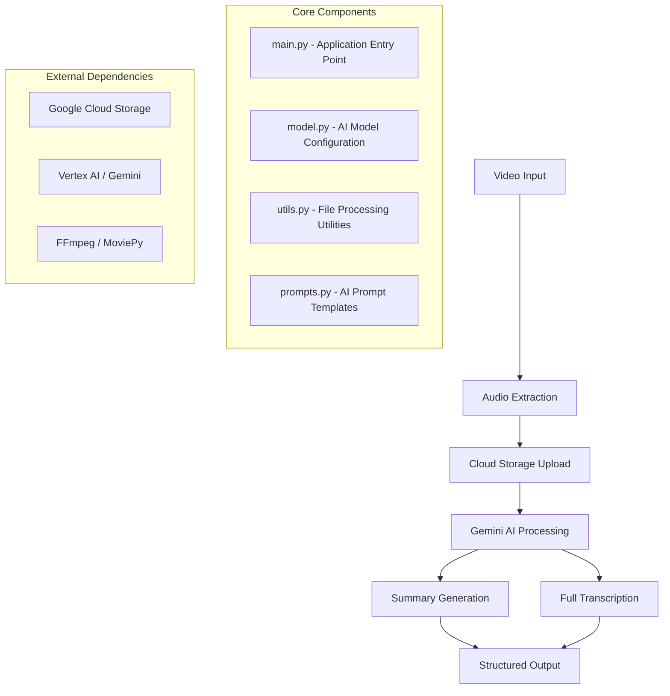

# Video Summarizer with Google Gemini Pro

A powerful Python application that leverages Google's Gemini Pro AI model to automatically transcribe and summarize video content. This tool extracts audio from video files, uploads them to Google Cloud Storage, and uses Vertex AI to generate intelligent summaries and complete transcriptions.

## Overview

This application streamlines the process of video content analysis by:
- Converting video files to audio format using FFmpeg and MoviePy
- Securely uploading audio files to Google Cloud Storage
- Utilizing Google's Gemini 2.0 Flash model for AI-powered content analysis
- Generating structured summaries with key moments and insights
- Providing complete transcriptions in the original language

## Key Features

- **Multi-format Video Support**: Processes various video formats through FFmpeg integration
- **Intelligent Summarization**: Generates structured summaries with introduction, key moments, and conclusions
- **Full Transcription**: Provides complete text transcription in the original language
- **Cloud Integration**: Seamless integration with Google Cloud Storage and Vertex AI
- **Secure Authentication**: Uses service account credentials for secure API access
- **Configurable AI Models**: Built on Google's latest Gemini 2.0 Flash model with customizable parameters

## Architecture

The application follows a modular architecture with clear separation of concerns:



## System Requirements

### Prerequisites
- **Operating System**: Ubuntu Linux (recommended)
- **Python**: Version 3.11 or higher
- **FFmpeg**: For video/audio processing
- **Google Cloud Account**: With Vertex AI and Cloud Storage APIs enabled
- **Service Account**: With appropriate permissions for Cloud Storage and Vertex AI

### Required APIs and Services
- Google Cloud Storage
- Vertex AI API
- Gemini API access

## Installation

1. **Clone the repository and navigate to the project directory**

2. **Install Python dependencies**:
   ```bash
   pip install -r requirements.txt
   ```

3. **Install FFmpeg**:
   ```bash
   # Ubuntu/Debian
   sudo apt update
   sudo apt install ffmpeg
   
   # macOS
   brew install ffmpeg
   ```

4. **Set up Google Cloud credentials**:
   - Create a service account in Google Cloud Console
   - Download the service account key file (JSON format)
   - Place the credentials file in the `keys/` directory

5. **Configure environment variables**:
   Create a `.env` file in the `keys/` directory with the following variables:
   ```
   PROJECT=your-gcp-project-id
   REGION=your-preferred-region
   GEMINI-API-KEY=your-gemini-api-key
   ```

## Usage

### Basic Usage
```bash
python main.py path/to/your/video.mp4
```

### Workflow Process

1. **Video Processing**: The application extracts audio from the input video file using MoviePy (which utilizes FFmpeg)

2. **Cloud Upload**: The extracted audio is securely uploaded to Google Cloud Storage using service account authentication

3. **AI Analysis**: The Gemini 2.0 Flash model processes the audio file to generate:
   - **Structured Summary**: 5-block format including introduction, key moments, and conclusion
   - **Complete Transcription**: Full text in the original language

4. **Output**: Results are displayed in the console with clear formatting

### Output Format

**Summary Structure**:
- **Block 1**: Introduction and video overview
- **Blocks 2-4**: Three main ideas/key moments from the content
- **Block 5**: Conclusion and summary

## Project Structure

```
Video_summarizer/
├── main.py              # Application entry point and orchestration
├── model.py             # Gemini AI model configuration and generation
├── utils.py             # Utility functions for video/audio processing
├── prompts.py           # AI prompt templates for different tasks
├── requirements.txt     # Python dependencies
├── keys/               # Authentication and configuration
│   ├── .env            # Environment variables
│   └── *.json          # Service account credentials
└── data/               # Temporary storage for processed files
```

## Core Components

### main.py
The application orchestrator that:
- Loads configuration and credentials
- Initializes Vertex AI and authentication
- Coordinates the video-to-summary pipeline
- Manages the complete workflow from input to output

### model.py
AI model management module that:
- Initializes the Gemini 2.0 Flash model with optimized settings
- Configures safety settings and generation parameters
- Handles AI content generation with error management
- Processes audio files through the Vertex AI API

### utils.py
Utility functions providing:
- Video-to-audio conversion using MoviePy and FFmpeg
- Secure file upload to Google Cloud Storage
- File management and temporary storage handling

### prompts.py
Template definitions for:
- **Summary Generation**: Structured 5-block format for key insights
- **Full Transcription**: Complete text extraction in original language

## Configuration

### Model Parameters
- **Model**: Gemini 2.0 Flash (gemini-2.0-flash-001)
- **Max Output Tokens**: 8,192
- **Temperature**: 1.0 (creative responses)
- **Top-p**: 0.95 (diverse output)

### Safety Settings
The application implements comprehensive safety measures:
- Hate speech protection
- Dangerous content filtering
- Sexually explicit content blocking
- Harassment prevention

## Dependencies

### Core Libraries
- **google-cloud-aiplatform**: Vertex AI integration
- **google-cloud-storage**: Cloud storage operations
- **moviepy**: Video/audio processing
- **python-dotenv**: Environment configuration
- **vertexai**: Google AI platform SDK

### Processing Tools
- **FFmpeg**: Multimedia framework for video/audio conversion
- **MoviePy**: Python video editing and manipulation

## Security Considerations

- Service account credentials are stored securely in the `keys/` directory
- Environment variables manage sensitive configuration
- Google Cloud IAM controls access to resources
- Temporary files are processed locally and cleaned up appropriately

## Troubleshooting

### Common Issues
1. **FFmpeg not found**: Ensure FFmpeg is properly installed and in your system PATH
2. **Authentication errors**: Verify service account credentials and API permissions
3. **Storage errors**: Check Cloud Storage bucket permissions and naming
4. **Model errors**: Ensure Vertex AI API is enabled and properly configured

### Error Handling
The application includes comprehensive error handling for:
- Video processing failures
- Network connectivity issues
- API rate limiting
- Authentication problems

## Contributing

This project welcomes contributions for:
- Additional video format support
- Enhanced summarization prompts
- Performance optimizations
- Extended cloud platform support

## License

This project utilizes various open-source libraries including MoviePy (MIT License) and integrates with Google Cloud services subject to their respective terms of service.