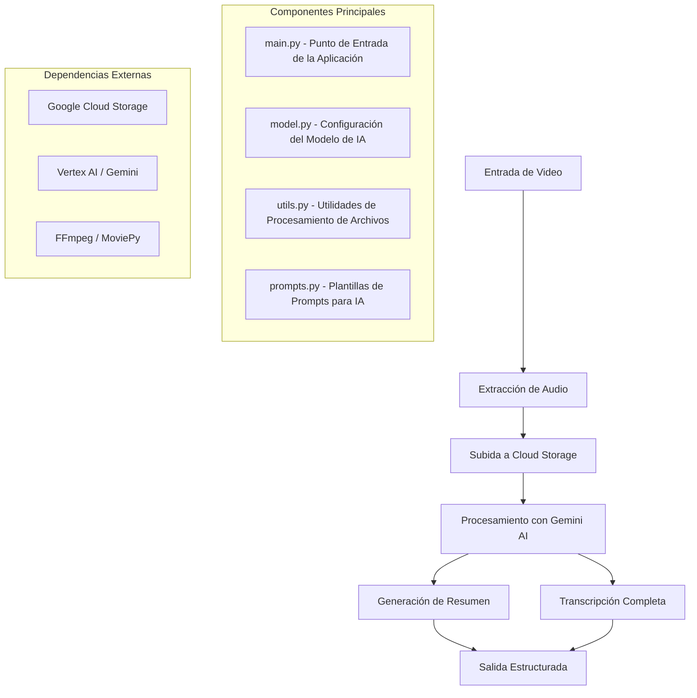

# Resumidor de Videos con Google Gemini Pro

Una potente aplicación de Python que aprovecha el modelo de IA Gemini Pro de Google para transcribir y resumir automáticamente contenido de video. Esta herramienta extrae audio de archivos de video, los sube a Google Cloud Storage y utiliza Vertex AI para generar resúmenes inteligentes y transcripciones completas.

## Descripción General

Esta aplicación optimiza el proceso de análisis de contenido de video mediante:
- Conversión de archivos de video a formato de audio usando FFmpeg y MoviePy
- Subida segura de archivos de audio a Google Cloud Storage
- Utilización del modelo Gemini 2.0 Flash de Google para análisis de contenido impulsado por IA
- Generación de resúmenes estructurados con momentos clave e insights
- Provisión de transcripciones completas en el idioma original

## Características Principales

- **Soporte Multi-formato de Video**: Procesa varios formatos de video a través de la integración con FFmpeg
- **Resumido Inteligente**: Genera resúmenes estructurados con introducción, momentos clave y conclusiones
- **Transcripción Completa**: Proporciona transcripción de texto completa en el idioma original
- **Integración en la Nube**: Integración fluida con Google Cloud Storage y Vertex AI
- **Autenticación Segura**: Utiliza credenciales de cuenta de servicio para acceso seguro a la API
- **Modelos de IA Configurables**: Construido sobre el último modelo Gemini 2.0 Flash de Google con parámetros personalizables

## Arquitectura

La aplicación sigue una arquitectura modular con clara separación de responsabilidades:



## Requisitos del Sistema

### Prerequisitos
- **Sistema Operativo**: Ubuntu Linux (recomendado)
- **Python**: Versión 3.11 o superior
- **FFmpeg**: Para procesamiento de video/audio
- **Cuenta de Google Cloud**: Con APIs de Vertex AI y Cloud Storage habilitadas
- **Cuenta de Servicio**: Con permisos apropiados para Cloud Storage y Vertex AI

### APIs y Servicios Requeridos
- Google Cloud Storage
- API de Vertex AI
- Acceso a la API de Gemini

## Instalación

1. **Clona el repositorio y navega al directorio del proyecto**

2. **Instala las dependencias de Python**:
   ```bash
   pip install -r requirements.txt
   ```

3. **Instala FFmpeg**:
   ```bash
   # Ubuntu/Debian
   sudo apt update
   sudo apt install ffmpeg
   
   # macOS
   brew install ffmpeg
   ```

4. **Configura las credenciales de Google Cloud**:
   - Crea una cuenta de servicio en Google Cloud Console
   - Descarga el archivo de clave de la cuenta de servicio (formato JSON)
   - Coloca el archivo de credenciales en el directorio `keys/`

5. **Configura las variables de entorno**:
   Crea un archivo `.env` en el directorio `keys/` con las siguientes variables:
   ```
   PROJECT=tu-id-de-proyecto-gcp
   REGION=tu-region-preferida
   GEMINI-API-KEY=tu-clave-api-gemini
   ```

## Uso

### Uso Básico
```bash
python main.py ruta/a/tu/video.mp4
```

### Proceso del Flujo de Trabajo

1. **Procesamiento de Video**: La aplicación extrae audio del archivo de video de entrada usando MoviePy (que utiliza FFmpeg)

2. **Subida a la Nube**: El audio extraído se sube de forma segura a Google Cloud Storage usando autenticación de cuenta de servicio

3. **Análisis con IA**: El modelo Gemini 2.0 Flash procesa el archivo de audio para generar:
   - **Resumen Estructurado**: Formato de 5 bloques incluyendo introducción, momentos clave y conclusión
   - **Transcripción Completa**: Texto completo en el idioma original

4. **Salida**: Los resultados se muestran en la consola con formato claro

### Formato de Salida

**Estructura del Resumen**:
- **Bloque 1**: Introducción y descripción general del video
- **Bloques 2-4**: Tres ideas principales/momentos clave del contenido
- **Bloque 5**: Conclusión y resumen

## Estructura del Proyecto

```
Video_summarizer/
├── main.py              # Punto de entrada y orquestación de la aplicación
├── model.py             # Configuración y generación del modelo Gemini AI
├── utils.py             # Funciones utilitarias para procesamiento de video/audio
├── prompts.py           # Plantillas de prompts de IA para diferentes tareas
├── requirements.txt     # Dependencias de Python
├── keys/               # Autenticación y configuración
│   ├── .env            # Variables de entorno
│   └── *.json          # Credenciales de cuenta de servicio
└── data/               # Almacenamiento temporal para archivos procesados
```

## Componentes Principales

### main.py
El orquestador de la aplicación que:
- Carga configuración y credenciales
- Inicializa Vertex AI y autenticación
- Coordina el pipeline de video a resumen
- Gestiona el flujo de trabajo completo desde entrada hasta salida

### model.py
Módulo de gestión del modelo de IA que:
- Inicializa el modelo Gemini 2.0 Flash con configuraciones optimizadas
- Configura ajustes de seguridad y parámetros de generación
- Maneja la generación de contenido de IA con gestión de errores
- Procesa archivos de audio a través de la API de Vertex AI

### utils.py
Funciones utilitarias que proporcionan:
- Conversión de video a audio usando MoviePy y FFmpeg
- Subida segura de archivos a Google Cloud Storage
- Gestión de archivos y manejo de almacenamiento temporal

### prompts.py
Definiciones de plantillas para:
- **Generación de Resúmenes**: Formato estructurado de 5 bloques para insights clave
- **Transcripción Completa**: Extracción de texto completo en idioma original

## Configuración

### Parámetros del Modelo
- **Modelo**: Gemini 2.0 Flash (gemini-2.0-flash-001)
- **Tokens Máximos de Salida**: 8,192
- **Temperatura**: 1.0 (respuestas creativas)
- **Top-p**: 0.95 (salida diversa)

### Configuraciones de Seguridad
La aplicación implementa medidas de seguridad comprehensivas:
- Protección contra discurso de odio
- Filtrado de contenido peligroso
- Bloqueo de contenido sexualmente explícito
- Prevención de acoso

## Dependencias

### Bibliotecas Principales
- **google-cloud-aiplatform**: Integración con Vertex AI
- **google-cloud-storage**: Operaciones de almacenamiento en la nube
- **moviepy**: Procesamiento de video/audio
- **python-dotenv**: Configuración de entorno
- **vertexai**: SDK de la plataforma Google AI

### Herramientas de Procesamiento
- **FFmpeg**: Framework multimedia para conversión de video/audio
- **MoviePy**: Edición y manipulación de video en Python

## Consideraciones de Seguridad

- Las credenciales de cuenta de servicio se almacenan de forma segura en el directorio `keys/`
- Las variables de entorno gestionan la configuración sensible
- Google Cloud IAM controla el acceso a los recursos
- Los archivos temporales se procesan localmente y se limpian apropiadamente

## Solución de Problemas

### Problemas Comunes
1. **FFmpeg no encontrado**: Asegúrate de que FFmpeg esté instalado correctamente y en tu PATH del sistema
2. **Errores de autenticación**: Verifica las credenciales de cuenta de servicio y permisos de API
3. **Errores de almacenamiento**: Verifica los permisos del bucket de Cloud Storage y nomenclatura
4. **Errores del modelo**: Asegúrate de que la API de Vertex AI esté habilitada y configurada correctamente

### Manejo de Errores
La aplicación incluye manejo comprensivo de errores para:
- Fallas en el procesamiento de video
- Problemas de conectividad de red
- Limitación de velocidad de API
- Problemas de autenticación

## Contribuciones

Este proyecto acepta contribuciones para:
- Soporte adicional de formatos de video
- Prompts de resumido mejorados
- Optimizaciones de rendimiento
- Soporte extendido de plataformas en la nube

## Licencia

Este proyecto utiliza varias bibliotecas de código abierto incluyendo MoviePy (Licencia MIT) e integra con servicios de Google Cloud sujetos a sus respectivos términos de servicio.