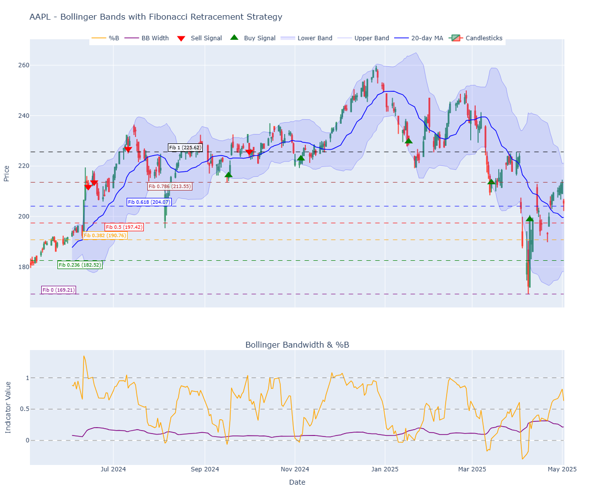
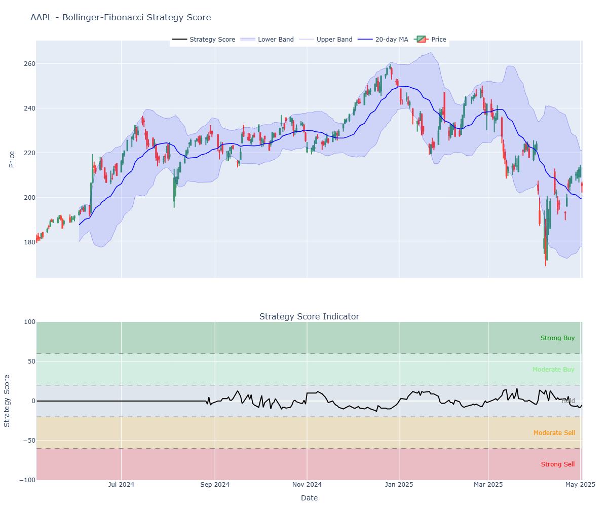

# Estrategia de Bandas de Bollinger y Retrocesos Fibonacci (Español)

## Bandas de Bollinger
Las Bandas de Bollinger son un indicador técnico que consiste en tres líneas: una media móvil (generalmente de 20 períodos) y dos bandas externas que se sitúan a una distancia 
de desviaciones estándar específicas (normalmente 2) por encima y por debajo de la media móvil. Estas bandas muestran la volatilidad del precio y ayudan a identificar cuando 
un activo está sobrecomprado o sobrevendido.

##  Retrocesos de Fibonacci
Los niveles de soporte son áreas donde el precio históricamente deja de caer y rebota al alza, funcionando como un "piso". Los niveles de resistencia son áreas donde el precio 
suele detenerse y retroceder, actuando como un "techo" que dificulta que el precio siga subiendo.

Los Retrocesos de Fibonacci son niveles horizontales que indican posibles áreas de soporte y resistencia basadas en los números de Fibonacci. 
Estos niveles (0%, 23.6%, 38.2%, 50%, 61.8%, 78.6%, 100%) se calculan entre un punto máximo y un punto mínimo significativos, y suelen actuar como zonas donde el precio puede
 rebotar o retroceder.

## Cómo funciona la estrategia conjunta
Esta estrategia combina las Bandas de Bollinger con los Retrocesos de Fibonacci para identificar señales de compra y venta más precisas. Funciona así:

Se generan señales de compra cuando el precio cruza por encima de la banda inferior de Bollinger y está cerca (dentro del 2%) de un nivel de soporte de Fibonacci.
  - En una tendencia alcista, estos niveles actúan como soportes (cuando el precio retrocede)
  - En una tendencia bajista, funcionan como resistencias (cuando el precio rebota)
Se generan señales de venta cuando el precio cruza por debajo de la banda superior de Bollinger y está cerca de un nivel de resistencia de Fibonacci.

Esta combinación ayuda a filtrar señales falsas que podrían generarse si se utilizara solo uno de los indicadores.

En los gráficos, las señales de compra aparecen como triángulos verdes apuntando hacia arriba cuando el precio rebota en la banda inferior y coincide con un nivel de Fibonacci.
Las señales de venta aparecen como triángulos rojos apuntando hacia abajo cuando el precio retrocede desde la banda superior y coincide con un nivel de Fibonacci.
Esta estrategia es especialmente útil en mercados que se mueven en rangos, donde las Bandas de Bollinger pueden identificar extremos de precio y los niveles de Fibonacci 
confirman posibles zonas de reversión.

# Interpretación del gráfico Bollinger Bandwidth & %B

El gráfico "Bollinger Bandwidth & %B" que aparece en la parte inferior de la visualización proporciona información complementaria valiosa para la estrategia:

## Bollinger Bandwidth (Ancho de Bandas)
- **Qué es**: Es la diferencia entre la banda superior e inferior dividida por la media móvil. Mide la volatilidad del mercado.
- **Interpretación**:
  - Un valor alto indica alta volatilidad (bandas muy separadas)
  - Un valor bajo indica baja volatilidad (bandas muy juntas)
  - Cuando alcanza mínimos, suele preceder a movimientos fuertes (expansión de volatilidad)
  - Se usa para identificar "compresiones" en el mercado que suelen preceder a movimientos direccionales significativos

## Indicador %B
- **Qué es**: Indica dónde se encuentra el precio en relación con las bandas de Bollinger.
- **Valores clave**:
  - 0 = precio en la banda inferior
  - 0.5 = precio en la media móvil
  - 1 = precio en la banda superior
  - >1 = precio por encima de la banda superior (sobrecompra)
  - <0 = precio por debajo de la banda inferior (sobreventa)
- **Interpretación**:
  - Sirve como indicador de sobrecompra/sobreventa
  - Cruces por encima de 0 pueden confirmar señales de compra
  - Cruces por debajo de 1 pueden confirmar señales de venta
  - Divergencias entre %B y precio pueden anticipar reversiones
  - En una tendencia alcista, estos niveles actúan como soportes (cuando el precio retrocede)
  - En una tendencia bajista, funcionan como resistencias (cuando el precio rebota)

Estos indicadores complementan la estrategia principal ayudando a:
1. Identificar períodos de baja volatilidad (compresión) que suelen preceder a movimientos importantes
2. Confirmar señales de compra y venta
3. Determinar la fuerza de las tendencias y posibles reversiones

Cuando combinas la lectura de estos indicadores con las señales principales de la estrategia (cruces de bandas cerca de niveles Fibonacci), obtienes un conjunto
 más completo de información para tomar decisiones de trading más informadas.
 
# Estrategia de Bandas de Bollinger y Retrocesos de Fibonacci

Esta estrategia combina dos herramientas técnicas poderosas para identificar oportunidades de trading:

## Bandas de Bollinger

Las Bandas de Bollinger son un indicador que mide la volatilidad de un activo y consiste en:

- **Línea Media**: Una media móvil (normalmente de 20 períodos)
- **Banda Superior**: La media móvil + 2 desviaciones estándar
- **Banda Inferior**: La media móvil - 2 desviaciones estándar

### Interpretación:
- Los precios tienden a moverse entre las bandas superior e inferior
- Cuando el precio toca o supera la banda superior, puede indicar sobrecompra
- Cuando toca o cae por debajo de la banda inferior, puede indicar sobreventa
- El estrechamiento de las bandas (baja volatilidad) suele preceder a movimientos fuertes

## Retrocesos de Fibonacci

Los retrocesos de Fibonacci utilizan secuencias de números para identificar posibles niveles de soporte y resistencia. Los niveles más comunes son:

- 0% (el punto más bajo del movimiento)
- 23.6%
- 38.2%
- 50%
- 61.8%
- 78.6%
- 100% (el punto más alto del movimiento)

### Interpretación:
- En una tendencia alcista, estos niveles actúan como soportes (cuando el precio retrocede)
- En una tendencia bajista, funcionan como resistencias (cuando el precio rebota)

## Cómo Funciona la Estrategia Combinada

Esta estrategia identifica oportunidades de trading mediante la combinación de ambas técnicas:

1. **Identificación de Tendencia**:
   - Se identifican los puntos de swing (máximos y mínimos significativos)
   - Se trazan los niveles de Fibonacci entre estos puntos

2. **Señales de Compra**:
   - El precio toca la banda inferior de Bollinger (posible sobreventa)
   - El precio coincide o está cerca de un nivel de Fibonacci importante
   - Esto aumenta la probabilidad de un rebote

3. **Señales de Venta**:
   - El precio toca la banda superior de Bollinger (posible sobrecompra)
   - El precio coincide o está cerca de un nivel de Fibonacci importante
   - Esto aumenta la probabilidad de una caída

4. **Sistema de Puntuación**:
   - La estrategia incluye un sistema de puntuación que va de -100 a +100
   - Por encima de +60: Señal fuerte de compra
   - Entre +20 y +60: Señal moderada de compra
   - Entre -20 y +20: Mantener posición
   - Entre -60 y -20: Señal moderada de venta
   - Por debajo de -60: Señal fuerte de venta

## Componentes de la Puntuación

La puntuación se basa en cuatro factores:

1. **Posición respecto a las Bandas de Bollinger (30% del peso)**:
   - Si el precio está cerca de la banda inferior: contribución positiva
   - Si está cerca de la banda superior: contribución negativa

2. **Evaluación de Volatilidad (15% del peso)**:
   - Analiza el ancho de las bandas y sus cambios recientes
   - Bandas estrechas que empiezan a expandirse pueden señalar potenciales rupturas

3. **Interacción con Niveles Fibonacci (35% del peso)**:
   - Mayor peso porque es el núcleo de esta estrategia combinada
   - Mide la proximidad a niveles Fibonacci clave
   - Considera si el precio rebota o rompe un nivel
   - Tiene en cuenta si el nivel actúa como soporte o resistencia

4. **Momentum del Precio (20% del peso)**:
   - Utiliza un indicador similar al RSI para identificar condiciones de sobrecompra/sobreventa
   - Condiciones de sobreventa (RSI por debajo de 30) contribuyen positivamente
   - Condiciones de sobrecompra (RSI por encima de 70) contribuyen negativamente

### Confirmación y gestión de riesgos:
- Esperar 2-3 días consecutivos en la misma zona de señal antes de actuar
- Colocar stop loss en el nivel de Fibonacci más cercano en la dirección opuesta
- Considerar tomar beneficios parciales al acercarse a niveles clave de resistencia/soporte

## Interpretación de los gráficos

En el primer gráfico vemos:
- El precio de AAPL con las Bandas de Bollinger (bandas azules)
- Los niveles de Fibonacci (líneas horizontales de colores)
- Señales de compra (triángulos verdes) y venta (triángulos rojos)
- Indicadores %B y Ancho de Banda en la parte inferior

En el segundo gráfico vemos:
- El precio de AAPL con las Bandas de Bollinger en la parte superior
- El indicador de puntuación de la estrategia en la parte inferior
- Zonas coloreadas que representan las diferentes señales de trading:
  - Verde oscuro: Compra fuerte
  - Verde claro: Compra moderada
  - Gris: Mantener
  - Naranja: Venta moderada
  - Rojo: Venta fuerte

## Bollinger Bands, Fibonacci Levels , Buy/Sell Signals, Bollinger Bandwitdh and %B

## Strategy and Scoring System Signals

