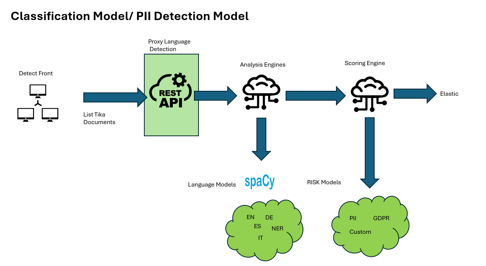
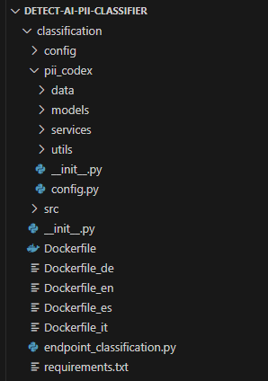
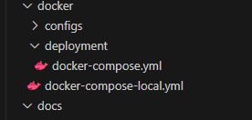

# Introduction

This repository contains the PII/GDPR Detection Model. The objective of this application is identify words or sentences in documents which are protected by privacy laws, classify them per type and score them according to the rules of a privacy Framework like PII or GDPR. One we have the individual entities identified, score the whole document according to a risk model and return these values back to the user to act accordingly.

# High Level Architecture

Currently the Application support 4 Languages English, Spanish, German and Italian. This can be easily extended to any language supported by [Spacy](https://spacy.io/). We have 3 main components:

- Language Detection Proxy: Take the Tika Request and detect the language of the content together with some controls like mime detection and length  of the content. 
- Analysis Engine: Identify the PII/GDPR entities in the text and create an object with the type of entity, its location in the text and a confident score for filtering purposes.
- Scoring Engine: Score the document according to one of the available Risk Models.

# Risk Models
We have defined Entities and scoring mechanism according to US PII and EU GDPR regulations. Additionaly the User can create its custom Model defined with their own requirements
The Model Schema it is defined in this [file](classification\pii_codex\data\v2\pii_gdpr_mapping.csv)

# Installation Process
Each component has a Dockerfile (1 per language supported and 1 for the proxy docker) and a requirements.txt file to create the container.

Additionaly we have docker-compose file to deploy dockers to production environments

# Software Dependencies

   - Python 3.10.11
   - Files [requirements.txt](classification\requirements.txt)

# Build and Test

In the test folder, we have different unit test cases for each component. Tests are included as part of the CI pipeline, which is configured in the [azure-pipelines.yml](azure-pipelines.yml) file present at the root of our repository

For tests, we use the unittest and pytest Python libraries.

# Running Locally with Docker Compose

in the folder `docker` there are 2 compose files - use the file `docker-compose-local` for local API development.

you can run the models in docker using the compose command

> cls; cd C:\git\Detect-AI\docker; docker-compose -f docker-compose-local.yml up -d

you can test the services using the health check endpoints

classification

> curl --location 'http://localhost:5000/health-check'

ROT

> curl --location 'http://localhost:5007/health-check'

# PremCloud Development

To contribute to this repository, you need to have experience in Python, serverless applications using FastAPI, and a number of deep learning and machine learning technologies like PyTorch, spaCy, scikit-learn, HuggingFace Transformers, and OpenCV.

# Setup Development Environment

    - Install Visual Studio Code or PyCharm.
    - Install Anaconda. Example for Windows: Anaconda Installation Guide for Windows.
    - Clone the repository to your local machine: git clone https://sceven@dev.azure.com/sceven/DataDetect/_git/Detect-AI-PII-Classifier.

    - Create a Conda environment from the environment.yml file (located at the root of our repository):
      - conda env create --file environment.yml
      - conda activate detect-ai
    - Launch Jupyter Notebook with the command: jupyter notebook inside the environment.

    - If you want to use Visual Studio Code, navigate to the root of the repo in a command line window, run conda activate detect-ai, and then code ..

# Endpoints / APIs

We use FastAPI, a web framework for building APIs with Python 3.7+ based on standard Python type hints. Documentation: FastAPI Documentation. https://fastapi.tiangolo.com/

A description of all APIs and endpoints developed in these applications is included in [here](docs/ENDPOINTS.md)
