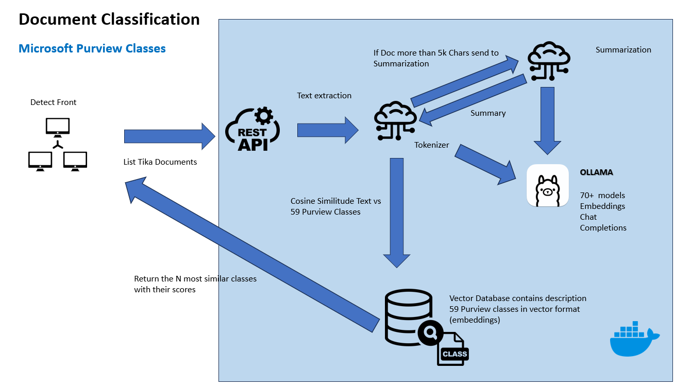
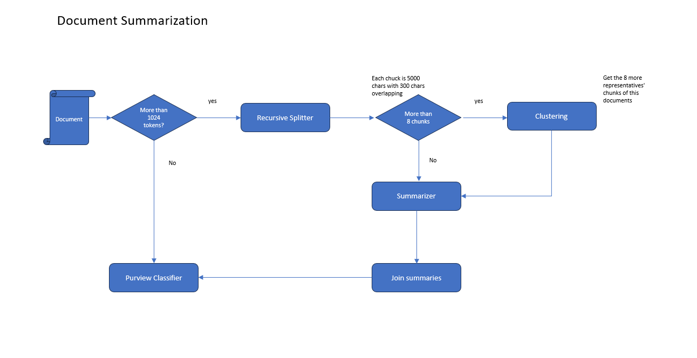

# Introduction

This repository contains Detect-AI Purview Classifier components. Detect-AI  Purview Classifier it is an AI component which classifier a document versus the Microsoft Purview classification classes defined in this document [here](nlp\app\document_classification\data\classes.csv). 60 classes with their descriptions.

# Getting Started

### High Level Architecture

  
  There is mainly 5 components. The classification component, the summarization Component, the Vector Store , the Inference Server and the Admin API component
  - The classification Componet and the Vector Store are in the same Docker in the [folder](nlp\app\document_classification) of this repo. This component as well has a Restful API to interact with Detect.
  - The summarization Component is an independent docker in this [folder](nlp\app\document_summarization). It contais the logic to create an abstractive summary of a text when this is longer than 4500 chars, aprox 900 tokens
  - The Inference Server, it is an independent docker running Ollama server which allow us create embeddings or summaries of text.
  - The admin component offers a REstful API to interacts with ollama [here](admin)
  
#### Summarization Process

When a document is longer than 1024 tokens, the classification Docker will send the text to the summarization docker to get an abstractive summary. The summarizer will take the document and it will split it in chuncks of 4800 chars with and overlap of 300 chars. Then if the number of chunks is higher than 8, the summarizer using clustering, will group all the chunks in 8 different classes based in similarity. From those eight clusters we choose the closest chunk to the cluster centroid to be representant. After we have the 8 representants, we use langchain and a summarization model to summarize the text to 1 single representative text of the whole initial document and return it to the classification component to finish classification.

# Installation and Setup

1. Installation Process

   Each component has a Dockerfile and a requirements.txt file to create the container. Additionally in the folder docker you have a [docker compose local](docker\docker-compose-local.yml) and a [docker compose for prod](docker\docker-compose.yml) which prepare the application to be deployed to a VM. The pipeline include create the 3 dockers and the nginx proxy to interacts with Detect.

2. Software Dependencies

   - Python 3.11.10
   - Files requirements.txt
   - detectaicore

3. Latest Releases
   N/A

4. API References
   [Errors](docs\errors.md)

# Build and Test
### Build
The [CI pipeline](azure-pipelines.yml) contains the components to build the dockers and push them to Azure Container Registry
### Test
TODO

