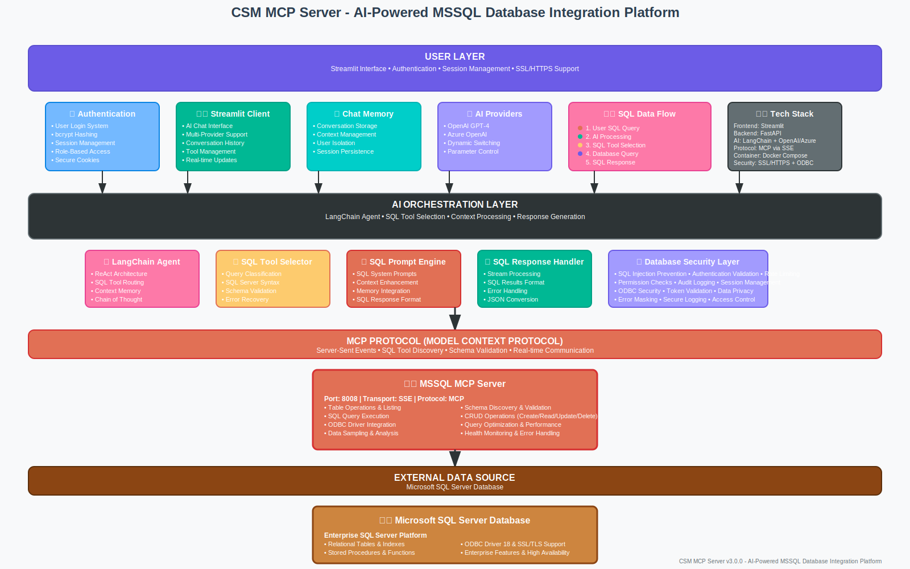

# AI-Powered MSSQL Database Integration Platform

A comprehensive full-stack application that provides AI-powered interactions with Microsoft SQL Server databases through Model Context Protocol (MCP) servers. This platform enables seamless data analysis, management, and automation of your MSSQL database infrastructure with optional HTTPS security and advanced user authentication.

## 🚀 System Overview

This application consists of two integrated components:

1. **Streamlit Client** - AI chat interface with multi-provider support, authentication, and SSL support
2. **MSSQL MCP Server** - SQL Server database operations with full CRUD support

## 🏗️ System Architecture



The diagram above shows the complete architecture of our AI-powered MSSQL database integration platform.

## ⚡ Quick Start

### Prerequisites
- Docker & Docker Compose
- Microsoft SQL Server database
- OpenAI API key or Azure OpenAI configuration
- ODBC Driver 18 for SQL Server

### 1. Environment Setup

Create a `.env` file in the project root:

```env
# AI Provider Configuration (choose one)
OPENAI_API_KEY=your_openai_api_key_here

# OR Azure OpenAI Configuration
AZURE_API_KEY=your_azure_api_key
AZURE_ENDPOINT=https://your-endpoint.openai.azure.com/
AZURE_DEPLOYMENT=your_deployment_name
AZURE_API_VERSION=2023-12-01-preview

# MSSQL Configuration
MSSQL_HOST=host.docker.internal
MSSQL_USER=your_mssql_username
MSSQL_PASSWORD=your_mssql_password
MSSQL_DATABASE=your_database_name
MSSQL_DRIVER=ODBC Driver 18 for SQL Server
TrustServerCertificate=yes
Trusted_Connection=no

# SSL Configuration (Optional)
SSL_ENABLED=true              # Enable HTTPS with self-signed certificates

# Enhanced Security (Optional)
USE_SQLITE=true              # Enable SQLite authentication
SESSION_TIMEOUT_HOURS=24     # Session timeout
MAX_LOGIN_ATTEMPTS=5         # Maximum login attempts
```

### 2. User Authentication Setup

Generate user credentials for the application:

```bash
cd client
python simple_generate_password.py
```

This will create `keys/config.yaml` with default users. You can modify the user credentials as needed.

### 3. SSL Certificate Setup (Optional)

For HTTPS support, set up SSL certificates:

#### Option A: Automatic Generation (Recommended)
```bash
# Enable SSL in environment - certificates will be generated automatically
echo "SSL_ENABLED=true" >> .env
```

#### Option B: Manual Generation
```bash
cd client

# Create required startup scripts
cat > startup_ssl.sh << 'EOF'
#!/bin/bash
echo "🚀 MSSQL MCP Platform - Starting Application..."

if [ "$SSL_ENABLED" = "true" ]; then
    echo "🔒 SSL mode enabled"
    
    if [ ! -f "ssl/cert.pem" ] || [ ! -f "ssl/private.key" ]; then
        echo "📝 Generating SSL certificates..."
        mkdir -p ssl
        
        if [ -f "generate_ssl_certificate.sh" ]; then
            chmod +x generate_ssl_certificate.sh
            ./generate_ssl_certificate.sh
        else
            echo "❌ Certificate generation script not found"
            SSL_ENABLED="false"
        fi
    fi
    
    if [ "$SSL_ENABLED" = "true" ] && [ -f "ssl/cert.pem" ] && [ -f "ssl/private.key" ]; then
        echo "🔒 Starting Streamlit with HTTPS on port 8502..."
        echo "📱 Access URL: https://localhost:8502"
        
        exec streamlit run app.py \
            --server.port=8502 \
            --server.address=0.0.0.0 \
            --server.enableCORS=false \
            --server.enableXsrfProtection=false \
            --server.sslCertFile=ssl/cert.pem \
            --server.sslKeyFile=ssl/private.key
    fi
fi

echo "🌐 Starting Streamlit with HTTP on port 8501..."
exec streamlit run app.py --server.port=8501 --server.address=0.0.0.0
EOF

chmod +x startup_ssl.sh

# Generate certificates manually (if needed)
python generate_ssl_certificate.py
# OR (Linux/Mac only)
./generate_ssl_certificate.sh
```

### 4. Launch the Platform

```bash
# Build and start all services
docker-compose up --build

# Or start individual services
docker-compose up mcpserver3  # MSSQL MCP Server
docker-compose up hostclient  # Streamlit Client
```

### 5. Access the Application

#### HTTPS Mode (Recommended)
- **Main Interface**: https://localhost:8502
- **Security**: Self-signed certificate (accept browser warning)

#### HTTP Mode (Default)
- **Main Interface**: http://localhost:8501
- **Alternative**: http://127.0.0.1:8501

#### Health Checks
- **MSSQL Server Health**: http://localhost:8008/health

#### Authentication
Use the credentials generated in step 2 (default: admin/very_Secure_p@ssword_123!)

## 🎯 Key Features

### **AI-Powered Interactions**
- Multi-provider AI support (OpenAI, Azure OpenAI)
- Natural language queries for database operations
- Intelligent tool selection and execution
- Conversation history and context management
- User authentication and session management

### **Security & Authentication**
- **User Authentication System**: Secure login with bcrypt password hashing
- **Session Management**: Persistent user sessions with configurable expiry
- **SSL/HTTPS Support**: Optional encrypted connections with self-signed certificates
- **Role-Based Access**: Pre-authorized email domains and user management
- **Secure Cookies**: Configurable authentication cookies with custom keys
- **Enhanced SQLite Authentication**: Modern database-backed user management

### **Database Support**
- **SQL Database Operations**: Full MSSQL Server support with ODBC
- **Schema Discovery**: Automatic table and column information retrieval
- **Visual Results**: Structured data presentation
- **CRUD Operations**: Complete Create, Read, Update, Delete support

### **Complete Database Operations**
- **MSSQL**: Table listing, SQL execution, CRUD operations, metadata queries
- **Data Exploration**: Sample data retrieval with configurable limits
- **Query Optimization**: SQL Server syntax support and performance optimization

### **Technical Excellence**
- **Docker Containerization**: Easy deployment and scaling
- **SSL/HTTPS Support**: Secure connections with automatic certificate generation
- **Real-time Communication**: Server-Sent Events (SSE) for MCP
- **Schema Validation**: Comprehensive input validation
- **Error Handling**: Robust error management and debugging
- **Health Monitoring**: Built-in health checks and monitoring

## 📚 Usage Examples

### **Authentication Workflow**

```
1. Navigate to https://localhost:8502 (SSL) or http://localhost:8501 (HTTP)
2. Use the sidebar authentication panel
3. Login with generated credentials:
   - Username: admin, Password: very_Secure_p@ssword_123!
   - Username: demo_user, Password: strong_password_123!
4. Access the full application features
```

### **Database Analysis Workflows**

```
"Show me all tables in the MSSQL database"
"Describe the structure of the customers table"
"List all tables and their row counts"
"Execute a SQL query to find top customers by revenue"
"Get 5 sample records from the orders table"
"Count the total number of products in inventory"
```

### **MSSQL Database Workflows**

```
"Show me all tables in the database"
"Describe the structure of the customers table"
"Get 5 sample records from the orders table"
"Find all customers with orders over $1000"
"Count the total number of products in inventory"
"Show me the top 10 best-selling products"
"Update customer information for CustomerID 123"
"Insert a new customer record"
"Delete inactive customers from last year"
```

### **Advanced SQL Operations**

```
"Show me monthly sales trends for the last year"
"Find customers who haven't placed orders in 6 months"
"Calculate average order value by customer segment"
"Generate a report of top-selling products by category"
"Analyze customer purchase patterns"
"Create a summary of order statuses"
```

## 🔧 Component Documentation

Each component has detailed documentation for advanced configuration and development:

### [🖥️ Streamlit Client Documentation](./client/Readme.md)
- **Authentication System**: Enhanced SQLite authentication, bcrypt password hashing, user session isolation
- **SSL/HTTPS Configuration**: Certificate management, secure connections, automatic generation
- **UI Configuration**: Modern tabbed interface, responsive design, user management panel
- **AI Provider Setup**: OpenAI and Azure OpenAI configuration, model parameter control
- **Tool Execution Monitoring**: Real-time tool usage tracking, execution history
- **Conversation Management**: Create, switch, delete, and export chat sessions
- **Docker Deployment**: Containerized deployment with SSL support and health monitoring

### [🗃️ MSSQL MCP Server Documentation](./servers/server3/Readme.md)
- **Connection Configuration**: ODBC Driver 18 setup, connection string management
- **SQL Operations**: Complete CRUD support, query execution, schema discovery
- **Tool Reference**: Detailed documentation of all available database tools
- **Security Considerations**: SQL injection prevention, access control, audit logging
- **Performance Optimization**: Query optimization, connection pooling, monitoring
- **Troubleshooting Guide**: Common issues, debugging steps, health checks

### [📊 System Architecture](./docs/csm_diagram.svg)
Visual representation of the complete platform architecture showing:
- User authentication and session management layer
- AI orchestration with LangChain agent
- MCP protocol communication
- MSSQL database integration
- Security and data flow patterns

### [🔧 Development Setup](./client/Readme.md#local-development-setup)
Comprehensive development environment setup including:
- Local installation and configuration
- Environment variable management
- SSL certificate generation
- User authentication setup
- Database connection testing

### [🔒 Security Documentation](./client/Readme.md#security-features)
Complete security implementation guide covering:
- Multi-backend authentication (SQLite, YAML, encrypted JSON)
- Session management and user isolation
- SSL/HTTPS implementation
- Database security best practices
- Audit logging and monitoring

### [🐛 Troubleshooting Guides](./servers/server3/readme.md#troubleshooting)
Detailed troubleshooting documentation for:
- **MSSQL Connection Issues**: ODBC driver problems, connectivity testing
- **Authentication Problems**: User management, credential verification
- **SSL Certificate Issues**: Certificate generation, validation, deployment
- **Performance Problems**: Query optimization, connection pooling
- **Docker Deployment**: Container configuration, health checks

## 🛠️ Development & Customization

### **Local Development Setup**

```bash
# Clone the repository
git clone <your-repo-url>
cd <project-directory>

# Install dependencies for each component
cd client && pip install -r requirements.txt
cd ../servers/server3 && pip install -r requirements.txt
```

**Detailed Setup Guide**: See [Client Development Setup](./client/Readme.md#local-development-setup) for comprehensive installation instructions.

### **MSSQL Server Setup**

For MSSQL integration, ensure you have:
- MSSQL Server instance running
- ODBC Driver 18 for SQL Server installed
- Appropriate database permissions
- Network connectivity to the database

**Complete Setup Guide**: See [MSSQL Server Documentation](./servers/server3/readme.md#installation--setup) for detailed configuration steps.

### **Authentication Configuration**

**Enhanced SQLite Authentication**:
```bash
# Enable SQLite authentication
echo "USE_SQLITE=true" >> .env

# Migrate existing users
cd client
python migration_scripts/migrate_users_to_sqlite.py
```

**User Management**: See [Authentication Documentation](./client/Readme.md#user-management-admin-only) for complete user management features.

### **SSL/HTTPS Setup**

**Automatic Certificate Generation**:
```bash
# Enable SSL mode
echo "SSL_ENABLED=true" >> .env

# Certificates will be generated automatically on startup
```

**Manual Setup**: See [SSL Configuration Guide](./client/Readme.md#sslhttps-setup) for detailed SSL implementation.

### **Adding Custom Tools**

1. **MSSQL Tools**: Add custom SQL operations and stored procedures
   - See [Custom Tool Development](./servers/server3/readme.md#development--extensions)
2. **Client Tools**: Integrate additional services via MCP protocol
   - See [Client Extensions](./client/Readme.md#advanced-configuration)

### **Configuration Management**

**Environment Variables**: All configuration is managed through `.env` files
- See [Configuration Guide](./client/Readme.md#configuration) for complete variable reference

**Server Configuration**: MCP server endpoints are defined in `servers_config.json`
- See [MCP Configuration](./client/Readme.md#mcp-server-configuration) for endpoint management

## 🔒 Security & Best Practices

### **Database Security**
- Use secure connection strings with proper authentication
- Implement least-privilege access for database users
- Enable SSL/TLS for database connections where possible
- Regularly update ODBC drivers and database clients

### **Application Security**
- **Enhanced User Authentication**: SQLite-backed user management with bcrypt hashing
- **Session Security**: Configurable session timeouts and secure token management
- **SSL/HTTPS Support**: Optional encrypted web connections
- **Input Validation**: SQL injection protection and input sanitization

## 📊 Monitoring & Debugging

### **Health Checks**
- **Overall System**: Streamlit interface status indicators
- **MSSQL Server**: http://localhost:8008/health

### **Database Monitoring**
- Connection pool status
- Query execution timing and performance metrics
- Error rates and connection failures
- Resource usage tracking

## 🚀 Deployment Options

### **Development Deployment**
```bash
# HTTP mode (default)
docker-compose up --build

# HTTPS mode
echo "SSL_ENABLED=true" >> .env
docker-compose up --build
```

### **Production Deployment**
- Use environment-specific `.env` files
- Configure proper SSL certificates for database connections
- Implement proper secret management
- Set up monitoring and alerting
- Use connection pooling for high-traffic scenarios

## 🐛 Troubleshooting

### **Common Issues**

**MSSQL Connection Problems**
- Verify ODBC driver installation: `odbcinst -j`
- Check SQL Server connectivity: `telnet [host] 1433`
- Verify database permissions and user access
- Check firewall settings and network connectivity

**Detailed Guide**: See [MSSQL Troubleshooting](./servers/server3/readme.md#troubleshooting) for comprehensive connection solutions.

**Authentication Issues**
- Verify `keys/config.yaml` exists and is properly formatted
- Check user credentials match the generated passwords
- For SQLite: ensure `USE_SQLITE=true` in `.env`
- Clear browser cookies if experiencing login issues

**Authentication Debugging**: See [Client Authentication Guide](./client/Readme.md#troubleshooting) for detailed debugging steps.

**SSL Certificate Issues**
- Run certificate generation script: `python generate_ssl_certificate.py`
- Check file permissions on `ssl/` directory
- Verify certificate and key files exist in `ssl/` folder

**SSL Debugging**: See [SSL Setup Guide](./client/Readme.md#sslhttps-setup) for certificate troubleshooting.

**Performance Issues**
- Monitor query execution times
- Implement connection pooling
- Use appropriate indexes in SQL databases
- Optimize SQL queries for better performance

**Performance Optimization**: See [MSSQL Performance Guide](./servers/server3/readme.md#monitoring--logging) for detailed optimization strategies.

### **Debug Tools and Scripts**

**Authentication Debugging**:
```bash
# Test SQLite authentication
cd client
python migration_scripts/sqlite_auth_debug.py

# Verify user migration
python migration_scripts/simple_verification_script.py

# Check password issues
python one_time/password_debug.py
```

**SSL Debugging**:
```bash
# Debug SSL configuration
cd client
./one_time/debug_ssl.sh

# Test certificate generation
python generate_ssl_certificate.py
```

**Database Debugging**:
```bash
# Test MSSQL connection
cd servers/server3
python test_connection.py

# Health check
curl http://localhost:8008/health
```

**Complete Debugging Guide**: See [Client Troubleshooting](./client/Readme.md#troubleshooting) for all available debug tools and procedures.

## 🤝 Contributing

### **Development Workflow**
1. Fork the repository
2. Create feature branches for each component
3. Test authentication and security features
4. Test database connections and operations
5. Submit pull requests with comprehensive testing

### **Database Testing**
- Test database connections in different environments
- Verify SQL query functionality
- Test failover and recovery scenarios
- Validate data consistency and integrity

## 🔄 Migration from Previous Versions

If you're upgrading from a previous version that included Neo4j and HubSpot:

### **Configuration Updates**
1. Remove Neo4j and HubSpot configuration from `.env`
2. Update `docker-compose.yml` to only include MSSQL services
3. Update client configuration to remove unused MCP servers

### **User Authentication Migration**
```bash
# Migrate to enhanced SQLite authentication
cd client
python migration_scripts/migrate_users_to_sqlite.py

# Verify migration
python migration_scripts/simple_verification_script.py
```

**Complete Migration Guide**: See [Migration Documentation](./client/Readme.md#migration-and-setup) for detailed migration procedures and troubleshooting.

### **Docker Configuration Updates**
Update your `docker-compose.yml` to remove legacy services:
```yaml
# Remove these services if present:
# - mcpserver4 (Neo4j)
# - mcpserver5 (HubSpot)

# Keep only:
services:
  mcpserver3:    # MSSQL MCP Server
  hostclient:    # Streamlit Client
```

### **Environment Variable Cleanup**
Remove these variables from your `.env` file:
```env
# Remove Neo4j variables
NEO4J_URI=
NEO4J_USERNAME=
NEO4J_PASSWORD=
NEO4J_DATABASE=

# Remove HubSpot variables
PRIVATE_APP_ACCESS_TOKEN=
```

**Configuration Reference**: See [Environment Setup](./client/Readme.md#installation) for current configuration requirements.

## 📚 Additional Resources

### **API Documentation**
- [MSSQL MCP Server API](./servers/server3/readme.md#api-endpoints) - Complete API reference
- [Health Check Endpoints](./servers/server3/readme.md#health-check) - Monitoring and status endpoints
- [Tool Reference](./servers/server3/readme.md#available-tools) - All available database tools

### **Configuration References**
- [Client Configuration](./client/Readme.md#configuration) - Complete client setup guide
- [Security Configuration](./client/Readme.md#security-features) - Authentication and SSL setup
- [Database Configuration](./servers/server3/readme.md#installation--setup) - MSSQL connection setup

### **Examples and Tutorials**
- [Usage Examples](./client/Readme.md#usage) - Step-by-step usage guide
- [SQL Query Examples](./servers/server3/readme.md#sql-server-syntax-support) - Database operation examples
- [Authentication Examples](./client/Readme.md#getting-started) - User management examples

### **Development Guides**
- [Local Development](./client/Readme.md#local-development-setup) - Development environment setup
- [Custom Tool Development](./servers/server3/readme.md#development--extensions) - Extending functionality
- [Docker Development](./client/Readme.md#docker-deployment) - Containerized development

---

**Version**: 3.0.0  
**Last Updated**: July 2025  
**Compatibility**: Docker 20+, Python 3.11+, MSSQL Server 2019+  
**Security**: Streamlit Authenticator 0.3.2, bcrypt password hashing, SSL/HTTPS support, ODBC 18+  
**Focus**: Streamlined MSSQL database integration with enhanced security and authentication