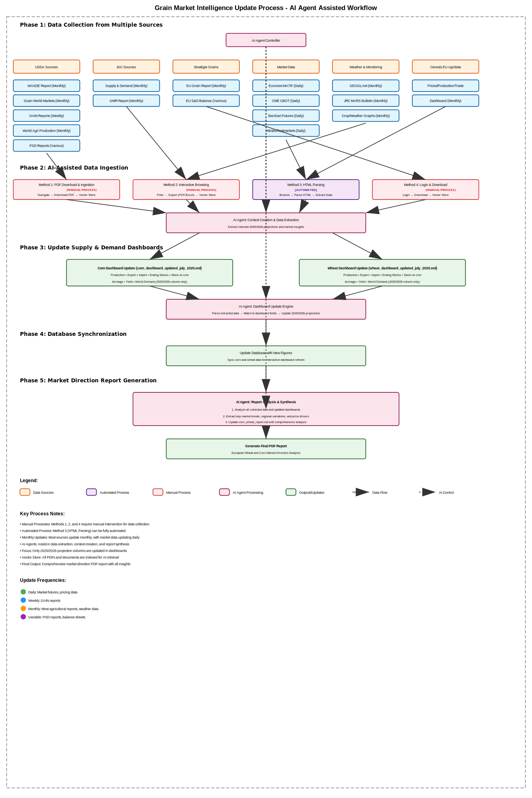

# AI-Powered Search MCP Integration Platform

A comprehensive full-stack application that provides AI-powered interactions with Firecrawl, Google Search, and Perplexity AI through Model Context Protocol (MCP) servers. This platform enables seamless web search, AI-powered analysis, content extraction, and agricultural data analytics with optional HTTPS security, user authentication, and advanced caching for optimal performance.

## 🌾 NEW: Grain Market Intelligence Update Process

The platform now includes an AI-assisted workflow for comprehensive grain market analysis and reporting. This feature automates the collection and synthesis of agricultural data from multiple sources to generate market direction reports.

### Grain Report Update Workflow Overview



The grain market intelligence system follows a 5-phase AI-assisted workflow:

#### **Phase 1: Data Collection from Multiple Sources**
The AI Agent Controller orchestrates data collection from:

- **USDA Sources** (Monthly/Weekly Updates)
  - WASDE Report (Monthly)
  - Grain World Markets (Monthly)
  - GAIN Reports (Weekly)
  - World Agricultural Production (Monthly)
  - PSD Reports (Various schedules)

- **IGC Sources** (Monthly)
  - Supply & Demand Reports
  - GMR Report

- **Stratégie Grains** (Monthly/Various)
  - EU Grain Report
  - EU Supply & Demand Balance

- **Market Data** (Daily)
  - Euronext MATIF
  - CME CBOT
  - Barchart Futures
  - Mintec/Fastmarkets

- **Weather & Monitoring** (Monthly)
  - GEOGLAM
  - JRC MARS Bulletin
  - Crop/Weather Graphs

- **EU Agridata** (Monthly)
  - Cereals Prices/Production/Trade
  - Dashboard Updates

#### **Phase 2: AI-Assisted Data Ingestion**
Four methods for data ingestion, with varying levels of automation:

1. **PDF Download & Ingestion** [MANUAL] - Navigate → Download PDF → Vector Store
2. **Interactive Browsing** [MANUAL] - Filter → Export (PDF/Excel) → Vector Store
3. **HTML Parsing** [AUTOMATED] - Browse → Parse HTML → Extract Data
4. **Login & Download** [MANUAL] - Login → Download → Vector Store

The AI Agent performs context creation and extracts relevant 2025/2026 projections and market insights.

#### **Phase 3: Dashboard Updates**
Automated updates to supply & demand dashboards:

- **Corn Dashboard** (`corn_dashboard_updated_july_2025.md`)
  - Production, Export, Import, Ending Stocks, Stock-to-Use
  - Acreage, Yield, World Demand (2025/2026 column only)

- **Wheat Dashboard** (`wheat_dashboard_updated_july_2025.md`)
  - Production, Export, Import, Ending Stocks, Stock-to-Use
  - Acreage, Yield, World Demand (2025/2026 column only)

#### **Phase 4: Database Synchronization**
- Updates SQLite databases with new figures
- Syncs corn and wheat data for interactive dashboard refresh

#### **Phase 5: Market Direction Report Generation**
AI-powered analysis and synthesis:
1. Analyzes all collected data and updated dashboards
2. Extracts key market trends, regional variations, and price drivers
3. Updates `corn_wheat_report.md` with comprehensive analysis
4. Generates final PDF report: "European Wheat and Corn Market Direction Analysis"

### Update Frequencies
- 🟢 **Daily**: Market futures, pricing data
- 🔵 **Weekly**: GAIN reports
- 🟠 **Monthly**: Most agricultural reports, weather data
- 🟣 **Variable**: PSD reports, balance sheets

### Key Process Features
- **Manual Processes**: Methods 1, 2, and 4 require manual intervention
- **Automated Process**: Method 3 (HTML Parsing) is fully automated
- **AI Assistance**: Agents help with data extraction, context creation, and report synthesis
- **Focus**: Only 2025/2026 projection columns are updated in dashboards
- **Vector Store**: All PDFs and documents are indexed for AI retrieval

## 🚀 System Overview

This application consists of four integrated components working together to provide comprehensive AI-powered search and analysis capabilities:

1. **Streamlit Client** - AI chat interface with multi-provider support, authentication, SSL support, embedded MCP server, and agricultural analytics dashboards
2. **Firecrawl MCP Server** - Advanced web scraping, crawling, and content extraction via Firecrawl API
3. **Google Search MCP Server** - Web search and content extraction via Google Custom Search API with intelligent caching
4. **Perplexity MCP Server** - AI-powered search with intelligent analysis via Perplexity API with response caching

## 🏗️ System Architecture


## 📋 Port Reference Table

| Service | Port | Protocol | Purpose |
|---------|------|----------|---------|
| **Streamlit HTTP** | 8501 | HTTP | Main web interface |
| **Streamlit HTTPS** | 8503 | HTTPS | Secure web interface (recommended) |
| **Firecrawl MCP** | 8001 | HTTP/SSE | Web scraping and crawling server |
| **Google Search MCP** | 8002 | HTTP/SSE | Web search server with caching |
| **Perplexity MCP** | 8003 | HTTP/SSE | AI search server with caching |

## 🔧 Core Technologies & Dependencies

### **🌐 Frontend & User Interface**

#### **[Streamlit](https://streamlit.io/)** - Web Application Framework
- **Purpose**: Primary web interface for user interactions and agricultural analytics
- **Version**: 1.44+
- **Features**: Real-time updates, component system, session management, data visualization
- **Enhanced**: Multi-tab interface with agricultural dashboards and AI tools

#### **[Streamlit Authenticator](https://github.com/mkhorasani/Streamlit-Authenticator)** - Authentication System
- **Purpose**: Secure user login and session management
- **Version**: 0.3.2
- **Features**: bcrypt password hashing, role-based access control, 30-day session persistence

### **🧠 AI & Language Models**

#### **[LangChain](https://python.langchain.com/)** - AI Framework
- **Purpose**: AI agent orchestration and tool routing
- **Version**: 0.3.20+
- **Features**: ReAct agents, memory management, tool execution, conversation history

#### **[OpenAI API](https://openai.com/api/)** - AI Language Models
- **Models**: GPT-4o, GPT-4o-mini
- **Features**: Tool calling, streaming responses, context handling

#### **[Anthropic Claude](https://anthropic.com)** - AI Language Models
- **Models**: Claude 3.5 Sonnet
- **Features**: Advanced reasoning, tool use, long context windows

### **🔍 Search & Data Sources**

#### **[Firecrawl API](https://firecrawl.dev/)** - Advanced Web Scraping
- **Purpose**: Comprehensive web scraping and crawling capabilities
- **Features**: Single page scraping, batch scraping, website mapping, deep research
- **Caching**: Built-in maxAge parameter for 500% faster scrapes

#### **[Google Custom Search API](https://developers.google.com/custom-search)** - Web Search Engine
- **Purpose**: Comprehensive web search capabilities with intelligent caching
- **Version**: v1
- **Caching**: 30-minute TTL for search results, 2-hour TTL for webpage content
- **Features**: Custom search engines, result filtering, content extraction optimization

#### **[Perplexity AI API](https://www.perplexity.ai/)** - AI-Powered Search
- **Models**: sonar-deep-research, sonar-reasoning-pro, sonar-reasoning, sonar-pro, sonar, r1-1776
- **Caching**: 30-minute TTL for API responses
- **Features**: Recency filtering, model selection, citation support, temperature control

### **🔗 Communication Protocols**

#### **[Model Context Protocol (MCP)](https://modelcontextprotocol.io/)** - Standardized AI Communication
- **Purpose**: Universal protocol for AI tool integration
- **Version**: 1.0+
- **Features**: Tool discovery, schema validation, transport flexibility (SSE + stdio)

#### **[Server-Sent Events (SSE)](https://developer.mozilla.org/en-US/docs/Web/API/Server-sent_events)** - Real-time Communication
- **Purpose**: Real-time bidirectional communication for external MCP servers
- **Features**: Automatic reconnection, message ordering, multiplexing

### **🐳 Infrastructure & Deployment**

#### **[Docker](https://www.docker.com/)** - Containerization Platform
- **Purpose**: Consistent deployment across environments
- **Features**: Multi-container orchestration, health checks, volume mounting

#### **[Docker Compose](https://docs.docker.com/compose/)** - Multi-Container Orchestration
- **Purpose**: Coordinated deployment of multiple services
- **Features**: Service scaling, configuration management, logging

### **📊 Data Management**

#### **[SQLite](https://www.sqlite.org/)** - Database Engine
- **Purpose**: Store agricultural production data and analytics
- **Features**: Lightweight, serverless, zero-configuration
- **Databases**: wheat_production.db, corn_production.db

#### **[Plotly](https://plotly.com/)** - Data Visualization
- **Purpose**: Interactive charts and graphs for agricultural data
- **Features**: Dynamic visualizations, export capabilities, responsive design

## ⚡ Quick Start

### Prerequisites
- Docker & Docker Compose
- API Keys:
  - Firecrawl API key
  - Google Custom Search API key & Search Engine ID
  - Perplexity API key
  - OpenAI or Anthropic API key
- Optional: SQLite databases for agricultural analytics

### 1. Environment Setup

Create a `.env` file in the project root:

```env
# AI Provider Configuration (choose one)
OPENAI_API_KEY=your_openai_api_key_here
# OR
ANTHROPIC_API_KEY=your_anthropic_api_key

# Firecrawl Configuration
FIRECRAWL_API_KEY=your_firecrawl_api_key
FIRECRAWL_API_URL=https://api.firecrawl.dev

# Google Search Configuration
GOOGLE_API_KEY=your_google_api_key
GOOGLE_SEARCH_ENGINE_ID=your_custom_search_engine_id

# Perplexity Configuration
PERPLEXITY_API_KEY=your_perplexity_api_key
PERPLEXITY_MODEL=sonar

# SSL Configuration (Optional)
SSL_ENABLED=true
```

### 2. API Setup

#### Firecrawl Setup
1. **Get API Key**: Sign up at [Firecrawl](https://firecrawl.dev) and get your API key
2. **Configure**: Add to `.env` file

#### Google Custom Search Setup
1. **Get API Key**: Go to [Google Cloud Console](https://console.cloud.google.com/), enable Custom Search API, create credentials
2. **Create Custom Search Engine**: Go to [Google Custom Search](https://cse.google.com/cse/), create new search engine, get Search Engine ID

#### Perplexity API Setup
1. **Get API Key**: Sign up at [Perplexity AI](https://perplexity.ai) and get your API key
2. **Choose Model**: Select from available models (sonar, sonar-pro, sonar-reasoning, etc.)

### 3. User Authentication Setup

Generate user credentials for the application:

```bash
cd client
python simple_generate_password.py
```

This creates `keys/config.yaml` with default users. You can modify user credentials as needed.

### 4. Launch the Platform

```bash
# Build and start all services
docker-compose up --build

# Or start individual services
docker-compose up mcpserver1    # Firecrawl MCP Server
docker-compose up mcpserver2    # Google Search MCP Server (with caching)
docker-compose up mcpserver3    # Perplexity MCP Server (with caching)
docker-compose up mcp-client    # Streamlit Client
```

### 5. Access the Application

#### HTTPS Mode (Recommended)
- **Main Interface**: https://localhost:8503
- **Security**: Self-signed certificate (accept browser warning)

#### HTTP Mode (Default)
- **Main Interface**: http://localhost:8501

#### Health Checks & Monitoring
- **Firecrawl Server**: http://localhost:8001/health
- **Google Search Server**: http://localhost:8002/health
- **Perplexity Server**: http://localhost:8003/health
- **Detailed Google Search Stats**: http://localhost:8002/health/detailed
- **Clear Google Search Cache**: http://localhost:8002/cache/clear

## 🎯 Key Features

### **🌾 Agricultural Analytics**
- **Wheat Supply & Demand**: Production, trade, stocks, yield analytics
- **Corn Supply & Demand**: Global market tracking and analysis
- **Interactive Dashboards**: Dynamic visualizations with Plotly
- **Data Management**: Import/export capabilities, in-line editing
- **Multi-Year Tracking**: Historical data and projections
- **Grain Market Intelligence**: Automated report generation from multiple sources

### **🤖 AI-Powered Search & Analysis**
- **Multi-Engine Search**: Firecrawl, Google Search, and Perplexity AI integration
- **Intelligent Caching**: Reduced API costs and improved response times
- **Tool Orchestration**: Automatic tool selection based on query intent
- **Conversation Memory**: Persistent chat history with context awareness

### **🔍 Advanced Search Capabilities**

#### **Firecrawl Operations (8 Tools)**
- **firecrawl_scrape**: Single page content extraction with caching
- **firecrawl_map**: Website URL discovery and mapping
- **firecrawl_crawl**: Asynchronous website crawling
- **firecrawl_check_crawl_status**: Monitor crawl job progress
- **firecrawl_search**: Web search with optional content extraction
- **firecrawl_extract**: LLM-powered structured data extraction
- **firecrawl_deep_research**: Comprehensive research on topics
- **firecrawl_generate_llmstxt**: Generate AI interaction guidelines

#### **Google Search Operations (4 Tools)** - Enhanced with Caching
- **google-search**: Google Custom Search API integration with 30-minute caching
- **read-webpage**: Clean webpage content extraction with 2-hour caching
- **clear-cache**: Cache management tool for clearing search and webpage caches
- **cache-stats**: Monitoring tool for cache performance and statistics

#### **Perplexity AI Operations (4 Tools)** - Enhanced with Caching
- **perplexity_search_web**: Standard AI-powered web search with 30-minute caching
- **perplexity_advanced_search**: Advanced search with custom model parameters and caching
- **clear_api_cache**: Cache management for Perplexity API responses
- **get_cache_stats**: Cache statistics and performance monitoring

### **🔒 Security & Authentication**
- **User Authentication System**: Secure login with bcrypt password hashing
- **Session Management**: Persistent user sessions with configurable expiry (30 days default)
- **SSL/HTTPS Support**: Optional encrypted connections with self-signed certificates on port 8503
- **Role-Based Access**: Pre-authorized email domains and user management

### **📈 Performance Optimization**
- **Intelligent Caching System**: Multi-layered caching for optimal performance
- **Cache Hit Rates**: 40-80% reduction in API calls
- **Response Times**: 80-95% faster for cached content
- **Resource Efficiency**: Automatic cleanup and memory management

## 📚 Available Tools & Capabilities

### **Total Tools Available: 16 Tools**

#### **Firecrawl MCP Server (8 Tools)**
1. **firecrawl_scrape** - Extract content from single URLs with advanced options
2. **firecrawl_map** - Discover all URLs on a website
3. **firecrawl_crawl** - Start asynchronous crawl jobs
4. **firecrawl_check_crawl_status** - Monitor crawl progress
5. **firecrawl_search** - Search web with optional scraping
6. **firecrawl_extract** - Extract structured data using LLM
7. **firecrawl_deep_research** - Conduct comprehensive research
8. **firecrawl_generate_llmstxt** - Create AI interaction guidelines

#### **Google Search MCP Server (4 Tools)** - With Intelligent Caching
1. **google-search** - Perform Google searches with 30-minute cache
2. **read-webpage** - Extract webpage content with 2-hour cache
3. **clear-cache** - Clear cached search results and content
4. **cache-stats** - Monitor cache performance metrics

#### **Perplexity Search MCP Server (4 Tools)** - With Response Caching
1. **perplexity_search_web** - AI-powered search with 30-minute cache
2. **perplexity_advanced_search** - Advanced search with parameters
3. **clear_api_cache** - Clear Perplexity API cache
4. **get_cache_stats** - Get cache statistics

## 📝 Usage Examples

### **Agricultural Analysis Workflow**
```
1. Navigate to Wheat/Corn dashboards
2. View production, trade, and demand analytics
3. Edit projections in-line
4. Export data for reporting
5. Use AI tools for market research
```

### **Grain Market Intelligence Workflow**
```
1. AI Agent initiates data collection from all sources
2. Manual download of PDFs for USDA, IGC reports
3. Automated HTML parsing for market data
4. AI extracts 2025/2026 projections
5. Dashboard updates with new figures
6. Database synchronization
7. AI generates comprehensive market direction report
8. Final PDF export for distribution
```

### **Comprehensive Research Workflow**
```
# 1. Deep research on a topic
Use firecrawl_deep_research: "renewable energy trends 2024"

# 2. Search for specific information
Use google-search: "solar panel efficiency improvements"

# 3. Extract content from results
Use read-webpage: "https://example.com/solar-research"

# 4. Get AI-powered synthesis
Use perplexity_search_web: "summarize latest solar technology breakthroughs"
```

### **Web Scraping Workflow**
```
# 1. Map a website
Use firecrawl_map: {"url": "https://example.com", "limit": 100}

# 2. Scrape specific pages
Use firecrawl_scrape: {"url": "https://example.com/page", "formats": ["markdown"]}

# 3. Extract structured data
Use firecrawl_extract: {
  "urls": ["https://example.com/products"],
  "schema": {"name": "string", "price": "number"}
}
```

### **Cache Management**
```
# Monitor performance
Use cache-stats: {"detailed": true}
Use get_cache_stats from Perplexity

# Clear caches when needed
Use clear-cache: {"cacheType": "all"}
Use clear_api_cache from Perplexity
```

## 🔧 Component Documentation

### [🖥️ Streamlit Client Documentation](./client/Readme.md)
- Agricultural analytics dashboards (wheat & corn)
- Authentication system setup and configuration
- SSL/HTTPS configuration and certificate management
- AI provider setup (OpenAI, Anthropic)
- Tool execution monitoring and conversation management

### [🔥 Firecrawl MCP Server Documentation](./servers/server1/readme.md)
- Firecrawl API integration for advanced web scraping
- 8 specialized tools for content extraction and research
- Support for self-hosted Firecrawl instances
- SSE and stdio transport options

### [🔍 Google Search MCP Server Documentation](./servers/server2/readme.md)
- Google Custom Search API integration with intelligent caching
- Web search and content extraction tools (4 tools)
- Performance optimization and cache monitoring
- SSE transport implementation with health checks

### [🔮 Perplexity MCP Server Documentation](./servers/server3/Readme.md)
- Perplexity AI API integration with response caching
- AI-powered search with multiple models (4 tools)
- Advanced search parameters and filtering
- Cache management and performance monitoring

## 🛠️ Development & Customization

### **Adding New Features**

#### Agricultural Data
- Add new commodity types in database_setup/
- Create corresponding dashboard pages in client/pages/
- Update navigation in client/app.py

#### MCP Tools
- Add new tools to respective server implementations
- Update tool registries
- Add appropriate caching if applicable

### **Cache Configuration**

#### **Google Search Server**
```javascript
// In servers/server2/tools/searchTool.js
const searchCache = new SearchCache(30); // 30 minutes TTL

// In servers/server2/tools/readWebpageTool.js
const webpageCache = new WebpageCacheClass(2); // 2 hours TTL
```

#### **Perplexity Server**
```python
# In servers/server3/perplexity_sse_server.py
api_cache = APICache(ttl_seconds=1800)  # 30 minutes cache
health_check_cache = {"ttl": 300}  # 5 minutes health check cache
```

## 🔒 Security & Best Practices

### **API Security**
- Store all API keys in environment variables
- Use .env files for local development (never commit)
- Implement rate limiting through caching
- Enable SSL/TLS for all communications
- Regularly rotate API keys and credentials

### **Data Security**
- SQLite databases should be backed up regularly
- User passwords are bcrypt hashed
- Session data is isolated per user
- No sensitive data stored in caches

### **Performance Monitoring**
- Monitor cache hit rates to optimize TTL settings
- Track API usage reduction through caching
- Monitor memory usage for cache sizing
- Use health check endpoints for system monitoring

## 🐛 Troubleshooting

### **Common Issues**

#### **Service Connection Issues**
```bash
# Check all services are running
docker-compose ps

# View logs for specific service
docker-compose logs mcpserver1  # Firecrawl
docker-compose logs mcpserver2  # Google Search
docker-compose logs mcpserver3  # Perplexity
docker-compose logs mcp-client   # Streamlit
```

#### **Cache-Related Issues**
```bash
# Check cache statistics
curl http://localhost:8002/health/detailed  # Google Search
curl http://localhost:8003/health           # Perplexity

# Clear caches if needed
curl http://localhost:8002/cache/clear
```

#### **API Issues**
- Verify all API keys are set in .env file
- Check API quotas and rate limits
- Monitor cache hit rates for cost optimization

#### **Database Issues**
- Ensure SQLite database files exist
- Check file permissions
- Run database setup scripts if needed

## 📈 Performance Metrics

### **Caching Performance**
- **Google Search Cache Hit Rate**: 40-60% for repeated queries
- **Webpage Content Cache Hit Rate**: 60-80% for popular pages
- **Perplexity Cache Hit Rate**: 30-50% for similar queries
- **API Call Reduction**: 40-70% overall reduction
- **Response Time Improvement**: 80-95% faster for cached responses

### **System Performance**
- **Cached Response Times**: ~50-100ms
- **Fresh API Calls**: 500-5000ms depending on service
- **Authentication**: <1s login/logout operations
- **Tool Discovery**: <2s for MCP server connection
- **Dashboard Loading**: <3s for agricultural analytics

## 🤝 Contributing

### **Development Workflow**
1. Fork the repository
2. Create feature branches
3. Test all components thoroughly
4. Ensure cache functionality works correctly
5. Submit pull requests with comprehensive testing

### **Testing Guidelines**
- Test authentication and security features
- Verify all search tools with and without cache
- Test agricultural dashboard functionality
- Monitor cache performance under load
- Verify health check endpoints

---

**Version**: 3.0.0  
**Last Updated**: January 2025  
**Compatibility**: Docker 20+, Python 3.11+, Node.js 18+  
**Total Tools**: 16 tools (8 Firecrawl, 4 Google Search with caching, 4 Perplexity with caching)  
**Servers**: 4 services (Streamlit Client, Firecrawl MCP, Google Search MCP, Perplexity MCP)  
**Performance**: Intelligent caching with 40-70% API usage reduction  
**Features**: Agricultural analytics, AI-powered search, web scraping, authentication, SSL support, grain market intelligence