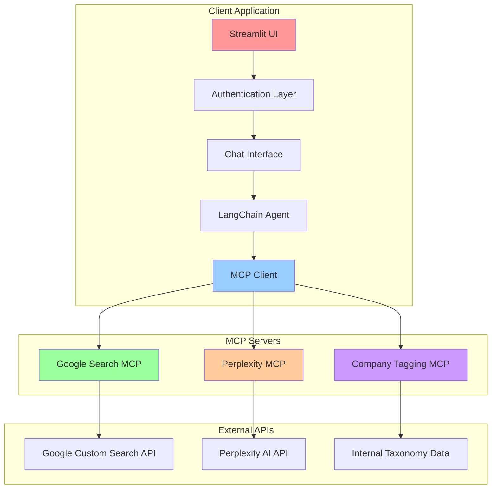

# 🔍 AI-Powered Search MCP Client

**A Multi-Engine Search Platform with Authentication, SSL Support & Advanced Company Tagging**

[](https://modelcontextprotocol.io)
[](https://streamlit.io)
[](https://python.org)
[](https://docker.com)
[](#security-features)

## 🌟 Overview

This is a sophisticated **Model Context Protocol (MCP) client** built with Streamlit that provides AI-powered web search capabilities through multiple search engines. The application serves as a secure, enterprise-ready interface for connecting AI models to external data sources via the standardized MCP protocol introduced by Anthropic in November 2024.

### What is MCP?

The **Model Context Protocol (MCP)** is an open standard that enables AI applications to connect with external tools, data sources, and systems through a standardized interface. Think of it as "USB for AI integrations" - instead of building custom connectors for every AI-tool combination, MCP provides a universal protocol that transforms the complex "N×M problem" into a simpler "N+M solution."

## 🚀 Key Features

### 🔍 **Multi-Engine Search Platform**
- **Google Search Integration**: Comprehensive web search using Google Custom Search API
- **Perplexity AI Search**: AI-powered search with intelligent analysis and synthesis
- **Company Tagging Workflow**: Specialized company categorization for trade show exhibitors
- **Real-time Content Extraction**: Clean webpage content analysis with automatic formatting

### 🔐 **Enterprise-Grade Security**
- **User Authentication System**: bcrypt password hashing with session management
- **SSL/HTTPS Support**: Self-signed certificates with automatic generation
- **Role-Based Access Control**: Pre-authorized email domains and user validation
- **Secure Cookie Management**: Configurable authentication with custom keys

### 🤖 **Advanced AI Integration**
- **Multi-Provider Support**: OpenAI GPT-4o, Azure OpenAI, and extensible provider system
- **LangChain Agent Framework**: Intelligent tool selection and execution
- **Conversation Memory**: Persistent chat history with context awareness
- **Enhanced Configuration**: Support for multiple AI providers in enhanced mode

### 🏗️ **Modern Architecture**
- **MCP Server Integration**: Support for SSE and stdio transport protocols
- **Responsive UI**: Modern tabbed interface with customizable themes
- **Docker Deployment**: Production-ready containerization with health checks
- **Real-time Streaming**: Live response streaming with tool execution tracking

## 📋 Table of Contents

- [Architecture Overview](#architecture-overview)
- [Quick Start](#quick-start)
- [Installation](#installation)
- [Configuration](#configuration)
- [Usage Guide](#usage-guide)
- [MCP Server Integration](#mcp-server-integration)
- [Security Features](#security-features)
- [Deployment](#deployment)
- [Development](#development)
- [Troubleshooting](#troubleshooting)
- [Contributing](#contributing)

## 🏗️ Architecture Overview



### Core Components

1. **Streamlit Frontend**: Modern web interface with authentication and chat capabilities
2. **Authentication System**: Secure user management with bcrypt and session control
3. **MCP Client**: Universal interface for connecting to multiple MCP servers
4. **LangChain Agent**: Intelligent routing and tool execution with conversation memory
5. **Search Engines**: Dual-engine search with Google and Perplexity integration
6. **Company Tagging**: Specialized workflow for trade show exhibitor categorization

## 🚀 Quick Start

### Prerequisites

- **Python 3.11+**
- **Docker** (optional, for containerized deployment)
- **Google Custom Search API** credentials
- **OpenAI API key** or **Azure OpenAI** configuration
- **Perplexity API key** (optional, for Perplexity search features)

### 1. Environment Setup

Create a `.env` file in the project root:

```env
# AI Provider Configuration (choose one)
OPENAI_API_KEY=your_openai_api_key_here

# OR Azure OpenAI Configuration
AZURE_API_KEY=your_azure_api_key
AZURE_ENDPOINT=https://your-endpoint.openai.azure.com/
AZURE_DEPLOYMENT=your_deployment_name
AZURE_API_VERSION=2023-12-01-preview

# Google Search Configuration
GOOGLE_API_KEY=your_google_api_key
GOOGLE_SEARCH_ENGINE_ID=your_custom_search_engine_id

# Perplexity Configuration (Optional)
PERPLEXITY_API_KEY=your_perplexity_api_key
PERPLEXITY_MODEL=sonar

# SSL Configuration (Optional)
SSL_ENABLED=true
```

### 2. Authentication Setup

Generate user credentials:

```bash
cd client
python simple_generate_password.py
```

This creates `keys/config.yaml` with default users:
- **admin**: `very_Secure_p@ssword_123!`
- **juan**: `Larisa1000@`
- **giovanni_romero**: `MrRomero2024!`
- **demo_user**: `strong_password_123!`

### 3. Quick Launch

```bash
# Install dependencies
pip install -r client/requirements.txt

# Start the application
cd client
streamlit run app.py
```

Access the application:
- **HTTP**: http://localhost:8501
- **HTTPS**: https://localhost:8503 (if SSL enabled)

## 📦 Installation

### Local Development

1. **Clone the Repository**
   ```bash
   git clone <repository-url>
   cd google-search-mcp-client
   ```

2. **Install Dependencies**
   ```bash
   cd client
   pip install -r requirements.txt
   ```

3. **Configure MCP Servers**
   
   Edit `servers_config.json`:
   ```json
   {
     "mcpServers": {
       "Google Search": {
         "transport": "sse",
         "url": "http://your-google-search-mcp-server:8002/sse",
         "timeout": 600,
         "sse_read_timeout": 900
       },
       "Perplexity Search": {
         "transport": "sse", 
         "url": "http://your-perplexity-mcp-server:8001/sse",
         "timeout": 600,
         "sse_read_timeout": 900
       },
       "Company Tagging": {
         "transport": "stdio",
         "command": "python",
         "args": ["-m", "mcp_servers.company_tagging.server"],
         "env": {
           "PERPLEXITY_API_KEY": "${PERPLEXITY_API_KEY}",
           "PERPLEXITY_MODEL": "${PERPLEXITY_MODEL}"
         }
       }
     }
   }
   ```

4. **Start the Application**
   ```bash
   streamlit run app.py
   ```

### Docker Deployment

1. **Build Docker Image**
   ```bash
   docker build -t google-search-mcp-client .
   ```

2. **Run with Docker**
   ```bash
   docker run -p 8501:8501 -p 8503:8503 \
     -e OPENAI_API_KEY=your_key \
     -e GOOGLE_API_KEY=your_google_key \
     -e GOOGLE_SEARCH_ENGINE_ID=your_search_engine_id \
     -e SSL_ENABLED=true \
     -v $(pwd)/.env:/app/.env \
     -v $(pwd)/keys:/app/keys \
     google-search-mcp-client
   ```

## ⚙️ Configuration

### AI Provider Configuration

The application supports multiple AI providers:

#### Basic Configuration (OpenAI & Azure OpenAI)
- **OpenAI**: Requires `OPENAI_API_KEY`
- **Azure OpenAI**: Requires `AZURE_API_KEY`, `AZURE_ENDPOINT`, `AZURE_DEPLOYMENT`, `AZURE_API_VERSION`

#### Enhanced Configuration Mode
Enable **Enhanced Mode** in the Configuration tab for support of:
- **Anthropic Claude**: Claude 3.5 Sonnet, Claude 3 Haiku, Claude 3 Opus
- **Google Gemini**: Gemini 1.5 Pro, Gemini 1.5 Flash, Gemini Pro
- **Cohere**: Command R+, Command R, Command
- **Mistral AI**: Mistral Large, Medium, Small
- **Ollama (Local)**: Local model deployment support

### Google Search Setup

1. **Create Google Cloud Project**
   - Go to [Google Cloud Console](https://console.cloud.google.com)
   - Create a new project or select existing
   - Enable the Custom Search API

2. **Get API Credentials**
   - Navigate to **APIs & Services > Credentials**
   - Create API Key and restrict to Custom Search API

3. **Setup Custom Search Engine**
   - Go to [Google Custom Search](https://cse.google.com)
   - Create a new search engine
   - Copy the Search Engine ID

### SSL/HTTPS Configuration

For secure connections:

1. **Enable SSL**
   ```env
   SSL_ENABLED=true
   ```

2. **Automatic Certificate Generation**
   - Certificates are generated automatically on startup
   - Accessible via https://localhost:8503
   - Accept browser security warning for self-signed certificates

3. **Custom Certificates**
   ```bash
   # Generate custom certificates
   python generate_ssl_certificate.py
   
   # Or use shell script (Unix/Linux)
   bash generate_ssl_certificate.sh
   ```

## 📖 Usage Guide

### Authentication

1. **Login Process**
   - Use the sidebar authentication panel
   - Enter username and password from generated credentials
   - Session persists for 30 days (configurable)

2. **User Management**
   - Modify users in `simple_generate_password.py`
   - Regenerate `keys/config.yaml`
   - Restart application to load changes

### Search Operations

#### Google Search Features
```
"Search for the latest developments in artificial intelligence"
"Find recent news about climate change"
"Search for Python programming tutorials"
```

#### Perplexity AI Features
```
"What are the current trends in web development?"
"Find and analyze multiple sources about cryptocurrency trends"
"Research the current state of renewable energy technology"
```

#### Content Extraction
```
"Search for climate reports and read the full content from the first result"
"Find the latest tech news and extract content from TechCrunch"
"Search for React documentation and read the official guide"
```

#### Company Tagging Workflow
```
"Tag companies for trade show categorization"
"Categorize the following companies for CAI show"
"Tag the following company data: [company information]"
```

### Interface Navigation

#### Configuration Tab
- **AI Provider Selection**: Choose between OpenAI, Azure OpenAI, or enhanced providers
- **Credentials Status**: Verify API key configuration
- **Model Parameters**: Adjust temperature, max tokens, and other settings
- **Enhanced Mode**: Enable multi-provider support

#### Connections Tab
- **Server Status**: View MCP server connection status
- **Connection Controls**: Connect/disconnect from servers
- **Server Configuration**: Manage server endpoints and settings
- **Testing Tools**: Test individual server connections

#### Tools Tab
- **Tool Categories**: Browse Google Search, Perplexity, and Company Tagging tools
- **Tool Documentation**: View parameters and usage examples
- **Resource Access**: Explore available MCP resources and prompts
- **Search Functionality**: Find specific tools by name or description

#### Chat Tab
- **Conversation Interface**: Natural language interaction with AI
- **Tool Execution History**: Monitor and debug tool usage
- **Multi-Engine Search**: Automatic selection of appropriate search engines
- **Company Tagging**: Specialized workflow for trade show categorization

## 🔌 MCP Server Integration

### Supported Transport Protocols

#### SSE (Server-Sent Events)
```json
{
  "transport": "sse",
  "url": "http://server:8002/sse",
  "timeout": 600,
  "sse_read_timeout": 900
}
```

#### STDIO (Standard Input/Output)
```json
{
  "transport": "stdio",
  "command": "python",
  "args": ["-m", "server_module"],
  "env": {
    "API_KEY": "${API_KEY}"
  }
}
```

#### Streamable HTTP (New Protocol - March 2025)
```json
{
  "transport": "streamable_http",
  "url": "http://server:3000/mcp",
  "timeout": 600
}
```

### Available MCP Tools

#### Google Search Tools
- **google-search**: Perform Google searches (1-10 results)
- **read-webpage**: Extract clean content from web pages

#### Perplexity AI Tools  
- **perplexity_search_web**: AI-powered web search with citations
- **perplexity_advanced_search**: Advanced search with model parameters

#### Company Tagging Tools
- **search_show_categories**: Access trade show category taxonomy
- **tag_companies**: Systematic company categorization prompt

### Custom MCP Server Development

Create your own MCP server:

```python
from mcp.server import Server
from mcp.types import Tool

server = Server("my-custom-server")

@server.list_tools()
async def list_tools():
    return [
        Tool(
            name="my_tool",
            description="Description of what the tool does",
            inputSchema={
                "type": "object",
                "properties": {
                    "param1": {"type": "string", "description": "Parameter description"}
                },
                "required": ["param1"]
            }
        )
    ]

@server.call_tool()
async def call_tool(name: str, arguments: dict):
    if name == "my_tool":
        # Tool implementation
        return [{"type": "text", "text": "Tool result"}]
```

## 🔐 Security Features

### Authentication Security
- **Password Hashing**: Industry-standard bcrypt with salt
- **Session Management**: Configurable timeout (30 days default)
- **Secure Cookies**: HTTPOnly and secure attributes
- **Access Control**: Pre-authorized email domain validation

### SSL/HTTPS Security
- **Self-Signed Certificates**: Automatic generation for development
- **Custom Certificates**: Support for production SSL certificates
- **Secure Headers**: Proper SSL configuration for Streamlit
- **Port Separation**: HTTP (8501) and HTTPS (8503) on different ports

### API Security
- **Environment Variables**: Secure credential storage
- **Token Validation**: Real-time API key verification
- **Input Sanitization**: XSS and injection protection
- **Error Handling**: Secure error messages without data exposure

### Data Protection
- **User Isolation**: Separate conversation histories per user
- **Session Tracking**: Login time and activity monitoring
- **Conversation Privacy**: Isolated chat sessions per user
- **Secure Cleanup**: Automatic session data management

## 🚀 Deployment

### Production Deployment

#### Docker Production Setup

1. **Production Dockerfile**
   ```dockerfile
   FROM python:3.11-slim-bullseye
   
   WORKDIR /app
   
   # Install system dependencies
   RUN apt-get update && apt-get install -y \
       openssl curl && rm -rf /var/lib/apt/lists/*
   
   COPY requirements.txt .
   RUN pip install --no-cache-dir -r requirements.txt
   
   COPY . .
   
   # Create necessary directories
   RUN mkdir -p keys ssl mcp_servers/company_tagging/categories
   
   # SSL setup
   COPY generate_ssl_certificate.sh startup_ssl.sh ./
   RUN chmod +x generate_ssl_certificate.sh startup_ssl.sh
   
   EXPOSE 8501 8503
   
   HEALTHCHECK --interval=30s --timeout=10s --start-period=40s \
       CMD curl -f http://localhost:8501 || exit 1
   
   CMD ["./startup_ssl.sh"]
   ```

2. **Docker Compose**
   ```yaml
   version: '3.8'
   services:
     mcp-client:
       build: .
       ports:
         - "8501:8501"
         - "8503:8503"
       environment:
         - OPENAI_API_KEY=${OPENAI_API_KEY}
         - GOOGLE_API_KEY=${GOOGLE_API_KEY}
         - GOOGLE_SEARCH_ENGINE_ID=${GOOGLE_SEARCH_ENGINE_ID}
         - SSL_ENABLED=true
       volumes:
         - ./keys:/app/keys
         - ./ssl:/app/ssl
       restart: unless-stopped
       healthcheck:
         test: ["CMD", "curl", "-f", "http://localhost:8501"]
         interval: 30s
         timeout: 10s
         retries: 3
   ```

#### Cloud Deployment

**AWS ECS/Fargate**
```bash
# Build and push to ECR
aws ecr get-login-password --region us-east-1 | docker login --username AWS --password-stdin <account>.dkr.ecr.us-east-1.amazonaws.com
docker build -t mcp-client .
docker tag mcp-client:latest <account>.dkr.ecr.us-east-1.amazonaws.com/mcp-client:latest
docker push <account>.dkr.ecr.us-east-1.amazonaws.com/mcp-client:latest
```

**Google Cloud Run**
```bash
# Deploy to Cloud Run
gcloud run deploy mcp-client \
  --image gcr.io/PROJECT_ID/mcp-client \
  --platform managed \
  --region us-central1 \
  --allow-unauthenticated \
  --port 8501
```

**Azure Container Instances**
```bash
# Deploy to Azure
az container create \
  --resource-group myResourceGroup \
  --name mcp-client \
  --image myregistry.azurecr.io/mcp-client:latest \
  --ports 8501 8503 \
  --environment-variables \
    OPENAI_API_KEY=your_key \
    SSL_ENABLED=true
```

### Load Balancing & Scaling

#### Nginx Configuration
```nginx
upstream mcp_backend {
    server localhost:8501;
    server localhost:8502;
    server localhost:8503;
}

server {
    listen 80;
    server_name your-domain.com;
    
    location / {
        proxy_pass http://mcp_backend;
        proxy_set_header Host $host;
        proxy_set_header X-Real-IP $remote_addr;
        proxy_set_header X-Forwarded-For $proxy_add_x_forwarded_for;
        proxy_set_header X-Forwarded-Proto $scheme;
        
        # WebSocket support for Streamlit
        proxy_http_version 1.1;
        proxy_set_header Upgrade $http_upgrade;
        proxy_set_header Connection "upgrade";
    }
}
```

### Monitoring & Observability

#### Health Checks
```python
# Add to your deployment
@app.route('/health')
def health_check():
    return {
        'status': 'healthy',
        'timestamp': datetime.now().isoformat(),
        'mcp_connections': len(st.session_state.get('tools', [])),
        'authentication': 'enabled'
    }
```

#### Logging Configuration
```python
import logging

logging.basicConfig(
    level=logging.INFO,
    format='%(asctime)s - %(name)s - %(levelname)s - %(message)s',
    handlers=[
        logging.FileHandler('app.log'),
        logging.StreamHandler()
    ]
)
```

## 🛠️ Development

### Development Setup

1. **Development Environment**
   ```bash
   # Create virtual environment
   python -m venv venv
   source venv/bin/activate  # On Windows: venv\Scripts\activate
   
   # Install dependencies
   pip install -r requirements.txt
   
   # Install development dependencies
   pip install pytest black flake8 mypy
   ```

2. **Pre-commit Hooks**
   ```bash
   pip install pre-commit
   pre-commit install
   ```

3. **Environment Configuration**
   ```bash
   cp .env.example .env
   # Edit .env with your credentials
   ```

### Project Structure

```
client/
├── app.py                          # Main Streamlit application
├── config.py                       # Configuration management
├── requirements.txt                # Python dependencies
├── servers_config.json             # MCP server configuration
├── .streamlit/
│   ├── config.toml                # Streamlit configuration
│   └── style.css                  # Custom CSS styling
├── services/
│   ├── ai_service.py              # AI provider integration
│   ├── chat_service.py            # Chat management
│   └── mcp_service.py             # MCP client operations
├── ui_components/
│   ├── sidebar_components.py      # Sidebar elements
│   ├── tab_components.py          # Tab content
│   ├── main_components.py         # Main UI components
│   └── enhanced_config.py         # Enhanced configuration
├── utils/
│   ├── ai_prompts.py              # AI prompt templates
│   ├── async_helpers.py           # Async utilities
│   └── tool_schema_parser.py      # Tool schema parsing
├── mcp_servers/
│   └── company_tagging/           # Embedded MCP server
│       ├── server.py              # Company tagging server
│       └── categories/
│           └── classes.csv        # Taxonomy data
├── keys/                          # Authentication files
├── ssl/                           # SSL certificates
└── icons/                         # Application icons
```

### Adding New Features

#### Adding a New AI Provider
```python
# In ai_service.py
def create_llm_model(llm_provider: str, **kwargs):
    if llm_provider == "New Provider":
        api_key = os.getenv("NEW_PROVIDER_API_KEY")
        return NewProviderLLM(
            api_key=api_key,
            model="new-model",
            temperature=kwargs.get('temperature', 0.7)
        )
```

#### Adding a New MCP Server
```json
// In servers_config.json
{
  "mcpServers": {
    "New Server": {
      "transport": "sse",
      "url": "http://new-server:8004/sse",
      "timeout": 600,
      "sse_read_timeout": 900
    }
  }
}
```

#### Adding Custom UI Components
```python
# In ui_components/custom_components.py
def create_custom_widget():
    """Create a custom UI widget."""
    with st.container(border=True):
        st.subheader("Custom Feature")
        # Your custom implementation
```

### Testing

#### Unit Tests
```bash
# Run unit tests
pytest tests/

# Run with coverage
pytest --cov=client tests/
```

#### Integration Tests
```bash
# Test MCP server connections
python test_mcp_integration.py

# Test authentication
python test_auth_integration.py
```

#### Manual Testing
```bash
# Test SSL certificate generation
python generate_ssl_certificate.py

# Test password generation
python simple_generate_password.py

# Debug SSL configuration
bash debug_ssl.sh
```

## 🐛 Troubleshooting

### Common Issues

#### Authentication Problems
```bash
# Issue: Login fails with correct credentials
# Solution: Regenerate password hashes
python simple_generate_password.py

# Issue: Session expires immediately
# Check: keys/config.yaml cookie configuration
```

#### MCP Connection Issues
```bash
# Issue: Cannot connect to MCP servers
# Debug: Check server configuration
cat servers_config.json

# Test: Server accessibility
curl http://server:8002/sse

# Solution: Update server URLs in config
```

#### SSL Certificate Issues
```bash
# Issue: Browser shows security warnings
# Solution: Accept self-signed certificate warning

# Issue: Certificate generation fails
# Debug: Check SSL status
bash debug_ssl.sh

# Solution: Regenerate certificates
python generate_ssl_certificate.py
```

#### API Key Issues
```bash
# Issue: OpenAI API key not working
# Check: Environment variable loading
echo $OPENAI_API_KEY

# Issue: Google Search not working
# Verify: API key and Search Engine ID
# Test: API quota and permissions
```

#### Performance Issues
```bash
# Issue: Slow response times
# Solution: Adjust timeout settings in servers_config.json

# Issue: Memory usage high
# Solution: Restart application, check conversation history size

# Issue: Tool execution fails
# Debug: Check tool execution history in UI
```

### Debug Mode

Enable debugging:
```python
# In app.py
import logging
logging.basicConfig(level=logging.DEBUG)

# Enable Streamlit debug mode
st.set_page_config(
    page_title="Debug Mode",
    layout='wide',
    initial_sidebar_state="expanded"
)
```

View debug information:
- Use "Tool Execution History" expander
- Check browser console for JavaScript errors
- Monitor Streamlit logs in terminal
- Review authentication logs

### Log Analysis

```bash
# Application logs
tail -f app.log

# Container logs (Docker)
docker logs -f container_name

# SSL debug
bash debug_ssl.sh

# MCP server logs
# Check individual server documentation
```

## 📚 Additional Resources

### Official Documentation
- [Model Context Protocol Specification](https://spec.modelcontextprotocol.io/)
- [Anthropic MCP Documentation](https://docs.anthropic.com/en/docs/mcp)
- [MCP GitHub Repository](https://github.com/modelcontextprotocol)

### Community Resources
- [MCP Market](https://mcpmarket.com/) - Discover MCP servers
- [MCP Community Forum](https://github.com/modelcontextprotocol/discussions)
- [Awesome MCP](https://github.com/punkpeye/awesome-mcp) - Curated list of MCP resources

### Related Projects
- [Claude Desktop](https://claude.ai/download) - Official MCP client
- [Cursor IDE](https://cursor.sh/) - MCP-enabled code editor
- [Cline](https://github.com/clinebot/cline) - VS Code MCP extension

## 🤝 Contributing

We welcome contributions! Please see our [Contributing Guide](CONTRIBUTING.md) for details.

### Development Workflow
1. Fork the repository
2. Create a feature branch (`git checkout -b feature/amazing-feature`)
3. Commit your changes (`git commit -m 'Add amazing feature'`)
4. Push to the branch (`git push origin feature/amazing-feature`)
5. Open a Pull Request

### Code Standards
- Follow PEP 8 for Python code
- Use type hints where possible
- Write comprehensive docstrings
- Add tests for new features
- Update documentation

## 📄 License

This project is licensed under the MIT License - see the [LICENSE](LICENSE) file for details.

## 🙏 Acknowledgments

- **Anthropic** for creating the Model Context Protocol
- **Streamlit** for the excellent web framework
- **LangChain** for the agent framework
- **The MCP Community** for tools and inspiration

