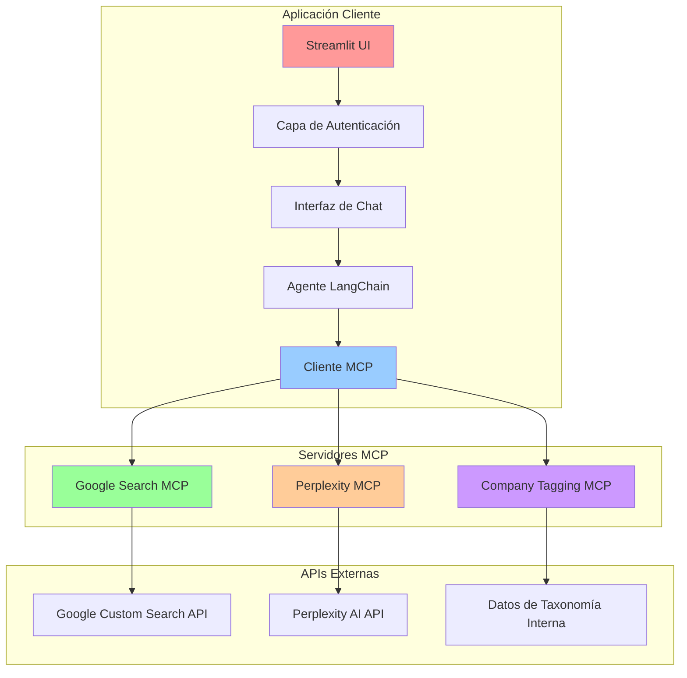

# 🔍 Cliente MCP de Búsqueda con IA

**Una Plataforma de Búsqueda Multi-Motor con Autenticación, Soporte SSL y Etiquetado Avanzado de Empresas**

[](https://modelcontextprotocol.io)
[](https://streamlit.io)
[](https://python.org)
[](https://docker.com)
[](#características-de-seguridad)

## 🌟 Resumen

Este es un sofisticado **cliente Model Context Protocol (MCP)** construido con Streamlit que proporciona capacidades de búsqueda web potenciadas por IA a través de múltiples motores de búsqueda. La aplicación sirve como una interfaz segura y lista para empresas para conectar modelos de IA con fuentes de datos externas a través del protocolo MCP estandarizado introducido por Anthropic en noviembre de 2024.

### ¿Qué es MCP?

El **Model Context Protocol (MCP)** es un estándar abierto que permite a las aplicaciones de IA conectarse con herramientas externas, fuentes de datos y sistemas a través de una interfaz estandarizada. Piénsalo como "USB para integraciones de IA" - en lugar de construir conectores personalizados para cada combinación de IA-herramienta, MCP proporciona un protocolo universal que transforma el complejo "problema N×M" en una solución "N+M" más simple.

## 🚀 Características Principales

### 🔍 **Plataforma de Búsqueda Multi-Motor**
- **Integración Google Search**: Búsqueda web completa usando Google Custom Search API
- **Perplexity AI Search**: Búsqueda potenciada por IA con análisis inteligente y síntesis
- **Flujo de Trabajo de Etiquetado de Empresas**: Categorización especializada de empresas para expositores de ferias comerciales
- **Extracción de Contenido en Tiempo Real**: Análisis de contenido web limpio con formato automático

### 🔐 **Seguridad de Nivel Empresarial**
- **Sistema de Autenticación de Usuario**: Hash de contraseñas bcrypt con gestión de sesiones
- **Soporte SSL/HTTPS**: Certificados auto-firmados con generación automática
- **Control de Acceso Basado en Roles**: Dominios de email pre-autorizados y validación de usuarios
- **Gestión Segura de Cookies**: Autenticación configurable con claves personalizadas

### 🤖 **Integración Avanzada de IA**
- **Soporte Multi-Proveedor**: OpenAI GPT-4o, Azure OpenAI, y sistema de proveedores extensible
- **Framework de Agente LangChain**: Selección y ejecución inteligente de herramientas
- **Memoria de Conversación**: Historial de chat persistente con conciencia de contexto
- **Configuración Mejorada**: Soporte para múltiples proveedores de IA en modo mejorado

### 🏗️ **Arquitectura Moderna**
- **Integración de Servidor MCP**: Soporte para protocolos de transporte SSE y stdio
- **UI Responsiva**: Interfaz moderna con pestañas y temas personalizables
- **Despliegue Docker**: Contenedorización lista para producción con verificaciones de salud
- **Streaming en Tiempo Real**: Streaming de respuestas en vivo con seguimiento de ejecución de herramientas

## 📋 Tabla de Contenidos

- [Resumen de Arquitectura](#resumen-de-arquitectura)
- [Inicio Rápido](#inicio-rápido)
- [Instalación](#instalación)
- [Configuración](#configuración)
- [Guía de Uso](#guía-de-uso)
- [Integración de Servidor MCP](#integración-de-servidor-mcp)
- [Características de Seguridad](#características-de-seguridad)
- [Despliegue](#despliegue)
- [Desarrollo](#desarrollo)
- [Solución de Problemas](#solución-de-problemas)
- [Contribuir](#contribuir)

## 🏗️ Resumen de Arquitectura



### Componentes Principales

1. **Frontend Streamlit**: Interfaz web moderna con autenticación y capacidades de chat
2. **Sistema de Autenticación**: Gestión segura de usuarios con bcrypt y control de sesiones
3. **Cliente MCP**: Interfaz universal para conectar con múltiples servidores MCP
4. **Agente LangChain**: Enrutamiento inteligente y ejecución de herramientas con memoria de conversación
5. **Motores de Búsqueda**: Búsqueda de motor dual con integración Google y Perplexity
6. **Etiquetado de Empresas**: Flujo de trabajo especializado para categorización de expositores de ferias comerciales

## 🚀 Inicio Rápido

### Requisitos Previos

- **Python 3.11+**
- **Docker** (opcional, para despliegue contenedorizado)
- Credenciales de **Google Custom Search API**
- **Clave API de OpenAI** o configuración de **Azure OpenAI**
- **Clave API de Perplexity** (opcional, para características de búsqueda Perplexity)

### 1. Configuración del Entorno

Crea un archivo `.env` en la raíz del proyecto:

```env
# Configuración del Proveedor de IA (elegir uno)
OPENAI_API_KEY=tu_clave_api_openai_aqui

# O Configuración Azure OpenAI
AZURE_API_KEY=tu_clave_api_azure
AZURE_ENDPOINT=https://tu-endpoint.openai.azure.com/
AZURE_DEPLOYMENT=nombre_de_tu_deployment
AZURE_API_VERSION=2023-12-01-preview

# Configuración Google Search
GOOGLE_API_KEY=tu_clave_api_google
GOOGLE_SEARCH_ENGINE_ID=tu_id_motor_busqueda_personalizado

# Configuración Perplexity (Opcional)
PERPLEXITY_API_KEY=tu_clave_api_perplexity
PERPLEXITY_MODEL=sonar

# Configuración SSL (Opcional)
SSL_ENABLED=true
```

### 2. Configuración de Autenticación

Genera credenciales de usuario:

```bash
cd client
python simple_generate_password.py
```

Esto crea `keys/config.yaml` con usuarios por defecto:
- **admin**: `very_Secure_p@ssword_123!`
- **juan**: `Larisa1000@`
- **giovanni_romero**: `MrRomero2024!`
- **demo_user**: `strong_password_123!`

### 3. Lanzamiento Rápido

```bash
# Instalar dependencias
pip install -r client/requirements.txt

# Iniciar la aplicación
cd client
streamlit run app.py
```

Accede a la aplicación:
- **HTTP**: http://localhost:8501
- **HTTPS**: https://localhost:8503 (si SSL está habilitado)

## 📦 Instalación

### Desarrollo Local

1. **Clonar el Repositorio**
   ```bash
   git clone <url-del-repositorio>
   cd google-search-mcp-client
   ```

2. **Instalar Dependencias**
   ```bash
   cd client
   pip install -r requirements.txt
   ```

3. **Configurar Servidores MCP**
   
   Edita `servers_config.json`:
   ```json
   {
     "mcpServers": {
       "Google Search": {
         "transport": "sse",
         "url": "http://tu-servidor-google-search-mcp:8002/sse",
         "timeout": 600,
         "sse_read_timeout": 900
       },
       "Perplexity Search": {
         "transport": "sse", 
         "url": "http://tu-servidor-perplexity-mcp:8001/sse",
         "timeout": 600,
         "sse_read_timeout": 900
       },
       "Company Tagging": {
         "transport": "stdio",
         "command": "python",
         "args": ["-m", "mcp_servers.company_tagging.server"],
         "env": {
           "PERPLEXITY_API_KEY": "${PERPLEXITY_API_KEY}",
           "PERPLEXITY_MODEL": "${PERPLEXITY_MODEL}"
         }
       }
     }
   }
   ```

4. **Iniciar la Aplicación**
   ```bash
   streamlit run app.py
   ```

### Despliegue Docker

1. **Construir Imagen Docker**
   ```bash
   docker build -t google-search-mcp-client .
   ```

2. **Ejecutar con Docker**
   ```bash
   docker run -p 8501:8501 -p 8503:8503 \
     -e OPENAI_API_KEY=tu_clave \
     -e GOOGLE_API_KEY=tu_clave_google \
     -e GOOGLE_SEARCH_ENGINE_ID=tu_id_motor_busqueda \
     -e SSL_ENABLED=true \
     -v $(pwd)/.env:/app/.env \
     -v $(pwd)/keys:/app/keys \
     google-search-mcp-client
   ```

## ⚙️ Configuración

### Configuración de Proveedor de IA

La aplicación soporta múltiples proveedores de IA:

#### Configuración Básica (OpenAI y Azure OpenAI)
- **OpenAI**: Requiere `OPENAI_API_KEY`
- **Azure OpenAI**: Requiere `AZURE_API_KEY`, `AZURE_ENDPOINT`, `AZURE_DEPLOYMENT`, `AZURE_API_VERSION`

#### Modo de Configuración Mejorada
Habilita **Modo Mejorado** en la pestaña Configuración para soporte de:
- **Anthropic Claude**: Claude 3.5 Sonnet, Claude 3 Haiku, Claude 3 Opus
- **Google Gemini**: Gemini 1.5 Pro, Gemini 1.5 Flash, Gemini Pro
- **Cohere**: Command R+, Command R, Command
- **Mistral AI**: Mistral Large, Medium, Small
- **Ollama (Local)**: Soporte para despliegue de modelos locales

### Configuración Google Search

1. **Crear Proyecto Google Cloud**
   - Ve a [Google Cloud Console](https://console.cloud.google.com)
   - Crea un nuevo proyecto o selecciona uno existente
   - Habilita la Custom Search API

2. **Obtener Credenciales API**
   - Navega a **APIs & Services > Credentials**
   - Crea una Clave API y restringe a Custom Search API

3. **Configurar Custom Search Engine**
   - Ve a [Google Custom Search](https://cse.google.com)
   - Crea un nuevo motor de búsqueda
   - Copia el Search Engine ID

### Configuración SSL/HTTPS

Para conexiones seguras:

1. **Habilitar SSL**
   ```env
   SSL_ENABLED=true
   ```

2. **Generación Automática de Certificados**
   - Los certificados se generan automáticamente al inicio
   - Accesible vía https://localhost:8503
   - Acepta la advertencia de seguridad del navegador para certificados auto-firmados

3. **Certificados Personalizados**
   ```bash
   # Generar certificados personalizados
   python generate_ssl_certificate.py
   
   # O usar script shell (Unix/Linux)
   bash generate_ssl_certificate.sh
   ```

## 📖 Guía de Uso

### Autenticación

1. **Proceso de Inicio de Sesión**
   - Usa el panel de autenticación de la barra lateral
   - Ingresa usuario y contraseña de las credenciales generadas
   - La sesión persiste por 30 días (configurable)

2. **Gestión de Usuarios**
   - Modifica usuarios en `simple_generate_password.py`
   - Regenera `keys/config.yaml`
   - Reinicia la aplicación para cargar cambios

### Operaciones de Búsqueda

#### Características Google Search
```
"Busca los últimos desarrollos en inteligencia artificial"
"Encuentra noticias recientes sobre cambio climático"
"Busca tutoriales de programación Python"
```

#### Características Perplexity AI
```
"¿Cuáles son las tendencias actuales en desarrollo web?"
"Encuentra y analiza múltiples fuentes sobre tendencias de criptomonedas"
"Investiga el estado actual de la tecnología de energía renovable"
```

#### Extracción de Contenido
```
"Busca reportes sobre clima y lee el contenido completo del primer resultado"
"Encuentra las últimas noticias tecnológicas y extrae contenido de TechCrunch"
"Busca documentación de React y lee la guía oficial"
```

#### Flujo de Trabajo de Etiquetado de Empresas
```
"Etiqueta empresas para categorización de feria comercial"
"Categoriza las siguientes empresas para la feria CAI"
"Etiqueta los siguientes datos de empresa: [información de empresa]"
```

### Navegación de la Interfaz

#### Pestaña Configuración
- **Selección de Proveedor de IA**: Elige entre OpenAI, Azure OpenAI, o proveedores mejorados
- **Estado de Credenciales**: Verifica la configuración de claves API
- **Parámetros del Modelo**: Ajusta temperatura, tokens máximos, y otras configuraciones
- **Modo Mejorado**: Habilita soporte multi-proveedor

#### Pestaña Conexiones
- **Estado del Servidor**: Ver estado de conexión del servidor MCP
- **Controles de Conexión**: Conectar/desconectar de servidores
- **Configuración de Servidor**: Gestionar endpoints y configuraciones de servidor
- **Herramientas de Prueba**: Probar conexiones de servidores individuales

#### Pestaña Herramientas
- **Categorías de Herramientas**: Navegar herramientas Google Search, Perplexity, y Company Tagging
- **Documentación de Herramientas**: Ver parámetros y ejemplos de uso
- **Acceso a Recursos**: Explorar recursos MCP disponibles y prompts
- **Funcionalidad de Búsqueda**: Encontrar herramientas específicas por nombre o descripción

#### Pestaña Chat
- **Interfaz de Conversación**: Interacción en lenguaje natural con IA
- **Historial de Ejecución de Herramientas**: Monitorear y depurar uso de herramientas
- **Búsqueda Multi-Motor**: Selección automática de motores de búsqueda apropiados
- **Etiquetado de Empresas**: Flujo de trabajo especializado para categorización de ferias comerciales

## 🔌 Integración de Servidor MCP

### Protocolos de Transporte Soportados

#### SSE (Server-Sent Events)
```json
{
  "transport": "sse",
  "url": "http://servidor:8002/sse",
  "timeout": 600,
  "sse_read_timeout": 900
}
```

#### STDIO (Standard Input/Output)
```json
{
  "transport": "stdio",
  "command": "python",
  "args": ["-m", "modulo_servidor"],
  "env": {
    "API_KEY": "${API_KEY}"
  }
}
```

#### Streamable HTTP (Nuevo Protocolo - Marzo 2025)
```json
{
  "transport": "streamable_http",
  "url": "http://servidor:3000/mcp",
  "timeout": 600
}
```

### Herramientas MCP Disponibles

#### Herramientas Google Search
- **google-search**: Realizar búsquedas Google (1-10 resultados)
- **read-webpage**: Extraer contenido limpio de páginas web

#### Herramientas Perplexity AI  
- **perplexity_search_web**: Búsqueda web potenciada por IA con citas
- **perplexity_advanced_search**: Búsqueda avanzada con parámetros de modelo

#### Herramientas Company Tagging
- **search_show_categories**: Acceder taxonomía de categorías de ferias comerciales
- **tag_companies**: Prompt sistemático de categorización de empresas

### Desarrollo de Servidor MCP Personalizado

Crea tu propio servidor MCP:

```python
from mcp.server import Server
from mcp.types import Tool

server = Server("mi-servidor-personalizado")

@server.list_tools()
async def list_tools():
    return [
        Tool(
            name="mi_herramienta",
            description="Descripción de lo que hace la herramienta",
            inputSchema={
                "type": "object",
                "properties": {
                    "param1": {"type": "string", "description": "Descripción del parámetro"}
                },
                "required": ["param1"]
            }
        )
    ]

@server.call_tool()
async def call_tool(name: str, arguments: dict):
    if name == "mi_herramienta":
        # Implementación de la herramienta
        return [{"type": "text", "text": "Resultado de la herramienta"}]
```

## 🔐 Características de Seguridad

### Seguridad de Autenticación
- **Hash de Contraseñas**: bcrypt estándar de la industria con salt
- **Gestión de Sesiones**: Timeout configurable (30 días por defecto)
- **Cookies Seguras**: Atributos HTTPOnly y secure
- **Control de Acceso**: Validación de dominios de email pre-autorizados

### Seguridad SSL/HTTPS
- **Certificados Auto-firmados**: Generación automática para desarrollo
- **Certificados Personalizados**: Soporte para certificados SSL de producción
- **Headers Seguros**: Configuración SSL apropiada para Streamlit
- **Separación de Puertos**: HTTP (8501) y HTTPS (8503) en puertos diferentes

### Seguridad API
- **Variables de Entorno**: Almacenamiento seguro de credenciales
- **Validación de Tokens**: Verificación de claves API en tiempo real
- **Sanitización de Entrada**: Protección XSS e inyección
- **Manejo de Errores**: Mensajes de error seguros sin exposición de datos

### Protección de Datos
- **Aislamiento de Usuario**: Historiales de conversación separados por usuario
- **Seguimiento de Sesión**: Monitoreo de tiempo de inicio de sesión y actividad
- **Privacidad de Conversación**: Sesiones de chat aisladas por usuario
- **Limpieza Segura**: Gestión automática de datos de sesión

## 🚀 Despliegue

### Despliegue de Producción

#### Configuración Docker de Producción

1. **Dockerfile de Producción**
   ```dockerfile
   FROM python:3.11-slim-bullseye
   
   WORKDIR /app
   
   # Instalar dependencias del sistema
   RUN apt-get update && apt-get install -y \
       openssl curl && rm -rf /var/lib/apt/lists/*
   
   COPY requirements.txt .
   RUN pip install --no-cache-dir -r requirements.txt
   
   COPY . .
   
   # Crear directorios necesarios
   RUN mkdir -p keys ssl mcp_servers/company_tagging/categories
   
   # Configuración SSL
   COPY generate_ssl_certificate.sh startup_ssl.sh ./
   RUN chmod +x generate_ssl_certificate.sh startup_ssl.sh
   
   EXPOSE 8501 8503
   
   HEALTHCHECK --interval=30s --timeout=10s --start-period=40s \
       CMD curl -f http://localhost:8501 || exit 1
   
   CMD ["./startup_ssl.sh"]
   ```

2. **Docker Compose**
   ```yaml
   version: '3.8'
   services:
     mcp-client:
       build: .
       ports:
         - "8501:8501"
         - "8503:8503"
       environment:
         - OPENAI_API_KEY=${OPENAI_API_KEY}
         - GOOGLE_API_KEY=${GOOGLE_API_KEY}
         - GOOGLE_SEARCH_ENGINE_ID=${GOOGLE_SEARCH_ENGINE_ID}
         - SSL_ENABLED=true
       volumes:
         - ./keys:/app/keys
         - ./ssl:/app/ssl
       restart: unless-stopped
       healthcheck:
         test: ["CMD", "curl", "-f", "http://localhost:8501"]
         interval: 30s
         timeout: 10s
         retries: 3
   ```

#### Despliegue en la Nube

**AWS ECS/Fargate**
```bash
# Construir y subir a ECR
aws ecr get-login-password --region us-east-1 | docker login --username AWS --password-stdin <cuenta>.dkr.ecr.us-east-1.amazonaws.com
docker build -t mcp-client .
docker tag mcp-client:latest <cuenta>.dkr.ecr.us-east-1.amazonaws.com/mcp-client:latest
docker push <cuenta>.dkr.ecr.us-east-1.amazonaws.com/mcp-client:latest
```

**Google Cloud Run**
```bash
# Desplegar a Cloud Run
gcloud run deploy mcp-client \
  --image gcr.io/PROJECT_ID/mcp-client \
  --platform managed \
  --region us-central1 \
  --allow-unauthenticated \
  --port 8501
```

**Azure Container Instances**
```bash
# Desplegar a Azure
az container create \
  --resource-group miGrupoDeRecursos \
  --name mcp-client \
  --image miregistro.azurecr.io/mcp-client:latest \
  --ports 8501 8503 \
  --environment-variables \
    OPENAI_API_KEY=tu_clave \
    SSL_ENABLED=true
```

### Balanceador de Carga y Escalado

#### Configuración Nginx
```nginx
upstream mcp_backend {
    server localhost:8501;
    server localhost:8502;
    server localhost:8503;
}

server {
    listen 80;
    server_name tu-dominio.com;
    
    location / {
        proxy_pass http://mcp_backend;
        proxy_set_header Host $host;
        proxy_set_header X-Real-IP $remote_addr;
        proxy_set_header X-Forwarded-For $proxy_add_x_forwarded_for;
        proxy_set_header X-Forwarded-Proto $scheme;
        
        # Soporte WebSocket para Streamlit
        proxy_http_version 1.1;
        proxy_set_header Upgrade $http_upgrade;
        proxy_set_header Connection "upgrade";
    }
}
```

### Monitoreo y Observabilidad

#### Verificaciones de Salud
```python
# Añadir a tu despliegue
@app.route('/health')
def health_check():
    return {
        'status': 'healthy',
        'timestamp': datetime.now().isoformat(),
        'mcp_connections': len(st.session_state.get('tools', [])),
        'authentication': 'enabled'
    }
```

#### Configuración de Logging
```python
import logging

logging.basicConfig(
    level=logging.INFO,
    format='%(asctime)s - %(name)s - %(levelname)s - %(message)s',
    handlers=[
        logging.FileHandler('app.log'),
        logging.StreamHandler()
    ]
)
```

## 🛠️ Desarrollo

### Configuración de Desarrollo

1. **Entorno de Desarrollo**
   ```bash
   # Crear entorno virtual
   python -m venv venv
   source venv/bin/activate  # En Windows: venv\Scripts\activate
   
   # Instalar dependencias
   pip install -r requirements.txt
   
   # Instalar dependencias de desarrollo
   pip install pytest black flake8 mypy
   ```

2. **Hooks Pre-commit**
   ```bash
   pip install pre-commit
   pre-commit install
   ```

3. **Configuración del Entorno**
   ```bash
   cp .env.example .env
   # Edita .env con tus credenciales
   ```

### Estructura del Proyecto

```
client/
├── app.py                          # Aplicación principal Streamlit
├── config.py                       # Gestión de configuración
├── requirements.txt                # Dependencias Python
├── servers_config.json             # Configuración servidor MCP
├── .streamlit/
│   ├── config.toml                # Configuración Streamlit
│   └── style.css                  # Estilos CSS personalizados
├── services/
│   ├── ai_service.py              # Integración proveedor IA
│   ├── chat_service.py            # Gestión de chat
│   └── mcp_service.py             # Operaciones cliente MCP
├── ui_components/
│   ├── sidebar_components.py      # Elementos de barra lateral
│   ├── tab_components.py          # Contenido de pestañas
│   ├── main_components.py         # Componentes UI principales
│   └── enhanced_config.py         # Configuración mejorada
├── utils/
│   ├── ai_prompts.py              # Plantillas de prompts IA
│   ├── async_helpers.py           # Utilidades async
│   └── tool_schema_parser.py      # Parsing de esquemas de herramientas
├── mcp_servers/
│   └── company_tagging/           # Servidor MCP embebido
│       ├── server.py              # Servidor etiquetado empresas
│       └── categories/
│           └── classes.csv        # Datos de taxonomía
├── keys/                          # Archivos de autenticación
├── ssl/                           # Certificados SSL
└── icons/                         # Iconos de aplicación
```

### Añadir Nuevas Características

#### Añadir un Nuevo Proveedor de IA
```python
# En ai_service.py
def create_llm_model(llm_provider: str, **kwargs):
    if llm_provider == "Nuevo Proveedor":
        api_key = os.getenv("NEW_PROVIDER_API_KEY")
        return NuevoProveedorLLM(
            api_key=api_key,
            model="nuevo-modelo",
            temperature=kwargs.get('temperature', 0.7)
        )
```

#### Añadir un Nuevo Servidor MCP
```json
// En servers_config.json
{
  "mcpServers": {
    "Nuevo Servidor": {
      "transport": "sse",
      "url": "http://nuevo-servidor:8004/sse",
      "timeout": 600,
      "sse_read_timeout": 900
    }
  }
}
```

#### Añadir Componentes UI Personalizados
```python
# En ui_components/custom_components.py
def create_custom_widget():
    """Crear un widget UI personalizado."""
    with st.container(border=True):
        st.subheader("Característica Personalizada")
        # Tu implementación personalizada
```

### Pruebas

#### Pruebas Unitarias
```bash
# Ejecutar pruebas unitarias
pytest tests/

# Ejecutar con cobertura
pytest --cov=client tests/
```

#### Pruebas de Integración
```bash
# Probar conexiones servidor MCP
python test_mcp_integration.py

# Probar autenticación
python test_auth_integration.py
```

#### Pruebas Manuales
```bash
# Probar generación certificado SSL
python generate_ssl_certificate.py

# Probar generación contraseñas
python simple_generate_password.py

# Depurar configuración SSL
bash debug_ssl.sh
```

## 🐛 Solución de Problemas

### Problemas Comunes

#### Problemas de Autenticación
```bash
# Problema: El inicio de sesión falla con credenciales correctas
# Solución: Regenerar hashes de contraseñas
python simple_generate_password.py

# Problema: La sesión expira inmediatamente
# Verificar: configuración de cookies en keys/config.yaml
```

#### Problemas de Conexión MCP
```bash
# Problema: No se puede conectar a servidores MCP
# Depurar: Verificar configuración del servidor
cat servers_config.json

# Probar: Accesibilidad del servidor
curl http://servidor:8002/sse

# Solución: Actualizar URLs del servidor en configuración
```

#### Problemas de Certificado SSL
```bash
# Problema: El navegador muestra advertencias de seguridad
# Solución: Aceptar advertencia de certificado auto-firmado

# Problema: La generación de certificados falla
# Depurar: Verificar estado SSL
bash debug_ssl.sh

# Solución: Regenerar certificados
python generate_ssl_certificate.py
```

#### Problemas de Clave API
```bash
# Problema: La clave API de OpenAI no funciona
# Verificar: Carga de variable de entorno
echo $OPENAI_API_KEY

# Problema: Google Search no funciona
# Verificar: Clave API y Search Engine ID
# Probar: Cuota API y permisos
```

#### Problemas de Rendimiento
```bash
# Problema: Tiempos de respuesta lentos
# Solución: Ajustar configuraciones de timeout en servers_config.json

# Problema: Alto uso de memoria
# Solución: Reiniciar aplicación, verificar tamaño historial conversación

# Problema: Ejecución de herramientas falla
# Depurar: Verificar historial ejecución herramientas en UI
```

### Modo Debug

Habilitar depuración:
```python
# En app.py
import logging
logging.basicConfig(level=logging.DEBUG)

# Habilitar modo debug Streamlit
st.set_page_config(
    page_title="Modo Debug",
    layout='wide',
    initial_sidebar_state="expanded"
)
```

Ver información de debug:
- Usar expandible "Tool Execution History"
- Verificar consola del navegador para errores JavaScript
- Monitorear logs Streamlit en terminal
- Revisar logs de autenticación

### Análisis de Logs

```bash
# Logs de aplicación
tail -f app.log

# Logs de contenedor (Docker)
docker logs -f nombre_contenedor

# Debug SSL
bash debug_ssl.sh

# Logs servidor MCP
# Verificar documentación del servidor individual
```

## 📚 Recursos Adicionales

### Documentación Oficial
- [Especificación Model Context Protocol](https://spec.modelcontextprotocol.io/)
- [Documentación MCP de Anthropic](https://docs.anthropic.com/en/docs/mcp)
- [Repositorio GitHub MCP](https://github.com/modelcontextprotocol)

### Recursos de la Comunidad
- [MCP Market](https://mcpmarket.com/) - Descubrir servidores MCP
- [Foro Comunidad MCP](https://github.com/modelcontextprotocol/discussions)
- [Awesome MCP](https://github.com/punkpeye/awesome-mcp) - Lista curada de recursos MCP

### Proyectos Relacionados
- [Claude Desktop](https://claude.ai/download) - Cliente MCP oficial
- [Cursor IDE](https://cursor.sh/) - Editor de código habilitado para MCP
- [Cline](https://github.com/clinebot/cline) - Extensión MCP para VS Code

## 🤝 Contribuir

¡Damos la bienvenida a contribuciones! Por favor consulta nuestra [Guía de Contribución](CONTRIBUTING.md) para detalles.

### Flujo de Trabajo de Desarrollo
1. Haz fork del repositorio
2. Crea una rama de característica (`git checkout -b feature/caracteristica-increible`)
3. Haz commit de tus cambios (`git commit -m 'Añadir característica increíble'`)
4. Sube a la rama (`git push origin feature/caracteristica-increible`)
5. Abre un Pull Request

### Estándares de Código
- Sigue PEP 8 para código Python
- Usa type hints donde sea posible
- Escribe docstrings comprensivos
- Añade pruebas para nuevas características
- Actualiza documentación

## 📄 Licencia

Este proyecto está licenciado bajo la Licencia MIT - consulta el archivo [LICENSE](LICENSE) para detalles.

## 🙏 Reconocimientos

- **Anthropic** por crear el Model Context Protocol
- **Streamlit** por el excelente framework web
- **LangChain** por el framework de agentes
- **La Comunidad MCP** por herramientas e inspiración

