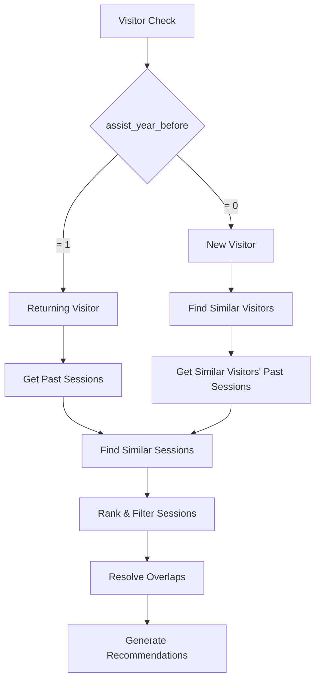

# Session Recommendation Algorithm

## Overview

The PA (Personal Agendas) system generates personalized session recommendations for event attendees based on their past attendance patterns and demographic similarity to other visitors. The algorithm handles two primary scenarios:

1. **Returning Visitors**: Attendees who have visited previous years' events
2. **New Visitors**: First-time attendees with no previous event history

## Core Algorithm Flow



## Returning Visitors (assist_year_before == "1")

### Step 1: Past Session Retrieval
- Query Neo4j for the visitor's past attendance using the `Same_Visitor` relationship
- Retrieve sessions from `Visitor_last_year_bva` and/or `Visitor_last_year_lva` nodes
- Handle cases where returning visitors may have no recorded past attendance

### Step 2: Similar Session Discovery
- Use session embeddings to find sessions similar to the visitor's past attendance
- Calculate cosine similarity between past session embeddings and current year sessions
- Apply minimum similarity threshold (default: 0.3)

### Step 3: Fallback for Returning Visitors Without History
If a returning visitor has no past attendance records, the system falls back to the new visitor algorithm:
- Find similar visitors from past years based on demographic attributes
- Use their past sessions as a proxy for recommendations

## New Visitors (assist_year_before == "0")

### Step 1: Similar Visitor Discovery
- Find visitors from the current year's registration who have `assist_year_before == "1"` (returning visitors this year)
- Match based on demographic similarity attributes with configurable weights:
  - `which_sector_does_your_company_primarily_operate_in` (weight: 0.8)
  - `Country` (weight: 0.3)
  - `what_is_your_involvment_in_the_decision_making_process` (weight: 0.5)
  - `which_of_the_following_best_describes_your_current_seniority_level` (weight: 0.6)
  - `you_are_representing` (weight: 0.4)
  - `which_of_the_following_best_describes_your_primary_professional_function_if_you_are_a_consultant_please_select_the_main_area_in_which_you_provide_expertise_or_services_select_one` (weight: 0.9)

### Step 2: Similarity Score Calculation
- Each attribute match contributes to a total similarity score (0.0 to 1.0)
- Similarity score = sum of (attribute_weight × match_indicator) for all attributes
- Only visitors with similarity > 0 are considered

### Step 3: Similar Visitor Selection
- Rank candidates by similarity score (descending), then by session attendance count (descending)
- Select exactly `similar_visitors_count` (default: 3) visitors
- **Tie Handling**: When multiple visitors have identical similarity scores and the group exceeds the limit, randomly select from that tie group to ensure fairness

### Step 4: Past Session Aggregation
- For selected similar visitors, follow `Same_Visitor` relationships to retrieve their past attendance
- Aggregate and deduplicate sessions across all similar visitors
- Use these sessions as the basis for current year recommendations

## Session Ranking and Filtering

### Similarity-Based Ranking
1. Calculate embedding similarity between past sessions and current year sessions
2. Rank by similarity score (highest first)
3. Apply minimum similarity threshold

### Overlapping Session Resolution
- When `resolve_overlapping_sessions_by_similarity = true`, prioritize sessions with higher similarity scores
- Remove conflicting sessions (same time slot) keeping the highest similarity ones

### Capacity and Business Rule Filtering
- **Theatre Capacity Limits**: Optionally filter sessions based on venue capacity
- **Vet-Specific Rules**: Apply domain-specific filtering (e.g., title exclusions, session type preferences)

## Fallback Mechanisms

### Popular Sessions Fallback
When personalized recommendations cannot be generated:
- Aggregate past attendance across all visitors
- Rank sessions by popularity (attendance count)
- Generate recommendations from top popular sessions

### Control Group Handling
- For A/B testing, randomly assign visitors to control groups
- Control group visitors receive popular session recommendations instead of personalized ones

## Configuration Parameters

### Similarity Attributes
```yaml
similarity_attributes:
  which_sector_does_your_company_primarily_operate_in: 0.8
  Country: 0.3
  what_is_your_involvment_in_the_decision_making_process: 0.5
  which_of_the_following_best_describes_your_current_seniority_level: 0.6
  you_are_representing: 0.4
  which_of_the_following_best_describes_your_primary_professional_function_if_you_are_a_consultant_please_select_the_main_area_in_which_you_provide_expertise_or_services_select_one: 0.9
```

### Key Thresholds
- `min_similarity_score`: 0.3 (minimum similarity for session recommendations)
- `max_recommendations`: 10 (maximum recommendations per visitor)
- `similar_visitors_count`: 3 (number of similar visitors to consider for new visitors)

## Data Quality Considerations

### Attribute Fill Rates
- Similarity attributes are selected based on data completeness (>86% fill rate)
- Low-fill attributes are excluded to ensure reliable matching

### Historical Data Challenges
- Past year visitor nodes may lack detailed survey properties
- Current year returning visitors provide higher quality similarity data
- Fallback mechanisms ensure recommendations for all visitor types

## Output Formats

### JSON Recommendations
```json
{
  "visitor": {...},
  "raw_recommendations": [...],
  "filtered_recommendations": [...],
  "metadata": {
    "generation_strategy": "new_similar_visitors",
    "raw_count": 15,
    "filtered_count": 8
  }
}
```

### CSV Export
Minimal CSV format includes: visitor_id, session_title, session_date, session_start_time, BadgeType, session_theatre_name

## Performance Optimizations

- **Caching**: Similar visitor results cached by visitor attributes and limit
- **Batch Processing**: Session embeddings processed in batches
- **Incremental Updates**: `create_only_new` flag for processing only new visitors
- **External Recommendations**: Optional merge with exhibitor-provided recommendations

## Monitoring and Logging

- Comprehensive logging of recommendation generation process
- Statistics tracking: visitors processed, recommendations generated, errors
- Performance metrics: processing time, cache hit rates
- Error handling with graceful fallbacks</content>
<parameter name="filePath">d:\repos\PA\docs\session_recommendation_algorithm.md