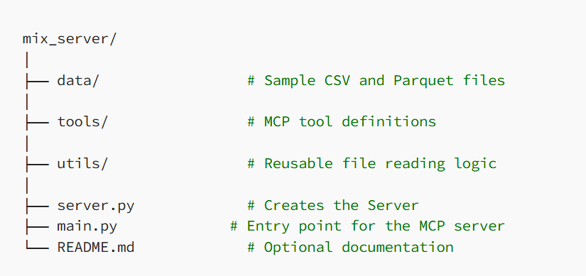

# MCP Model Context Protocol Projects

# Install
- Install uv https://github.com/astral-sh/uv
    - Linux/ Mac -->curl -LsSf https://astral.sh/uv/install.sh | sh
    - Windows --> powershell -ExecutionPolicy ByPass -c "irm https://astral.sh/uv/install.ps1 | iex"

- Initialize Project and Repository: uv init (name project / repository) cd "name project"
- create an environment uv venv 
    - Linux source .venv/bin/activate
    - Windows   .venv\Scripts\activate
- Add Required dependencies Ex. uv add "mcp[cli]" pandas pyarrow yfinance langchain langchain_mcp_adapters langgraph langchain_google_genai google-generativeai python-dotenv

# Create Project Structure
Example
