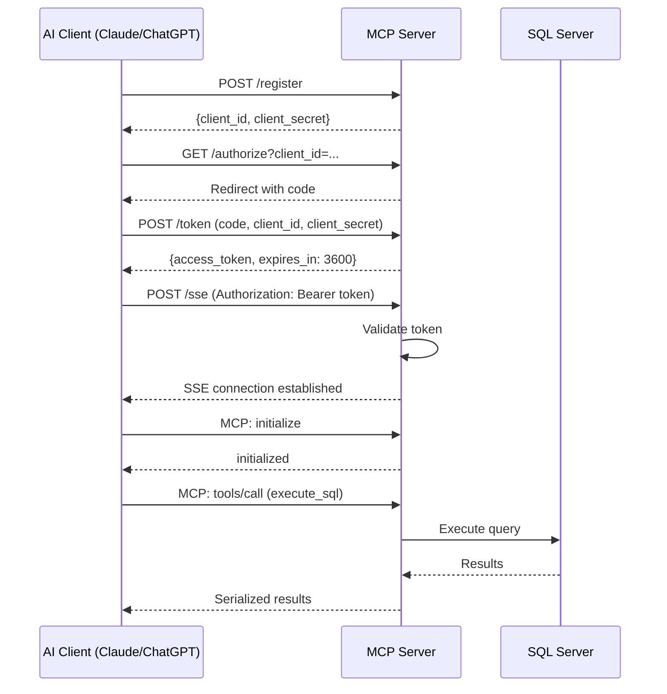

# MSSQL MCP Server with OAuth 2.0 & ChatGPT Integration

A production-ready Model Context Protocol (MCP) server that provides secure, AI-powered interactions with Microsoft SQL Server databases. This server implements OAuth 2.0 authentication, SSL/TLS encryption, and seamless integration with both Claude.ai and ChatGPT (Deep Research).

## 🚀 Features

### **Dual-Mode Support**
- **Claude.ai Integration**: OAuth 2.0 authenticated MCP server for Claude Desktop
- **ChatGPT Integration**: Custom connector compatible with ChatGPT Deep Research
- **Universal Database Access**: Query MSSQL databases through natural language

### **Database Operations**
- **Table Management**: List all tables, describe structure, get sample data
- **SQL Execution**: Execute SELECT, INSERT, UPDATE, DELETE queries
- **Schema Discovery**: Automatic table and column information retrieval
- **Data Exploration**: Sample data retrieval with configurable limits
- **Read-Only Mode**: Optional read-only operations for production safety

### **Security Features**
- **OAuth 2.0 Authentication**: Dynamic client registration with authorization code flow
- **SSL/TLS Encryption**: Let's Encrypt certificates with automatic renewal
- **Token Management**: Short-lived access tokens (1 hour expiration)
- **Secure Connections**: TLS 1.2+ with ODBC Driver 18 for SQL Server
- **Host Whitelisting**: Restricted OAuth redirect URIs to trusted domains

### **Transport Layer**
- **Server-Sent Events (SSE)**: Persistent, efficient streaming connection
- **Nginx Reverse Proxy**: Production-grade proxying with SSE optimization
- **Health Monitoring**: Built-in health check endpoints
- **Auto-Reconnection**: Robust connection handling

### **ChatGPT-Specific Features**
- **Search Tool**: Multi-purpose database search (list tables, describe, sample, query)
- **Fetch Tool**: Retrieve specific records by ID with caching
- **Result Caching**: TTL-based caching for improved performance
- **Discovery Endpoints**: Full OAuth 2.0 and OIDC discovery support

## 📋 Architecture

```
┌─────────────┐         ┌─────────────┐         ┌──────────────┐         ┌──────────────┐
│  Claude.ai  │◄─HTTPS─►│    Nginx    │◄─HTTP──►│  MCP Server  │◄─ODBC──►│  SQL Server  │
│  /ChatGPT   │   443   │  (SSL/TLS)  │   8008  │ (OAuth 2.0)  │         │   Database   │
└─────────────┘         └─────────────┘         └──────────────┘         └──────────────┘
                             │
                             │
                        ┌────▼────┐
                        │ Certbot │
                        │  Auto   │
                        │ Renewal │
                        └─────────┘
```

### Components

1. **MCP Server** (`server_oauth.py` / `server_chatgpt.py`)
   - Python 3.11 with Starlette (ASGI)
   - MCP protocol implementation
   - OAuth 2.0 authentication
   - Database connectivity via pyodbc

2. **Nginx Reverse Proxy**
   - SSL/TLS termination
   - SSE-optimized proxying
   - Request routing and load balancing
   - Security headers

3. **Certbot**
   - Automatic certificate issuance
   - Renewal checks every 12 hours
   - ACME protocol (Let's Encrypt)

## 🛠️ Installation & Setup

### Prerequisites

- **Infrastructure**:
  - Docker Engine 20.10+
  - Docker Compose 2.0+
  - Public domain with DNS A record
  - VM with ports 80, 443, 8008 accessible

- **Database**:
  - Microsoft SQL Server 2019+
  - ODBC Driver 18 for SQL Server
  - Database user with appropriate permissions

### 1. Environment Configuration

Create a `.env` file in the project root:

```bash
# Database Configuration
MSSQL_HOST=your-sql-server.database.windows.net
MSSQL_USER=your_username
MSSQL_PASSWORD=your_secure_password
MSSQL_DATABASE=your_database
MSSQL_DRIVER=ODBC Driver 18 for SQL Server

# Security Settings
TrustServerCertificate=yes
Trusted_Connection=no
READ_ONLY_MODE=true

# OAuth Configuration
ALLOWED_REDIRECT_HOSTS=chatgpt.com,openai.com,claude.ai,anthropic.com

# Optional: Development/Testing Only
ALLOW_UNAUTH_METHODS=false
ALLOW_UNAUTH_TOOLS_CALL=false

# ChatGPT Settings
MAX_SEARCH_RESULTS=50
CACHE_TTL_SECONDS=3600
```

### 2. SSL Certificate Setup

Run the automated Let's Encrypt setup:

```bash
# Make script executable
chmod +x setup-letsencrypt.sh

# Run setup
./setup-letsencrypt.sh

# Follow prompts:
# - Enter domain: data.forensic-bot.com
# - Enter email: your-email@example.com
# - Choose production (0) or staging (1)
```

The script will:
1. Check prerequisites (Docker, Docker Compose)
2. Create required directories
3. Download TLS parameters
4. Configure Nginx
5. Request Let's Encrypt certificate
6. Set up automatic renewal

### 3. Docker Deployment

#### Production Deployment

```bash
# Build and start all services
docker-compose -f docker-compose.prod.yml up -d

# View logs
docker-compose -f docker-compose.prod.yml logs -f

# Check service health
curl https://your-domain.com/health
```

#### Development Deployment

```bash
# Start with hot-reload
docker-compose up --build

# Access locally
curl http://localhost:8008/health
```

### 4. Verify Installation

```bash
# Test HTTPS connection
curl https://your-domain.com/health

# Test OAuth discovery
curl https://your-domain.com/.well-known/oauth-authorization-server

# Test SSE capability (requires authentication)
curl -I https://your-domain.com/sse
```

## 🔧 Integration Guides

### Claude.ai Integration

1. **Register Your Server**:
   ```json
   POST https://your-domain.com/register
   {
     "client_name": "Claude Desktop",
     "redirect_uris": ["https://claude.ai/api/mcp/auth_callback"]
   }
   ```

2. **Configure Claude Desktop** (`claude_desktop_config.json`):
   ```json
   {
     "mcpServers": {
       "mssql": {
         "url": "https://your-domain.com/sse",
         "oauth": {
           "authorization_url": "https://your-domain.com/authorize",
           "token_url": "https://your-domain.com/token",
           "client_id": "your_client_id",
           "client_secret": "your_client_secret"
         }
       }
     }
   }
   ```

3. **Authenticate**: Claude Desktop will handle OAuth flow automatically

### ChatGPT Integration (Deep Research)

1. **Add Custom Connector** in ChatGPT Settings:
   - Name: `MSSQL Database`
   - Type: `Custom Connector`
   - URL: `https://your-domain.com/chatgpt/sse`

2. **Discovery URL**: `https://your-domain.com/chatgpt/.well-known/oauth-authorization-server`

3. **OAuth Settings**: ChatGPT auto-discovers from well-known endpoints

4. **Authorize**: Follow ChatGPT's OAuth flow

5. **Use with Deep Research**:
   ```
   Query: "Search the database for top 10 customers by revenue"
   ChatGPT will:
   1. Call search tool to execute query
   2. Process results
   3. Call fetch tool for detailed records if needed
   ```

## 📚 API Reference

### OAuth Endpoints

| Endpoint | Method | Purpose |
|----------|--------|---------|
| `/.well-known/oauth-authorization-server` | GET | OAuth AS discovery |
| `/.well-known/openid-configuration` | GET | OIDC discovery (alias) |
| `/.well-known/oauth-protected-resource` | GET | OAuth RS discovery |
| `/register` | POST | Dynamic client registration |
| `/authorize` | GET | Authorization code grant |
| `/token` | POST | Token exchange |

### MCP Endpoints

| Endpoint | Method | Purpose | Authentication |
|----------|--------|---------|----------------|
| `/sse` | HEAD | SSE capability check | Optional |
| `/sse` | POST | MCP message handling | Required (Bearer token) |
| `/health` | GET | Server health status | None |

### ChatGPT Endpoints

| Endpoint | Method | Purpose |
|----------|--------|---------|
| `/chatgpt/sse` | POST | ChatGPT SSE endpoint |
| `/chatgpt/.well-known/*` | GET | Discovery endpoints |

## 🔨 Available Tools

### Claude.ai Tools

#### 1. list_tables
```json
{
  "name": "list_tables",
  "description": "List all tables in the database",
  "inputSchema": {
    "type": "object",
    "properties": {},
    "required": []
  }
}
```

#### 2. describe_table
```json
{
  "name": "describe_table",
  "description": "Get table structure and metadata",
  "inputSchema": {
    "type": "object",
    "properties": {
      "table_name": {
        "type": "string",
        "description": "Name of the table"
      }
    },
    "required": ["table_name"]
  }
}
```

#### 3. execute_sql
```json
{
  "name": "execute_sql",
  "description": "Execute SQL query (SELECT only in read-only mode)",
  "inputSchema": {
    "type": "object",
    "properties": {
      "query": {
        "type": "string",
        "description": "SQL query to execute"
      }
    },
    "required": ["query"]
  }
}
```

#### 4. get_table_sample
```json
{
  "name": "get_table_sample",
  "description": "Get sample data from a table",
  "inputSchema": {
    "type": "object",
    "properties": {
      "table_name": {
        "type": "string",
        "description": "Name of the table"
      },
      "limit": {
        "type": "integer",
        "description": "Number of rows to return",
        "default": 10
      }
    },
    "required": ["table_name"]
  }
}
```

### ChatGPT Tools

#### 1. search
Multi-purpose database search tool that handles:
- List tables: `"list tables"`
- Describe table: `"describe Customers"`
- Sample data: `"sample Orders limit 10"`
- SQL queries: `"SELECT TOP 5 * FROM Products WHERE Price > 100"`

```json
{
  "name": "search",
  "description": "Search database: list tables, describe schema, sample data, or execute queries",
  "parameters": {
    "query": {
      "type": "string",
      "description": "Natural language query or SQL statement"
    }
  }
}
```

#### 2. fetch
Retrieve specific records by ID (from search results):

```json
{
  "name": "fetch",
  "description": "Fetch a specific record by its ID from previous search results",
  "parameters": {
    "id": {
      "type": "string",
      "description": "Record ID from search results"
    }
  }
}
```

## 🔒 Security

### Authentication Flow



### Network Security

#### GCP Firewall Rules (Example)
```bash
# HTTPS traffic
gcloud compute firewall-rules create allow-mcp-https \
    --allow tcp:443 \
    --source-ranges 0.0.0.0/0 \
    --target-tags mcp-server

# HTTP (Let's Encrypt only)
gcloud compute firewall-rules create allow-letsencrypt \
    --allow tcp:80 \
    --source-ranges 0.0.0.0/0 \
    --target-tags mcp-server

# SSH (management)
gcloud compute firewall-rules create allow-ssh \
    --allow tcp:22 \
    --source-ranges YOUR_IP/32 \
    --target-tags mcp-server
```

### Application Security

- **OAuth 2.0**: RFC 6749 compliant authorization
- **Token Expiration**: 1-hour access tokens
- **Secure Generation**: `secrets.token_urlsafe()` for tokens
- **Host Whitelisting**: Restricted redirect URIs
- **Read-Only Mode**: Optional database read-only operations
- **Parameterized Queries**: SQL injection protection via pyodbc
- **TLS 1.2+**: Modern cipher suites only

### Security Headers (Nginx)

```nginx
add_header Strict-Transport-Security "max-age=31536000; includeSubDomains" always;
add_header X-Content-Type-Options nosniff;
add_header X-Frame-Options DENY;
add_header X-XSS-Protection "1; mode=block";
add_header Referrer-Policy "strict-origin-when-cross-origin";
```

## 📊 Monitoring & Maintenance

### Health Checks

```bash
# Server health
curl https://your-domain.com/health

# Expected response:
{
  "status": "healthy",
  "transport": "sse",
  "oauth": "enabled",
  "database": "your_database",
  "mcp_version": "2025-06-18",
  "read_only": true
}
```

### Logging

```bash
# View all logs
docker-compose logs -f

# MCP server logs
docker-compose logs -f mcp-server-http

# Nginx logs
docker-compose logs -f nginx

# Filter by level
docker-compose logs -f | grep ERROR
```

### Certificate Management

```bash
# Check certificate expiration
echo | openssl s_client -servername your-domain.com -connect your-domain.com:443 2>/dev/null | openssl x509 -noout -dates

# Test renewal (dry run)
docker-compose exec certbot certbot renew --dry-run

# Force renewal
docker-compose exec certbot certbot renew --force-renewal

# View certificates
docker-compose exec certbot certbot certificates
```

### Performance Monitoring

```bash
# Container stats
docker stats

# Nginx connections
docker exec nginx cat /var/log/nginx/access.log | tail -100

# Database connection test
docker exec mcp-server-http python -c "
from server_oauth import get_db_config
config, conn_str = get_db_config()
print(f'Connected to: {config[\"database\"]}')"
```

## 🐛 Troubleshooting

### Common Issues

#### 1. Certificate Validation Failed
```bash
# Check certificate
openssl s_client -connect your-domain.com:443 -servername your-domain.com

# Verify DNS
nslookup your-domain.com

# Check certbot logs
docker-compose logs certbot
```

#### 2. OAuth Token Invalid
```bash
# Check token expiration
# Tokens expire after 1 hour

# Re-register client
curl -X POST https://your-domain.com/register \
  -H "Content-Type: application/json" \
  -d '{"client_name": "test"}'
```

#### 3. Database Connection Failed
```bash
# Test ODBC driver
docker exec mcp-server-http odbcinst -j

# Verify environment variables
docker exec mcp-server-http env | grep MSSQL

# Test connection
docker exec mcp-server-http python -c "
import pyodbc
conn = pyodbc.connect('DRIVER={ODBC Driver 18 for SQL Server};SERVER=your-server;...')
print('Success')
"
```

#### 4. SSE Connection Issues
```bash
# Test SSE endpoint (with token)
curl -N -H "Authorization: Bearer YOUR_TOKEN" \
  -H "Accept: text/event-stream" \
  https://your-domain.com/sse

# Check Nginx SSE config
docker exec nginx cat /etc/nginx/conf.d/default.conf | grep -A 10 "location /sse"
```

### Debug Mode

Enable detailed logging in `.env`:
```bash
LOG_LEVEL=DEBUG
```

Or modify the server code:
```python
# In server_oauth.py or server_chatgpt.py
logging.basicConfig(
    level=logging.DEBUG,
    format='%(asctime)s - %(name)s - %(levelname)s - %(message)s'
)
```

## 📖 Documentation

### Project Structure
```
.
├── server_oauth.py              # Claude.ai MCP server
├── server_chatgpt.py            # ChatGPT-compatible server
├── Dockerfile                   # HTTP server image
├── Dockerfile.https             # HTTPS server image
├── Dockerfile.chatgpt           # ChatGPT server image
├── docker-compose.yml           # Development compose
├── docker-compose.prod.yml      # Production compose
├── setup-letsencrypt.sh         # SSL setup script
├── requirements.txt             # Python dependencies
├── .env                         # Environment variables
├── nginx/
│   ├── nginx.conf              # Main Nginx config
│   └── conf.d/
│       └── default.conf        # Site configuration
├── certbot/
│   ├── conf/                   # SSL certificates
│   └── www/                    # ACME challenge
├── docs/
│   ├── chatgpt-connector-setup.md
│   ├── security.md
│   ├── explanation_en.md
│   └── read_only.md
└── README.md                    # This file
```

### Related Documentation

- [ChatGPT Connector Setup Guide](docs/chatgpt-connector-setup.md)
- [Security Best Practices](docs/security.md)
- [Technical Explanation](docs/explanation_en.md)
- [Read-Only Mode Guide](docs/read_only.md)

### External Resources

- [Model Context Protocol Specification](https://spec.modelcontextprotocol.io)
- [OAuth 2.0 RFC 6749](https://tools.ietf.org/html/rfc6749)
- [Let's Encrypt Documentation](https://letsencrypt.org/docs/)
- [Nginx SSE Guide](https://nginx.org/en/docs/http/ngx_http_proxy_module.html)

## 🔄 Deployment Workflow

### Initial Deployment
```bash
1. Clone repository
2. Configure .env file
3. Run setup-letsencrypt.sh
4. Start services: docker-compose -f docker-compose.prod.yml up -d
5. Verify health: curl https://your-domain.com/health
6. Configure AI clients (Claude/ChatGPT)
```

### Updates
```bash
# Pull latest changes
git pull

# Rebuild containers
docker-compose -f docker-compose.prod.yml build

# Restart services (zero-downtime)
docker-compose -f docker-compose.prod.yml up -d

# Verify
curl https://your-domain.com/health
```

### Rollback
```bash
# Stop services
docker-compose -f docker-compose.prod.yml down

# Checkout previous version
git checkout <previous-commit>

# Rebuild and restart
docker-compose -f docker-compose.prod.yml up --build -d
```

## 🧪 Testing

### Unit Tests
```bash
# Run pytest
pytest tests/

# With coverage
pytest --cov=server_oauth --cov=server_chatgpt tests/
```

### Integration Tests
```bash
# Test OAuth flow
python tests/test_oauth_flow.py

# Test database connectivity
python tests/test_database.py

# Test MCP protocol
python tests/test_mcp.py
```

### Load Testing
```bash
# Using Apache Bench
ab -n 1000 -c 10 -H "Authorization: Bearer TOKEN" \
  https://your-domain.com/sse

# Using hey
hey -n 1000 -c 10 -H "Authorization: Bearer TOKEN" \
  https://your-domain.com/sse
```


## 📝 License

MIT License - See LICENSE file for details

## 📧 Support

For issues and questions:
- GitHub Issues: [repository-url]
- Email: support@your-domain.com
- Documentation: https://your-domain.com/docs

---

**Version**: 2.0.0  
**Last Updated**: October 2025  
**Protocol**: MCP 2025-06-18  
**Compatibility**: SQL Server 2019+, Python 3.11+, Docker 20.10+  
**Platforms**: Claude.ai, ChatGPT (Deep Research)  
**Transport**: Server-Sent Events (SSE)  
**Authentication**: OAuth 2.0 (Authorization Code Flow)  
**Encryption**: TLS 1.2+ with Let's Encrypt