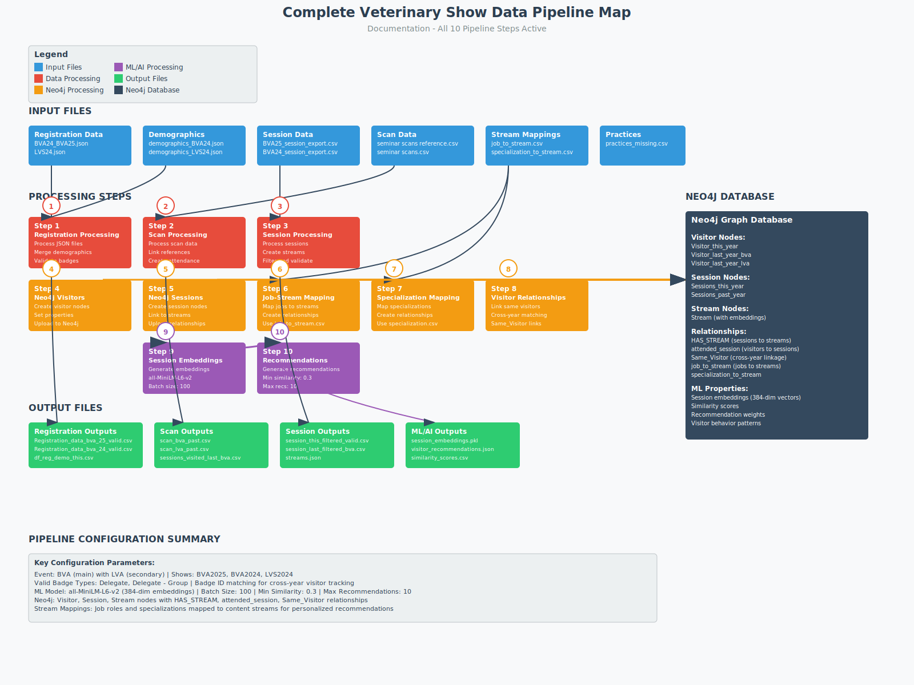

# Generic Event Recommendation Pipeline (Personal Agendas)

A fully configurable data processing and recommendation pipeline for event management, designed to process registration, attendance, and session information to generate personalized recommendations through knowledge graph analytics.

## Overview

This pipeline has been refactored from a veterinary-specific system (BVA/LVA) to a generic, configuration-driven architecture that can handle any type of professional event or conference. The system processes event data to:

- Track visitor registration and demographics across multiple events
- Analyze session attendance patterns and visitor behavior
- Generate personalized session recommendations using ML/AI
- Build comprehensive knowledge graphs in Neo4j
- Support multiple event types through YAML configuration files

## Architecture Evolution

### From Specific to Generic

The pipeline has undergone a complete transformation:
- **Before**: Hardcoded for veterinary events (BVA/LVA) with embedded business logic
- **After**: Fully configurable for any event type through YAML configuration files

Key architectural changes:
- Separated event-specific configuration from core processing logic
- Introduced multiple configuration files per event type (`config_vet.yaml`, `config_ecomm.yaml`)
- Made all processors generic with configuration-driven behavior
- Removed hardcoded veterinary-specific functions and rules

## Project Structure

```
repo-root/
├── PA/                                         # Core Python package (renamed from 'app')
│   ├── main.py                                 # Main orchestrator
│   ├── pipeline.py                             # Pipeline coordinator
│   ├── registration_processor.py               # Registration data processing
│   ├── scan_processor.py                       # Scan data processing
│   ├── session_processor.py                    # Session data processing
│   ├── neo4j_visitor_processor.py              # Visitor node creation
│   ├── neo4j_session_processor.py              # Session node creation
│   ├── neo4j_job_stream_processor.py           # Job-stream relationships
│   ├── neo4j_specialization_stream_processor.py# Specialization relationships
│   ├── neo4j_visitor_relationship_processor.py # Cross-year visitor linking
│   ├── session_embedding_processor.py          # ML embeddings generation
│   ├── session_recommendation_processor.py     # Recommendation engine
│   ├── run_embedding.py                        # Standalone embedding runner
│   ├── run_recommendations.py                  # Standalone recommendation runner
│   ├── utils/                                  # Utility modules
│   │   ├── config_utils.py
│   │   ├── data_utils.py
│   │   ├── logging_utils.py
│   │   ├── neo4j_utils.py
│   │   ├── summary_utils.py
│   │   └── mlflow_utils.py
│   ├── config/                                  # (If using internal packaged configs)
│   │   ├── config_vet.yaml (optional copy)      # Example veterinary config
│   │   └── config_ecomm.yaml (optional copy)    # Example e-commerce config
│   └── logs/                                    # Runtime logs (gitignored typically)
├── bva/ & ecomm/                                # Jupyter notebooks per domain
├── data/                                        # Raw & interim data (structured per event)
├── docs/                                        # Documentation & diagrams
└── readme.md
```

> Migration Note: The package directory was renamed from `app` to `PA`. Update any external scripts, cron jobs, CI/CD pipeline steps, or Azure ML pipeline definitions that referenced `python app/...` to now use `python PA/...`.

## Configuration System

### Multi-Event Support

The pipeline now supports multiple event types through separate configuration files:

#### `config_vet.yaml` - Veterinary Events
```yaml
event:
  name: "vet"
  main_event_name: "bva"        # Triggers vet-specific processing
  secondary_event_name: "lva"
  shows_this_year: [['BVA2025']]
  shows_last_year_main: "BVA2024"
  shows_last_year_secondary: "LVS2024"
```

#### `config_ecomm.yaml` - E-Commerce Events
```yaml
event:
  name: "ecomm"
  main_event_name: "ecomm"      # Generic processing mode
  secondary_event_name: "tfm"
  shows_this_year: [['ECE25','TFM25']]
  shows_last_year_main: "ECE24"
  shows_last_year_secondary: "TFM24"
```

### Configuration Components

Each configuration file contains:

1. **Event Configuration**: Event names, years, and show identifiers
2. **Badge History Columns**: Column mappings for cross-year visitor tracking
3. **Practice Type Columns**: Dynamic field mapping for different event types
4. **Output File Configurations**: Standardized output naming conventions
5. **Pipeline Step Activation**: Enable/disable specific processing steps
6. **Input File Paths**: Event-specific data source locations
7. **Processing Parameters**: ML models, batch sizes, similarity thresholds

## Pipeline Processing Steps



### Data Processing Phase (Steps 1-3)

1. **Registration Processing**
   - Loads registration JSON files for main and secondary events
   - Identifies returning visitors through badge ID matching
   - Processes demographic data with configurable field mappings
   - Outputs standardized CSV files

2. **Scan Processing**
   - Processes session attendance scan data
   - Matches scans with visitor profiles
   - Creates attendance records for past events
   - Enriches with demographic information

3. **Session Processing**
   - Loads session information from CSV files
   - Extracts and categorizes content streams
   - Generates AI descriptions for streams (optional)
   - Filters sessions based on configurable criteria

### Neo4j Integration Phase (Steps 4-8)

4. **Visitor Node Creation**
   - Creates visitor nodes for current and past years
   - Sets properties from registration and demographic data
   - Maintains separate node types per event year

5. **Session Node Creation**
   - Creates session nodes with metadata
   - Links sessions to stream categories
   - Maintains temporal separation (this_year/past_year)

6. **Job-Stream Relationship Processing**
   - Maps job roles to relevant content streams
   - Creates weighted relationships based on relevance
   - Configurable to skip for non-professional events

7. **Specialization-Stream Processing**
   - Links practice specializations to appropriate content
   - Creates domain-specific relationships
   - Can be disabled for generic events

8. **Cross-Year Visitor Relationships**
   - Links same visitors across different years
   - Creates "Same_Visitor" relationships
   - Enables historical attendance analysis

### ML/AI Processing Phase (Steps 9-10)

9. **Session Embedding Generation**
   - Creates semantic embeddings for session content
   - Uses sentence-transformers (all-MiniLM-L6-v2)
   - Generates 384-dimensional vectors
   - Enables content-based similarity matching

10. **Recommendation Generation**
    - Analyzes visitor profiles and historical attendance
    - Finds similar visitors using configurable attributes
    - Generates personalized recommendations
    - Applies optional business rules filtering

## Neo4j Schema


### Node Types

| Node Type | Description | Key Properties |
|-----------|-------------|----------------|
| `Visitor_this_year` | Current year visitors | BadgeId, show, job_role, specialization |
| `Visitor_last_year_bva` | Past year main event visitors | BadgeId, show, attendance history |
| `Visitor_last_year_lva` | Past year secondary event visitors | BadgeId, show, attendance history |
| `Sessions_this_year` | Current year sessions | session_id, title, stream, embedding |
| `Sessions_past_year` | Historical sessions | session_id, title, stream, embedding |
| `Stream` | Content categories | stream, description, show |

### Relationships

| Relationship | From → To | Properties |
|--------------|-----------|------------|
| `HAS_STREAM` | Session → Stream | - |
| `attended_session` | Visitor → Session | scan_date, seminar_name |
| `Same_Visitor` | Visitor → Visitor | type (cross-year link) |
| `job_to_stream` | Visitor → Stream | weight (relevance score) |
| `specialization_to_stream` | Visitor → Stream | created_by |
| `IS_RECOMMENDED` | Visitor → Session | similarity_score, generated_at |

## Installation

### Prerequisites

- Python 3.8+
- Neo4j Database 4.4+
- Optional: OpenAI API or Azure OpenAI credentials for AI features

### Setup

1. **Clone the repository**
   ```bash
   git clone <repository-url>
   cd PA
   ```

2. **Install dependencies**
   ```bash
   pip install -r requirements.txt
   ```

3. **Configure environment variables**
   Create `.env` file in `keys/` directory:
   ```env
   # Neo4j credentials
   NEO4J_URI=bolt://localhost:7687
   NEO4J_USERNAME=neo4j
   NEO4J_PASSWORD=your-password

   # Optional: OpenAI or Azure OpenAI
   OPENAI_API_KEY=your-api-key
   # OR
   AZURE_API_KEY=your-azure-key
   AZURE_ENDPOINT=your-azure-endpoint
   AZURE_DEPLOYMENT=your-deployment-name
   ```

4. **Select configuration file**
   Choose the appropriate configuration for your event type:
   - Veterinary events: `config/config_vet.yaml`
   - E-commerce events: `config/config_ecomm.yaml`
   - Create custom: Copy and modify existing config

## Usage

### Running the Complete Pipeline

```bash
# Run with veterinary configuration
python PA/main.py --config config/config_vet.yaml

# Run with e-commerce configuration
python PA/main.py --config config/config_ecomm.yaml
```

### Selective Processing

```bash
# Run specific steps only
python PA/main.py --config config/config_vet.yaml --only-steps 1,2,3

# Skip Neo4j upload
python PA/main.py --config config/config_vet.yaml --skip-neo4j

# Process only new visitors without existing recommendations
python PA/main.py --config config/config_vet.yaml --create-only-new

# Recreate all Neo4j nodes
python PA/main.py --config config/config_vet.yaml --recreate-all
```

### Standalone Components

```bash
# Generate session embeddings only
python PA/run_embedding.py --config config/config_vet.yaml

# Generate recommendations only
python PA/run_recommendations.py --config config/config_vet.yaml \
   --min-score 0.3 --max-recommendations 10
```

## Creating Custom Event Configurations

To adapt the pipeline for a new event type:

1. **Copy an existing configuration**
   ```bash
   cp config/config_vet.yaml config/config_myevent.yaml
   ```

2. **Modify event-specific settings**
   ```yaml
   event:
     name: "myevent"
     main_event_name: "myevent"  # Use event name != "bva" for generic mode
     shows_this_year: [['MYEVENT2025']]
   ```

3. **Update input file paths**
   ```yaml
   input_files:
     main_event_registration: "data/myevent/registration.json"
     main_event_demographic: "data/myevent/demographics.json"
   ```

4. **Configure field mappings**
   ```yaml
   practice_type_columns:
     current: "your_practice_question_field"
     past: "your_past_practice_field"
   ```

5. **Enable/disable pipeline steps**
   ```yaml
   pipeline_steps:
     neo4j_job_stream_processing: false  # Disable if not applicable
     neo4j_specialization_stream_processing: false
   ```

## Output Files

The pipeline generates various outputs organized by type:

### CSV Files
- `Registration_data_[event]_[year]_only_valid.csv` - Validated registrations
- `df_reg_demo_this.csv` - Current year with demographics
- `session_this_filtered_valid_cols.csv` - Processed sessions
- `scan_[year]_filtered_valid_cols_[event].csv` - Attendance records

### JSON Files
- `streams.json` - Stream catalog with AI descriptions
- `specializations.json` - Practice specializations mapping
- `job_roles.json` - Job role classifications
- `visitor_recommendations_[timestamp].json` - Generated recommendations

### Logs
- `logs/data_processing.log` - Main processing log
- `logs/processing_summary.json` - Summary statistics
- MLflow tracking (if enabled)

## Monitoring and Tracking

### MLflow Integration

The pipeline includes MLflow tracking for:
- Configuration parameters logging
- Processing metrics per step
- Output file artifacts
- Performance monitoring

Enable MLflow tracking:
```bash
mlflow ui  # Start MLflow UI
python PA/main.py --config config/config_vet.yaml  # Tracking enabled by default
```

Disable MLflow:
```bash
python PA/main.py --config config/config_vet.yaml --skip-mlflow
```

## Troubleshooting

### Common Issues

1. **Neo4j Connection Failed**
   - Verify Neo4j is running: `neo4j status`
   - Check credentials in `.env` file
   - Confirm URI format: `bolt://host:port`

2. **Missing Input Files**
   - Verify paths in configuration file
   - Check JSON file format and structure
   - Ensure data directory permissions

3. **Memory Issues**
   - Process in batches: `--only-steps 1,2,3`
   - Adjust batch sizes in configuration
   - Increase Python heap size if needed

4. **Configuration Errors**
   - Validate YAML syntax
   - Check required fields are present
   - Ensure event names are consistent

## Performance Optimization

### Batch Processing
- Use `create_only_new` flag for incremental updates
- Process steps separately for large datasets
- Adjust `batch_size` in configuration

### Neo4j Optimization
- Create indexes on frequently queried properties
- Use constraints for unique identifiers
- Batch node/relationship creation

### ML Processing
- Cache embeddings when possible
- Use GPU acceleration for embedding generation
- Adjust `max_recommendations` based on needs

## Development Guidelines

### Adding New Event Types

1. Create event-specific configuration file
2. Ensure input data matches expected format
3. Map event-specific fields to standard properties
4. Test with small dataset first
5. Validate Neo4j schema compatibility

### Extending Processors

When adding new functionality:
1. Inherit from base processor classes
2. Use configuration for all event-specific logic
3. Add new configuration parameters as needed
4. Update documentation and examples
5. Ensure backward compatibility

### Code Standards

- Type hints for all function signatures
- Comprehensive docstrings following Google style
- PEP 8 compliance
- Error handling with meaningful messages
- Logging at appropriate levels

## Implementation Guide

### Phase 1: Data Preparation
1. Organize input files in event-specific directories
2. Create configuration file for your event
3. Validate JSON structure matches expected format
4. Run registration processing (step 1) to test

### Phase 2: Processing Pipeline
1. Execute data processing steps (1-3)
2. Review output CSV files for correctness
3. Check logs for warnings or errors
4. Validate data quality metrics

### Phase 3: Neo4j Integration
1. Clear existing Neo4j data if needed
2. Run Neo4j processing steps (4-8)
3. Verify node and relationship creation
4. Query Neo4j to validate schema

### Phase 4: Recommendations
1. Generate session embeddings (step 9)
2. Run recommendation engine (step 10)
3. Review recommendation quality
4. Adjust similarity thresholds as needed

### Phase 5: Production Deployment
1. Set up monitoring with MLflow
2. Configure incremental processing
3. Schedule pipeline runs
4. Set up alerting for failures


## License

CSM Propietary

## Support

For questions or issues:
- Review logs in `logs/` directory
- Check configuration syntax and completeness
- Verify Neo4j connectivity
- Consult documentation for specific processors

