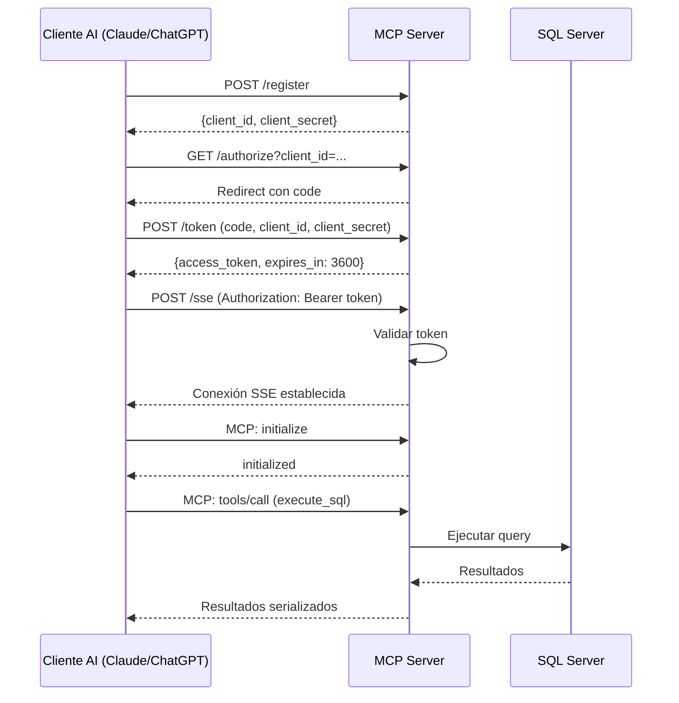

# MSSQL MCP Server con OAuth 2.0 e Integración ChatGPT

Un servidor Model Context Protocol (MCP) listo para producción que proporciona interacciones seguras con bases de datos Microsoft SQL Server potenciadas por IA. Este servidor implementa autenticación OAuth 2.0, cifrado SSL/TLS e integración perfecta tanto con Claude.ai como con ChatGPT (Deep Research).

## 🚀 Características

### **Soporte Dual**
- **Integración Claude.ai**: Servidor MCP con autenticación OAuth 2.0 para Claude Desktop
- **Integración ChatGPT**: Conector personalizado compatible con ChatGPT Deep Research
- **Acceso Universal a Base de Datos**: Consulta bases de datos MSSQL mediante lenguaje natural

### **Operaciones de Base de Datos**
- **Gestión de Tablas**: Listar todas las tablas, describir estructura, obtener datos de muestra
- **Ejecución SQL**: Ejecutar queries SELECT, INSERT, UPDATE, DELETE
- **Descubrimiento de Schema**: Recuperación automática de información de tablas y columnas
- **Exploración de Datos**: Recuperación de datos de muestra con límites configurables
- **Modo Read-Only**: Operaciones de solo lectura opcionales para seguridad en producción

### **Características de Seguridad**
- **Autenticación OAuth 2.0**: Registro dinámico de clientes con flujo de authorization code
- **Cifrado SSL/TLS**: Certificados Let's Encrypt con renovación automática
- **Gestión de Tokens**: Access tokens de corta duración (expiración de 1 hora)
- **Conexiones Seguras**: TLS 1.2+ con ODBC Driver 18 para SQL Server
- **Whitelist de Hosts**: URIs de redirect OAuth restringidos a dominios confiables

### **Capa de Transporte**
- **Server-Sent Events (SSE)**: Conexión persistente y eficiente mediante streaming
- **Nginx Reverse Proxy**: Proxying de grado de producción con optimización SSE
- **Monitoreo de Salud**: Endpoints de health check integrados
- **Auto-Reconexión**: Manejo robusto de conexiones

### **Características Específicas de ChatGPT**
- **Tool Search**: Búsqueda de base de datos multipropósito (listar tablas, describir, muestrear, consultar)
- **Tool Fetch**: Recuperar registros específicos por ID con caché
- **Caché de Resultados**: Caché basado en TTL para mejor rendimiento
- **Endpoints de Discovery**: Soporte completo de discovery OAuth 2.0 y OIDC

## 📋 Arquitectura

```
┌─────────────┐         ┌─────────────┐         ┌──────────────┐         ┌──────────────┐
│  Claude.ai  │◄─HTTPS─►│    Nginx    │◄─HTTP──►│  MCP Server  │◄─ODBC──►│  SQL Server  │
│  /ChatGPT   │   443   │  (SSL/TLS)  │   8008  │ (OAuth 2.0)  │         │   Database   │
└─────────────┘         └─────────────┘         └──────────────┘         └──────────────┘
                             │
                             │
                        ┌────▼────┐
                        │ Certbot │
                        │  Auto   │
                        │ Renewal │
                        └─────────┘
```

### Componentes

1. **MCP Server** (`server_oauth.py` / `server_chatgpt.py`)
   - Python 3.11 con Starlette (ASGI)
   - Implementación del protocolo MCP
   - Autenticación OAuth 2.0
   - Conectividad a base de datos vía pyodbc

2. **Nginx Reverse Proxy**
   - Terminación SSL/TLS
   - Proxying optimizado para SSE
   - Enrutamiento de requests y load balancing
   - Headers de seguridad

3. **Certbot**
   - Emisión automática de certificados
   - Verificaciones de renovación cada 12 horas
   - Protocolo ACME (Let's Encrypt)

## 🛠️ Instalación y Configuración

### Prerrequisitos

- **Infraestructura**:
  - Docker Engine 20.10+
  - Docker Compose 2.0+
  - Dominio público con registro DNS A
  - VM con puertos 80, 443, 8008 accesibles

- **Base de Datos**:
  - Microsoft SQL Server 2019+
  - ODBC Driver 18 para SQL Server
  - Usuario de base de datos con permisos apropiados

### 1. Configuración de Entorno

Crear archivo `.env` en la raíz del proyecto:

```bash
# Configuración de Base de Datos
MSSQL_HOST=your-sql-server.database.windows.net
MSSQL_USER=your_username
MSSQL_PASSWORD=your_secure_password
MSSQL_DATABASE=your_database
MSSQL_DRIVER=ODBC Driver 18 for SQL Server

# Configuración de Seguridad
TrustServerCertificate=yes
Trusted_Connection=no
READ_ONLY_MODE=true

# Configuración OAuth
ALLOWED_REDIRECT_HOSTS=chatgpt.com,openai.com,claude.ai,anthropic.com

# Opcional: Solo Desarrollo/Pruebas
ALLOW_UNAUTH_METHODS=false
ALLOW_UNAUTH_TOOLS_CALL=false

# Configuración ChatGPT
MAX_SEARCH_RESULTS=50
CACHE_TTL_SECONDS=3600
```

### 2. Configuración de Certificado SSL

Ejecutar la configuración automatizada de Let's Encrypt:

```bash
# Hacer script ejecutable
chmod +x setup-letsencrypt.sh

# Ejecutar configuración
./setup-letsencrypt.sh

# Seguir los prompts:
# - Ingresar dominio: data.forensic-bot.com
# - Ingresar email: tu-email@example.com
# - Elegir producción (0) o staging (1)
```

El script realizará:
1. Verificar prerrequisitos (Docker, Docker Compose)
2. Crear directorios requeridos
3. Descargar parámetros TLS
4. Configurar Nginx
5. Solicitar certificado Let's Encrypt
6. Configurar renovación automática

### 3. Despliegue Docker

#### Despliegue de Producción

```bash
# Construir e iniciar todos los servicios
docker-compose -f docker-compose.prod.yml up -d

# Ver logs
docker-compose -f docker-compose.prod.yml logs -f

# Verificar salud del servicio
curl https://tu-dominio.com/health
```

#### Despliegue de Desarrollo

```bash
# Iniciar con hot-reload
docker-compose up --build

# Acceso local
curl http://localhost:8008/health
```

### 4. Verificar Instalación

```bash
# Probar conexión HTTPS
curl https://tu-dominio.com/health

# Probar discovery OAuth
curl https://tu-dominio.com/.well-known/oauth-authorization-server

# Probar capacidad SSE (requiere autenticación)
curl -I https://tu-dominio.com/sse
```

## 🔧 Guías de Integración

### Integración Claude.ai

1. **Registrar Tu Servidor**:
   ```json
   POST https://tu-dominio.com/register
   {
     "client_name": "Claude Desktop",
     "redirect_uris": ["https://claude.ai/api/mcp/auth_callback"]
   }
   ```

2. **Configurar Claude Desktop** (`claude_desktop_config.json`):
   ```json
   {
     "mcpServers": {
       "mssql": {
         "url": "https://tu-dominio.com/sse",
         "oauth": {
           "authorization_url": "https://tu-dominio.com/authorize",
           "token_url": "https://tu-dominio.com/token",
           "client_id": "tu_client_id",
           "client_secret": "tu_client_secret"
         }
       }
     }
   }
   ```

3. **Autenticar**: Claude Desktop manejará el flujo OAuth automáticamente

### Integración ChatGPT (Deep Research)

1. **Agregar Conector Personalizado** en Configuración de ChatGPT:
   - Nombre: `MSSQL Database`
   - Tipo: `Custom Connector`
   - URL: `https://tu-dominio.com/chatgpt/sse`

2. **Discovery URL**: `https://tu-dominio.com/chatgpt/.well-known/oauth-authorization-server`

3. **Configuración OAuth**: ChatGPT autodescubre desde endpoints well-known

4. **Autorizar**: Seguir el flujo OAuth de ChatGPT

5. **Usar con Deep Research**:
   ```
   Query: "Buscar en la base de datos los 10 mejores clientes por ingresos"
   ChatGPT:
   1. Llamará al tool search para ejecutar query
   2. Procesará resultados
   3. Llamará al tool fetch para registros detallados si es necesario
   ```

## 📚 Referencia de API

### Endpoints OAuth

| Endpoint | Método | Propósito |
|----------|--------|-----------|
| `/.well-known/oauth-authorization-server` | GET | Discovery OAuth AS |
| `/.well-known/openid-configuration` | GET | Discovery OIDC (alias) |
| `/.well-known/oauth-protected-resource` | GET | Discovery OAuth RS |
| `/register` | POST | Registro dinámico de cliente |
| `/authorize` | GET | Grant de authorization code |
| `/token` | POST | Intercambio de token |

### Endpoints MCP

| Endpoint | Método | Propósito | Autenticación |
|----------|--------|---------|----------------|
| `/sse` | HEAD | Verificación de capacidad SSE | Opcional |
| `/sse` | POST | Manejo de mensajes MCP | Requerida (Bearer token) |
| `/health` | GET | Estado de salud del servidor | Ninguna |

### Endpoints ChatGPT

| Endpoint | Método | Propósito |
|----------|--------|---------|
| `/chatgpt/sse` | POST | Endpoint SSE ChatGPT |
| `/chatgpt/.well-known/*` | GET | Endpoints de discovery |

## 🔨 Tools Disponibles

### Tools Claude.ai

#### 1. list_tables
```json
{
  "name": "list_tables",
  "description": "Listar todas las tablas en la base de datos",
  "inputSchema": {
    "type": "object",
    "properties": {},
    "required": []
  }
}
```

#### 2. describe_table
```json
{
  "name": "describe_table",
  "description": "Obtener estructura y metadatos de tabla",
  "inputSchema": {
    "type": "object",
    "properties": {
      "table_name": {
        "type": "string",
        "description": "Nombre de la tabla"
      }
    },
    "required": ["table_name"]
  }
}
```

#### 3. execute_sql
```json
{
  "name": "execute_sql",
  "description": "Ejecutar query SQL (solo SELECT en modo read-only)",
  "inputSchema": {
    "type": "object",
    "properties": {
      "query": {
        "type": "string",
        "description": "Query SQL a ejecutar"
      }
    },
    "required": ["query"]
  }
}
```

#### 4. get_table_sample
```json
{
  "name": "get_table_sample",
  "description": "Obtener datos de muestra de una tabla",
  "inputSchema": {
    "type": "object",
    "properties": {
      "table_name": {
        "type": "string",
        "description": "Nombre de la tabla"
      },
      "limit": {
        "type": "integer",
        "description": "Número de filas a retornar",
        "default": 10
      }
    },
    "required": ["table_name"]
  }
}
```

### Tools ChatGPT

#### 1. search
Tool de búsqueda de base de datos multipropósito que maneja:
- Listar tablas: `"list tables"`
- Describir tabla: `"describe Customers"`
- Datos de muestra: `"sample Orders limit 10"`
- Queries SQL: `"SELECT TOP 5 * FROM Products WHERE Price > 100"`

```json
{
  "name": "search",
  "description": "Buscar base de datos: listar tablas, describir schema, datos de muestra o ejecutar queries",
  "parameters": {
    "query": {
      "type": "string",
      "description": "Query en lenguaje natural o statement SQL"
    }
  }
}
```

#### 2. fetch
Recuperar registros específicos por ID (de resultados de búsqueda):

```json
{
  "name": "fetch",
  "description": "Obtener un registro específico por su ID de resultados de búsqueda previos",
  "parameters": {
    "id": {
      "type": "string",
      "description": "ID de registro de resultados de búsqueda"
    }
  }
}
```

## 🔒 Seguridad

### Flujo de Autenticación



### Seguridad de Red

#### Reglas de Firewall GCP (Ejemplo)
```bash
# Tráfico HTTPS
gcloud compute firewall-rules create allow-mcp-https \
    --allow tcp:443 \
    --source-ranges 0.0.0.0/0 \
    --target-tags mcp-server

# HTTP (solo Let's Encrypt)
gcloud compute firewall-rules create allow-letsencrypt \
    --allow tcp:80 \
    --source-ranges 0.0.0.0/0 \
    --target-tags mcp-server

# SSH (gestión)
gcloud compute firewall-rules create allow-ssh \
    --allow tcp:22 \
    --source-ranges TU_IP/32 \
    --target-tags mcp-server
```

### Seguridad de Aplicación

- **OAuth 2.0**: Autorización compatible con RFC 6749
- **Expiración de Tokens**: Access tokens de 1 hora
- **Generación Segura**: `secrets.token_urlsafe()` para tokens
- **Whitelist de Hosts**: URIs de redirect restringidos
- **Modo Read-Only**: Operaciones de solo lectura opcionales en base de datos
- **Queries Parametrizadas**: Protección contra inyección SQL vía pyodbc
- **TLS 1.2+**: Solo cipher suites modernos

### Headers de Seguridad (Nginx)

```nginx
add_header Strict-Transport-Security "max-age=31536000; includeSubDomains" always;
add_header X-Content-Type-Options nosniff;
add_header X-Frame-Options DENY;
add_header X-XSS-Protection "1; mode=block";
add_header Referrer-Policy "strict-origin-when-cross-origin";
```

## 📊 Monitoreo y Mantenimiento

### Health Checks

```bash
# Salud del servidor
curl https://tu-dominio.com/health

# Respuesta esperada:
{
  "status": "healthy",
  "transport": "sse",
  "oauth": "enabled",
  "database": "tu_database",
  "mcp_version": "2025-06-18",
  "read_only": true
}
```

### Logging

```bash
# Ver todos los logs
docker-compose logs -f

# Logs del servidor MCP
docker-compose logs -f mcp-server-http

# Logs de Nginx
docker-compose logs -f nginx

# Filtrar por nivel
docker-compose logs -f | grep ERROR
```

### Gestión de Certificados

```bash
# Verificar expiración de certificado
echo | openssl s_client -servername tu-dominio.com -connect tu-dominio.com:443 2>/dev/null | openssl x509 -noout -dates

# Probar renovación (dry run)
docker-compose exec certbot certbot renew --dry-run

# Forzar renovación
docker-compose exec certbot certbot renew --force-renewal

# Ver certificados
docker-compose exec certbot certbot certificates
```

### Monitoreo de Rendimiento

```bash
# Estadísticas de contenedores
docker stats

# Conexiones Nginx
docker exec nginx cat /var/log/nginx/access.log | tail -100

# Prueba de conexión a base de datos
docker exec mcp-server-http python -c "
from server_oauth import get_db_config
config, conn_str = get_db_config()
print(f'Conectado a: {config[\"database\"]}')"
```

## 🐛 Solución de Problemas

### Problemas Comunes

#### 1. Validación de Certificado Falló
```bash
# Verificar certificado
openssl s_client -connect tu-dominio.com:443 -servername tu-dominio.com

# Verificar DNS
nslookup tu-dominio.com

# Verificar logs de certbot
docker-compose logs certbot
```

#### 2. Token OAuth Inválido
```bash
# Verificar expiración de token
# Los tokens expiran después de 1 hora

# Re-registrar cliente
curl -X POST https://tu-dominio.com/register \
  -H "Content-Type: application/json" \
  -d '{"client_name": "test"}'
```

#### 3. Conexión a Base de Datos Falló
```bash
# Probar driver ODBC
docker exec mcp-server-http odbcinst -j

# Verificar variables de entorno
docker exec mcp-server-http env | grep MSSQL

# Probar conexión
docker exec mcp-server-http python -c "
import pyodbc
conn = pyodbc.connect('DRIVER={ODBC Driver 18 for SQL Server};SERVER=tu-servidor;...')
print('Éxito')
"
```

#### 4. Problemas de Conexión SSE
```bash
# Probar endpoint SSE (con token)
curl -N -H "Authorization: Bearer TU_TOKEN" \
  -H "Accept: text/event-stream" \
  https://tu-dominio.com/sse

# Verificar configuración SSE de Nginx
docker exec nginx cat /etc/nginx/conf.d/default.conf | grep -A 10 "location /sse"
```

### Modo Debug

Habilitar logging detallado en `.env`:
```bash
LOG_LEVEL=DEBUG
```

O modificar el código del servidor:
```python
# En server_oauth.py o server_chatgpt.py
logging.basicConfig(
    level=logging.DEBUG,
    format='%(asctime)s - %(name)s - %(levelname)s - %(message)s'
)
```

## 📖 Documentación

### Estructura del Proyecto
```
.
├── server_oauth.py              # Servidor MCP para Claude.ai
├── server_chatgpt.py            # Servidor compatible con ChatGPT
├── Dockerfile                   # Imagen servidor HTTP
├── Dockerfile.https             # Imagen servidor HTTPS
├── Dockerfile.chatgpt           # Imagen servidor ChatGPT
├── docker-compose.yml           # Compose desarrollo
├── docker-compose.prod.yml      # Compose producción
├── setup-letsencrypt.sh         # Script configuración SSL
├── requirements.txt             # Dependencias Python
├── .env                         # Variables de entorno
├── nginx/
│   ├── nginx.conf              # Configuración principal Nginx
│   └── conf.d/
│       └── default.conf        # Configuración del sitio
├── certbot/
│   ├── conf/                   # Certificados SSL
│   └── www/                    # Desafío ACME
├── docs/
│   ├── chatgpt-connector-setup.md
│   ├── security.md
│   ├── explanation_en.md
│   ├── explicacion_es.md
│   └── read_only.md
└── README.md                    # Este archivo
```

### Documentación Relacionada

- [Guía de Configuración del Conector ChatGPT](docs/chatgpt-connector-setup.md)
- [Mejores Prácticas de Seguridad](docs/security.md)
- [Explicación Técnica (English)](docs/explanation_en.md)
- [Explicación Técnica (Español)](docs/explicacion_es.md)
- [Guía Modo Read-Only](docs/read_only.md)

### Recursos Externos

- [Especificación Model Context Protocol](https://spec.modelcontextprotocol.io)
- [OAuth 2.0 RFC 6749](https://tools.ietf.org/html/rfc6749)
- [Documentación Let's Encrypt](https://letsencrypt.org/docs/)
- [Guía Nginx SSE](https://nginx.org/en/docs/http/ngx_http_proxy_module.html)

## 🔄 Flujo de Despliegue

### Despliegue Inicial
```bash
1. Clonar repositorio
2. Configurar archivo .env
3. Ejecutar setup-letsencrypt.sh
4. Iniciar servicios: docker-compose -f docker-compose.prod.yml up -d
5. Verificar salud: curl https://tu-dominio.com/health
6. Configurar clientes AI (Claude/ChatGPT)
```

### Actualizaciones
```bash
# Obtener últimos cambios
git pull

# Reconstruir contenedores
docker-compose -f docker-compose.prod.yml build

# Reiniciar servicios (cero downtime)
docker-compose -f docker-compose.prod.yml up -d

# Verificar
curl https://tu-dominio.com/health
```

### Rollback
```bash
# Detener servicios
docker-compose -f docker-compose.prod.yml down

# Checkout versión anterior
git checkout <commit-anterior>

# Reconstruir y reiniciar
docker-compose -f docker-compose.prod.yml up --build -d
```

## 🧪 Testing

### Tests Unitarios
```bash
# Ejecutar pytest
pytest tests/

# Con cobertura
pytest --cov=server_oauth --cov=server_chatgpt tests/
```

### Tests de Integración
```bash
# Probar flujo OAuth
python tests/test_oauth_flow.py

# Probar conectividad base de datos
python tests/test_database.py

# Probar protocolo MCP
python tests/test_mcp.py
```

### Load Testing
```bash
# Usando Apache Bench
ab -n 1000 -c 10 -H "Authorization: Bearer TOKEN" \
  https://tu-dominio.com/sse

# Usando hey
hey -n 1000 -c 10 -H "Authorization: Bearer TOKEN" \
  https://tu-dominio.com/sse
```


## 📝 Licencia

Licencia MIT - Ver archivo LICENSE para detalles

## 📧 Soporte

Para problemas y preguntas:
- GitHub Issues: [repository-url]
- Email: support@tu-dominio.com
- Documentación: https://tu-dominio.com/docs

## 🔗 Links Útiles

- [Soporte Anthropic - Custom Connectors](https://support.anthropic.com/en/articles/11175166-getting-started-with-custom-connectors-using-remote-mcp)
- [Netify AI - Claude Application](https://www.netify.ai/resources/applications/claude)
- [Let's Encrypt](https://letsencrypt.org/)
- [Nginx](https://nginx.org/)
- [Certbot](https://certbot.eff.org/)

---

**Versión**: 2.0.0  
**Última Actualización**: Octubre 2025  
**Protocolo**: MCP 2025-06-18  
**Compatibilidad**: SQL Server 2019+, Python 3.11+, Docker 20.10+  
**Plataformas**: Claude.ai, ChatGPT (Deep Research)  
**Transport**: Server-Sent Events (SSE)  
**Autenticación**: OAuth 2.0 (Authorization Code Flow)  
**Cifrado**: TLS 1.2+ con Let's Encrypt