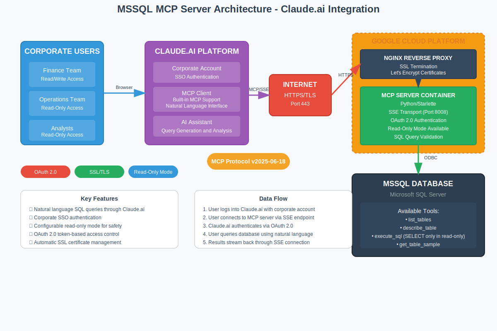

# MSSQL MCP Server - Documentación Técnica

## Tabla de Contenidos
- [Descripción General](#descripción-general)
- [Arquitectura](#arquitectura)
- [Stack Técnico](#stack-técnico)
- [Componentes del Sistema](#componentes-del-sistema)
- [Flujo de Autenticación](#flujo-de-autenticación)
- [Endpoints de la API](#endpoints-de-la-api)
- [Herramientas de Base de Datos](#herramientas-de-base-de-datos)
- [Despliegue](#despliegue)
- [Seguridad](#seguridad)
- [Monitoreo y Mantenimiento](#monitoreo-y-mantenimiento)
- [Solución de Problemas](#solución-de-problemas)

## Descripción General

El MSSQL MCP Server es una implementación de grado de producción del Model Context Protocol (MCP) que proporciona acceso seguro y autenticado mediante OAuth 2.0 a bases de datos Microsoft SQL Server a través de Claude.ai y otros clientes compatibles con MCP. El servidor implementa la especificación MCP versión 2025-06-18, habilitando interacciones con bases de datos en lenguaje natural a través de asistentes de IA.

### Características Principales
- Implementación completa del protocolo MCP con transport SSE
- Autenticación OAuth 2.0 con registro dinámico de clientes
- Operaciones comprehensivas de SQL Server (SELECT, INSERT, UPDATE, DELETE)
- Cifrado TLS/SSL con certificados Let's Encrypt
- Despliegue basado en contenedores con Docker
- Reverse proxy Nginx con manejo optimizado de SSE
- Monitoreo de salud listo para producción

## Arquitectura

### Diagrama de Arquitectura del Sistema
```
┌─────────────┐         HTTPS/TLS            ┌──────────────┐
│  Claude.ai  │ ◄──────────────────────────► │    Nginx     │
│   Client    │         Puerto 443           │ Reverse Proxy│
└─────────────┘                              └──────┬───────┘
                                                    │
                                             ┌──────▼───────┐
                                             │  MCP Server  │
                                             │   (Python)   │
                                             │  Puerto 8008 │
                                             └──────┬───────┘
                                                    │
                                             ┌──────▼───────┐
                                             │ MSSQL Server │
                                             │ Base de Datos│
                                             └──────────────┘
```

### Flujo de Interacción de Componentes
1. Claude.ai inicia conexión HTTPS al servidor
2. Nginx maneja la terminación SSL y hace proxy al servidor MCP
3. El servidor MCP autentica las requests vía OAuth 2.0
4. Las requests autorizadas ejecutan operaciones de base de datos
5. Los resultados se transmiten de vuelta a través de la conexión SSE



### Implementación Multi-tenant

[Cómo agregar un nuevo Mcp-Server](docs/multi-tenant-implementation-guide.md)

## Stack Técnico

### Tecnologías Principales
- **Lenguaje**: Python 3.11
- **Framework**: Starlette ASGI
- **Base de Datos**: Microsoft SQL Server 2019+
- **Driver**: ODBC Driver 18 for SQL Server
- **Protocolo**: Model Context Protocol (MCP) 2025-06-18
- **Transport**: Server-Sent Events (SSE)
- **Autenticación**: OAuth 2.0 con discovery RFC 9728

### Infraestructura
- **Contenedor**: Docker con builds multi-stage
- **Proxy**: Nginx 1.24+ con optimización SSE
- **SSL**: Let's Encrypt con auto-renovación Certbot
- **Plataforma**: Google Cloud Platform (GCP)

## Componentes del Sistema

### 1. MCP Server (`server_oauth.py`)

El servidor de aplicación principal implementando:

#### Manejadores de Protocolo
```python
# Implementaciones de Métodos MCP
- initialize: Negociación de capacidades del servidor
- tools/list: Descubrimiento de herramientas disponibles
- tools/call: Ejecución de herramientas
- notifications/initialized: Establecimiento de sesión
```

#### Gestión de Conexión a Base de Datos
```python
def get_db_config() -> tuple[dict, str]:
    """
    Construye string de conexión ODBC desde variables de entorno.
    Retorna diccionario de configuración y string de conexión.
    """
```

#### Serialización de Datos
```python
def serialize_row_data(data) -> Any:
    """
    Convierte objetos Row de pyodbc y tipos de SQL Server a formato compatible con JSON.
    Maneja: Decimal, DateTime, Date, objetos Row
    """
```

### 2. Herramientas de Base de Datos

#### Herramientas Disponibles

| Herramienta | Propósito | Parámetros |
|-------------|-----------|------------|
| `list_tables` | Enumerar todas las tablas de la base de datos | Ninguno |
| `describe_table` | Obtener schema y metadatos de tabla | `table_name: str` |
| `execute_sql` | Ejecutar queries SQL arbitrarias | `query: str` |
| `get_table_sample` | Obtener datos de muestra de tabla | `table_name: str`, `limit: int` |

#### Ejemplo de Implementación de Herramienta
```python
def execute_sql_impl(query: str) -> str:
    """
    Ejecuta query SQL con manejo apropiado de transacciones.
    Retorna resultados en formato JSON para queries SELECT,
    o cuenta de filas afectadas para operaciones DML.
    """
```

### 3. Implementación OAuth 2.0

#### Endpoints de Discovery (RFC 9728)
- `/.well-known/oauth-authorization-server`: Metadatos AS
- `/.well-known/oauth-protected-resource`: Metadatos RS

#### Flujo OAuth
1. **Registro Dinámico**: `/register` - Registro de cliente
2. **Autorización**: `/authorize` - Grant de código de autorización
3. **Intercambio de Token**: `/token` - Emisión de access token
4. **Validación de Token**: Store de tokens en memoria con expiración

### 4. Configuración Nginx

#### Optimización SSE
```nginx
location /sse {
    proxy_pass http://mcp-server:8008;
    
    # Configuraciones críticas SSE
    proxy_http_version 1.1;
    proxy_set_header Connection '';
    proxy_buffering off;
    chunked_transfer_encoding off;
    proxy_read_timeout 24h;
    
    # Headers de respuesta
    add_header Content-Type text/event-stream;
    add_header Cache-Control no-cache;
    add_header X-Accel-Buffering no;
}
```

## Flujo de Autenticación

### Secuencia OAuth 2.0
```
Cliente                 Servidor                Recurso
  │                       │                         │
  ├──► POST /register     │                         │
  │◄── client_id/secret   │                         │
  │                       │                         │
  ├──► GET /authorize     │                         │
  │◄── authorization_code │                         │
  │                       │                         │
  ├──► POST /token        │                         │
  │◄── access_token       │                         │
  │                       │                         │
  ├──► GET /sse + Bearer  │                         │
  │                       ├──► Validar Token        │
  │◄── Stream SSE         │◄── Resultados BD        │
```

## Endpoints de la API

### Endpoints Públicos

| Endpoint | Método | Propósito |
|----------|--------|-----------|
| `/health` | GET | Verificación de salud y estado |
| `/.well-known/oauth-authorization-server` | GET | Discovery OAuth AS |
| `/.well-known/oauth-protected-resource` | GET | Discovery OAuth RS |

### Endpoints OAuth

| Endpoint | Método | Propósito | Request Body |
|----------|--------|-----------|--------------|
| `/register` | POST | Registro dinámico de cliente | `{client_name, redirect_uris}` |
| `/authorize` | GET | Grant de código de autorización | Query: `client_id, redirect_uri, state` |
| `/token` | POST | Intercambio de token | `{grant_type, code, client_id, client_secret}` |

### Endpoints MCP

| Endpoint | Método | Propósito | Autenticación |
|----------|--------|-----------|---------------|
| `/sse` | HEAD | Verificación de capacidad SSE | Opcional |
| `/sse` | POST | Manejo de mensajes MCP | Bearer token |

## Herramientas de Base de Datos

### Especificaciones de Herramientas

#### list_tables
```json
{
  "name": "list_tables",
  "description": "Listar todas las tablas en la base de datos",
  "inputSchema": {
    "type": "object",
    "properties": {},
    "required": []
  }
}
```

#### describe_table
```json
{
  "name": "describe_table",
  "description": "Obtener estructura y metadatos de tabla",
  "inputSchema": {
    "type": "object",
    "properties": {
      "table_name": {
        "type": "string",
        "description": "Nombre de la tabla"
      }
    },
    "required": ["table_name"]
  }
}
```

#### execute_sql
```json
{
  "name": "execute_sql",
  "description": "Ejecutar query SQL",
  "inputSchema": {
    "type": "object",
    "properties": {
      "query": {
        "type": "string",
        "description": "Query SQL a ejecutar"
      }
    },
    "required": ["query"]
  }
}
```

### Compatibilidad con SQL Server
[Implementación Final Read-Only](docs/read_only.md)

#### Operaciones Soportadas
- Consulta de Datos: SELECT con TOP, JOINs, CTEs
- Manipulación de Datos: INSERT, UPDATE, DELETE
- Descubrimiento de Schema: queries INFORMATION_SCHEMA
- Transacciones: Commit/rollback automático

#### Mapeo de Tipos de Datos
| Tipo SQL Server | Tipo Python | Serialización JSON |
|-----------------|-------------|-------------------|
| INT, BIGINT | int | number |
| DECIMAL, NUMERIC | Decimal | number (float) |
| VARCHAR, NVARCHAR | str | string |
| DATETIME, DATE | datetime | string ISO 8601 |
| BIT | bool | boolean |

## Despliegue

### Prerrequisitos
- Docker Engine 20.10+
- Docker Compose 2.0+
- Dominio con registro DNS A
- VM GCP con reglas de firewall configuradas

### Configuración de Entorno

Crear archivo `.env`:
```bash
# Configuración de Base de Datos
MSSQL_HOST=your-sql-server.database.windows.net
MSSQL_USER=your_username
MSSQL_PASSWORD=your_secure_password
MSSQL_DATABASE=your_database
MSSQL_DRIVER=ODBC Driver 18 for SQL Server

# Seguridad
TrustServerCertificate=yes
Trusted_Connection=no
```

### Despliegue Docker

#### Build y Ejecución
```bash
# Construir contenedores
docker compose build

# Iniciar servicios
docker compose up -d

# Ver logs
docker compose logs -f mcp-server
```

#### Configuración de Contenedores
```yaml
services:
  mcp-server:
    build: .
    expose:
      - "8008"
    environment:
      - MSSQL_HOST=${MSSQL_HOST}
      - MSSQL_USER=${MSSQL_USER}
      - MSSQL_PASSWORD=${MSSQL_PASSWORD}
      - MSSQL_DATABASE=${MSSQL_DATABASE}
    healthcheck:
      test: ["CMD", "curl", "-f", "http://localhost:8008/health"]
      interval: 30s
      timeout: 10s
      retries: 3
```

### Configuración de Certificado SSL

#### Configuración Inicial
```bash
# Ejecutar script de configuración
./setup-letsencrypt.sh

# Verificar certificado
openssl s_client -connect data.forensic-bot.com:443 -servername data.forensic-bot.com
```

#### Renovación Automática
El contenedor Certbot ejecuta verificaciones de renovación cada 12 horas:
```yaml
certbot:
  image: certbot/certbot
  entrypoint: "/bin/sh -c 'trap exit TERM; while :; do certbot renew; sleep 12h & wait $${!}; done;'"
```

## Seguridad

### Seguridad de Red

#### Reglas de Firewall GCP
```bash
# Tráfico HTTPS
gcloud compute firewall-rules create allow-mcp-https \
    --allow tcp:443 \
    --source-ranges 0.0.0.0/0 \
    --target-tags mcp-server

# HTTP para Let's Encrypt
gcloud compute firewall-rules create allow-letsencrypt \
    --allow tcp:80 \
    --source-ranges 0.0.0.0/0 \
    --target-tags mcp-server
```

### Seguridad de Aplicación

#### Protección OAuth 2.0
- Registro dinámico de clientes
- Access tokens de corta duración (1 hora)
- Generación segura de tokens usando `secrets.token_urlsafe()`

#### Seguridad de Base de Datos
- Queries parametrizadas (vía pyodbc)
- Usuario de solo lectura recomendado para producción
- Credenciales de string de conexión desde variables de entorno
- Cifrado TLS para conexiones de base de datos

#### Configuración TLS
```nginx
ssl_protocols TLSv1.2 TLSv1.3;
ssl_ciphers HIGH:!aNULL:!MD5;
ssl_prefer_server_ciphers off;
ssl_session_cache shared:SSL:10m;
```

### Headers de Seguridad
```nginx
add_header Strict-Transport-Security "max-age=31536000; includeSubDomains" always;
add_header X-Content-Type-Options nosniff;
add_header X-Frame-Options DENY;
```

## Monitoreo y Mantenimiento

### Monitoreo de Salud

#### Endpoint de Health Check
```bash
curl https://data.forensic-bot.com/health
```

Respuesta:
```json
{
  "status": "healthy",
  "transport": "sse",
  "oauth": "enabled",
  "database": "your_database"
}
```

### Logging

#### Logs de Aplicación
```python
logging.basicConfig(
    level=logging.INFO,
    format='%(asctime)s - %(name)s - %(levelname)s - %(message)s'
)
```

#### Logs de Contenedores
```bash
# Ver todos los logs
docker compose logs

# Seguir servicio específico
docker compose logs -f mcp-server

# Últimas 100 líneas
docker compose logs --tail=100 mcp-server
```

### Monitoreo de Performance

#### Métricas Clave
- Tiempo de respuesta por ejecución de herramienta
- Conexiones SSE activas
- Tasa de generación de tokens OAuth
- Performance de queries de base de datos

#### Comandos de Monitoreo
```bash
# Uso de recursos de contenedores
docker stats mcp-server

# Conexiones Nginx
docker exec nginx-container nginx -T | grep worker_connections

# Conexiones de base de datos
docker exec mcp-server python -c "import pyodbc; print(pyodbc.drivers())"
```

## Solución de Problemas

### Problemas Comunes

#### 1. Fallos de Conexión a Base de Datos
```bash
# Probar instalación ODBC
docker exec mcp-server odbcinst -j

# Verificar variables de entorno
docker exec mcp-server env | grep MSSQL

# Probar conexión
docker exec mcp-server python -c "
import pyodbc
from os import getenv
conn_str = f\"Driver={{ODBC Driver 18 for SQL Server}};Server={getenv('MSSQL_HOST')};...\"
conn = pyodbc.connect(conn_str)
print('Conectado exitosamente')
"
```

#### 2. Problemas de Conexión SSE
```bash
# Probar endpoint SSE
curl -N -H "Accept: text/event-stream" https://data.forensic-bot.com/sse

# Verificar buffering de Nginx
docker exec nginx-container cat /etc/nginx/conf.d/default.conf | grep proxy_buffering
```

#### 3. Fallos de Autenticación OAuth
```bash
# Probar discovery OAuth
curl https://data.forensic-bot.com/.well-known/oauth-authorization-server

# Registrar cliente de prueba
curl -X POST https://data.forensic-bot.com/register \
  -H "Content-Type: application/json" \
  -d '{"client_name": "test"}'
```

#### 4. Problemas de Renovación de Certificados
```bash
# Probar renovación (dry run)
docker compose exec certbot certbot renew --dry-run

# Forzar renovación
docker compose exec certbot certbot renew --force-renewal

# Verificar expiración de certificado
echo | openssl s_client -servername data.forensic-bot.com -connect data.forensic-bot.com:443 2>/dev/null | openssl x509 -noout -dates
```

### Modo Debug

Habilitar logging detallado:
```python
# En server_oauth.py
logging.basicConfig(level=logging.DEBUG)

# Agregar logging de request/response
logger.debug(f"Request: {method} - Body: {json.dumps(body)}")
logger.debug(f"Response: {json.dumps(response)}")
```

### Optimización de Performance

#### Optimización de Base de Datos
```sql
-- Agregar índices para columnas consultadas frecuentemente
CREATE INDEX idx_table_column ON table_name(column_name);

-- Actualizar estadísticas
UPDATE STATISTICS table_name;
```

#### Optimización Nginx
```nginx
# Incrementar conexiones de worker
worker_connections 4096;

# Habilitar HTTP/2
listen 443 ssl http2;

# Optimizar cache de sesión SSL
ssl_session_cache shared:SSL:50m;
ssl_session_timeout 1d;
```

## Apéndice

### Referencia del Protocolo MCP
- Especificación: https://modelcontextprotocol.io/specification
- Versión: 2025-06-18
- Transport: Server-Sent Events (SSE)

### Referencia de Funciones SQL Server
| SQL Server | Descripción |
|------------|-------------|
| TOP n | Limitar resultados |
| GETDATE() | Timestamp actual |
| LEN() | Longitud de string |
| CHARINDEX() | Encontrar substring |
| ISNULL() | Manejo de null |

### Referencia de Variables de Entorno
| Variable | Descripción | Ejemplo |
|----------|-------------|---------|
| MSSQL_HOST | Servidor de base de datos | server.database.windows.net |
| MSSQL_USER | Usuario de base de datos | sa |
| MSSQL_PASSWORD | Contraseña de base de datos | SecurePass123! |
| MSSQL_DATABASE | Nombre de base de datos | production |
| MSSQL_DRIVER | Driver ODBC | ODBC Driver 18 for SQL Server |
| TrustServerCertificate | Confianza en certificado SSL | yes |

### Referencia de Puertos
| Puerto | Servicio | Propósito |
|--------|----------|-----------|
| 80 | HTTP | Validación Let's Encrypt |
| 443 | HTTPS | Tráfico de producción |
| 8008 | MCP Server | API interna |

### Links Utiles
- https://support.anthropic.com/en/articles/11175166-getting-started-with-custom-connectors-using-remote-mcp
- https://www.netify.ai/resources/applications/claude
- https://letsencrypt.org/
- https://nginx.org/
- https://certbot.eff.org/

---

Versión: 2.0.0  
Última Actualización: Agosto 2025  
Protocolo: MCP 2025-06-18  
Compatibilidad: SQL Server 2019+, Python 3.11+, Docker 20.10+
