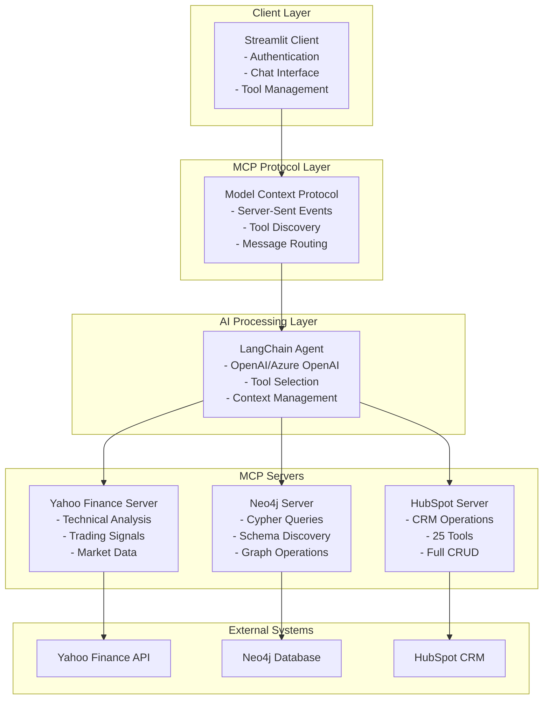
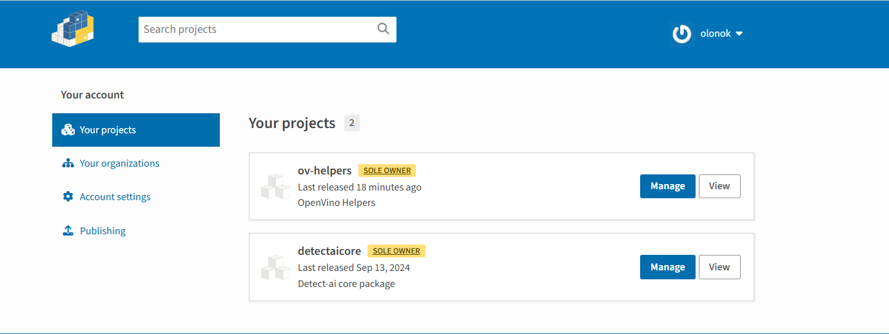
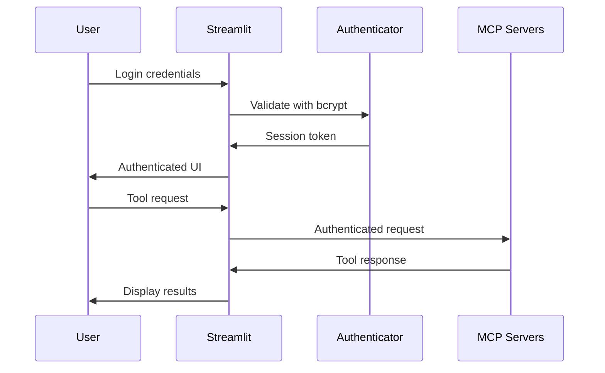

# AI-Powered CRM & Graph Database Integration Platform
## Technical Overview & Architecture

---

## 📋 Agenda

1. **What is this platform?**
2. **Architecture Overview**
3. **Technical Stack**
4. **Component Deep Dive**
5. **Installation & Deployment**
6. **Security & Authentication**
7. **Performance & Scaling**
8. **Demo & Use Cases**
9. **Q&A**

---

## 🎯 What is this Platform?

### **Executive Summary**
A **comprehensive AI-powered integration platform** that unifies:
- **Financial Market Data** (Yahoo Finance)
- **Graph Database Operations** (Neo4j)
- **CRM Management** (HubSpot)

Through a **single conversational AI interface** using the **Model Context Protocol (MCP)**.

### **Key Value Propositions**
- **Natural Language Interface**: Query databases and CRM using plain English
- **Multi-System Integration**: Single interface for disparate systems
- **Enterprise Security**: Authentication, session management, SSL/TLS
- **Real-time Analysis**: Live financial data with proprietary algorithms
- **Extensible Architecture**: Plugin-based system for new integrations

---

## 🏗️ Architecture Overview

### **High-Level Architecture**


### Architecture Diagram



### **Component Communication Flow**

1. **User Input** → Streamlit Client (authenticated session)
2. **Message Routing** → MCP Protocol Layer
3. **AI Processing** → LangChain Agent (tool selection)
4. **Tool Execution** → Appropriate MCP Server
5. **Data Retrieval** → External System (Yahoo/Neo4j/HubSpot)
6. **Response Processing** → Back through the chain
7. **User Display** → Formatted results in chat interface

---

## 💻 Technical Stack

### **Frontend & Client**
```yaml
Technology: Streamlit 1.44+
Language: Python 3.11+
Authentication: Streamlit Authenticator 0.3.2
Security: bcrypt, SSL/TLS support
UI Framework: Custom CSS, responsive design
```

### **Backend Services**
```yaml
Yahoo Finance Server:
  - FastAPI + uvicorn
  - Python 3.12+
  - yfinance library
  - Custom algorithms

Neo4j Server:
  - FastAPI + uvicorn  
  - Python 3.11+
  - neo4j-driver
  - APOC procedures

HubSpot Server:
  - Express.js + Node.js 18+
  - JavaScript ES6+
  - 25 specialized tools
  - Zod validation
```

### **Infrastructure**
```yaml
Containerization: Docker + Docker Compose
Protocol: Model Context Protocol (MCP)
Transport: Server-Sent Events (SSE)
Database: Neo4j 5.0+ with APOC
External APIs: Yahoo Finance, HubSpot REST API
```

### **AI & ML**
```yaml
Framework: LangChain + LangGraph
Providers: OpenAI GPT-4o, Azure OpenAI
Agent: ReAct (Reasoning + Acting)
Context: Conversation memory + tool history
```

---

## 🔧 Component Deep Dive

### **1. Streamlit Client (Port 8501/8502)**

#### **Features**
- **Enterprise Authentication**: bcrypt + session management
- **Modern UI**: Tabbed interface (Chat, Config, Connections, Tools)
- **SSL Support**: Auto-generated certificates, HTTPS mode
- **Multi-User**: Isolated conversations and sessions

#### **Technical Details**
```python
# Key Technologies
- streamlit-authenticator: User management
- nest-asyncio: Async support in Streamlit
- langchain-mcp-adapters: MCP client integration
- langgraph: Agent framework
```

#### **Authentication Flow**
```yaml
1. User Login → bcrypt verification
2. Session Creation → Secure cookie
3. MCP Connection → Authenticated context
4. Tool Access → Permission-based routing
```

---

### **2. Yahoo Finance MCP Server (Port 8002)**

#### **Capabilities**
- **6 Advanced Tools**: MACD, Bollinger-Fibonacci, Donchian Channels
- **Proprietary Algorithms**: Custom scoring systems (-100 to +100)
- **Real-time Data**: No API keys required
- **Trading Signals**: Automated buy/sell/hold recommendations

#### **Technical Implementation**
```python
# Core Tools
calculate_macd_score_tool()           # MACD analysis
calculate_donchian_channel_score()   # Trend analysis  
calculate_combined_score()           # Multi-indicator
calculate_bollinger_fibonacci()      # Advanced strategy
calculate_bollinger_z_score()        # Volatility analysis
calculate_connors_rsi_score()        # RSI variants
```

#### **Algorithm Example: MACD Scoring**
```python
# Weighted Components
macd_signal_score = 40%  # MACD vs Signal line
macd_zero_score = 30%    # MACD vs Zero line  
histogram_score = 30%    # Momentum analysis
final_score = sum(weighted_components)  # -100 to +100
```

---

### **3. Neo4j MCP Server (Port 8003)**

#### **Architecture**
- **Schema-First Approach**: Mandatory schema discovery
- **Query Validation**: Prevents invalid Cypher queries
- **Safe Operations**: Separate read/write tools
- **APOC Integration**: Advanced graph procedures

#### **Tools & Workflow**
```python
# Required Workflow
1. get_neo4j_schema()      # ALWAYS FIRST
2. read_neo4j_cypher()     # Safe queries
3. write_neo4j_cypher()    # Validated writes
```

#### **Security Features**
```yaml
Validation: Schema-aware query checking
Permissions: Separate read/write operations
Connection: Async connection pooling
Error Handling: Detailed without data exposure
```

---

### **4. HubSpot MCP Server (Port 8004)**

#### **Complete Tool Suite (25 Tools)**
```yaml
OAuth (1): User authentication & context
Objects (7): Full CRUD operations
Properties (4): Custom field management
Associations (3): Relationship mapping
Engagements (3): Notes, tasks, activities
Workflows (2): Automation insights
Links (2): UI integration
```

#### **Tool Categories**
```javascript
// Object Management
hubspot_list_objects()     // Pagination support
hubspot_search_objects()   // Advanced filtering
hubspot_batch_create()     // Bulk operations
hubspot_batch_update()     // Bulk modifications

// Relationship Management  
hubspot_create_association()  // Link objects
hubspot_list_associations()   // View relationships

// UI Integration
hubspot_get_link()         // Generate HubSpot URLs
```

#### **Validation & Security**
```javascript
// Zod Schema Validation
const schema = z.object({
  objectType: z.enum(['contacts', 'companies', 'deals']),
  properties: z.record(z.string()),
  associations: z.array(z.object({...}))
});
```

---

## 🚀 Installation & Deployment

### **Development Setup (5 minutes)**

```bash
# 1. Clone repository
git clone <repo-url>
cd ai-crm-platform

# 2. Environment configuration
cat > .env << EOF
OPENAI_API_KEY=your_key
NEO4J_URI=bolt://localhost:7687
NEO4J_PASSWORD=your_password
PRIVATE_APP_ACCESS_TOKEN=hubspot_token
EOF

# 3. Generate authentication
cd client
python simple_generate_password.py

# 4. Start all services
docker-compose up --build

# 5. Access application
# HTTP:  http://localhost:8501
# HTTPS: https://localhost:8502 (if SSL_ENABLED=true)
```

### **Production Deployment**

```yaml
# docker-compose.prod.yml
services:
  hostclient:
    environment:
      - SSL_ENABLED=true
    volumes:
      - ./certs:/app/ssl
      - ./config:/app/keys
    networks:
      - traefik-public
    labels:
      - "traefik.enable=true"
      - "traefik.http.routers.app.rule=Host(`your-domain.com`)"
      - "traefik.http.routers.app.tls.certresolver=letsencrypt"
```

### **Health Monitoring**

```bash
# Health checks
curl http://localhost:8502/health   # Yahoo Finance
curl http://localhost:8503/health   # Neo4j  
curl http://localhost:8504/health   # HubSpot
curl http://localhost:8501          # Client

# Automated health check script
python health_check.py
```

---

## 🔒 Security & Authentication

### **Authentication Architecture**



### **Security Features**

#### **Authentication**
```yaml
Password Hashing: bcrypt with salt
Session Management: 30-day expiry (configurable)
Cookie Security: HTTPOnly, Secure, SameSite
Access Control: Pre-authorized email domains
Multi-User: Complete session isolation
```

#### **Network Security**
```yaml
SSL/TLS: Auto-generated certificates
Container Isolation: Docker network segregation
API Keys: Environment variable protection
Input Validation: XSS and injection prevention
Error Handling: No sensitive data exposure
```

#### **Default Users (Development)**
```yaml
admin: very_Secure_p@ssword_123!
juan: Larisa1000@
giovanni_romero: MrRomero2024!
demo_user: strong_password_123!
```

---

## 📊 Performance & Scaling

### **Performance Metrics**

```yaml
Response Times:
  - Authentication: <200ms
  - Tool Discovery: <500ms
  - Simple Queries: <2s
  - Complex Analysis: <10s

Throughput:
  - Concurrent Users: 50+ (single instance)
  - Tool Executions: 100+ per minute
  - Data Processing: 10MB+ per query
```

### **Scaling Strategies**

#### **Horizontal Scaling**
```yaml
Load Balancing: Multiple client instances
MCP Servers: Independent scaling per service
Database: Neo4j clustering
Cache: Redis for session storage
```

#### **Vertical Scaling**
```yaml
Memory: 2GB+ per container
CPU: 2+ cores recommended
Storage: SSD for Neo4j performance
Network: 1Gbps+ for large datasets
```

### **Monitoring & Observability**

```yaml
Health Checks: Built-in endpoints
Logging: Structured logs with levels
Metrics: Tool execution timing
Alerts: Failed authentication attempts
Tracing: Full request/response logging
```

---

## 🎬 Demo & Use Cases

### **Financial Analysis Workflow**

```python
# User Query
"Analyze AAPL using MACD and Bollinger-Fibonacci strategies, 
then create a HubSpot task to review our tech investments"

# AI Execution Flow
1. yahoo_finance.calculate_macd_score(symbol="AAPL")
2. yahoo_finance.calculate_bollinger_fibonacci(ticker="AAPL") 
3. hubspot.create_engagement(type="task", content="Review tech investments based on AAPL analysis")
4. hubspot.get_link(objectType="tasks", objectId="12345")

# Result
- MACD Score: +73 (Strong Buy)
- Bollinger-Fibonacci: +82 (Strong Buy) 
- Task Created: "Review tech investments"
- HubSpot Link: Generated for direct access
```

### **Database + CRM Integration**

```python
# User Query  
"Find all customers from the Neo4j database who haven't been 
contacted in HubSpot for over 30 days and create follow-up tasks"

# AI Execution Flow
1. neo4j.get_schema()
2. neo4j.read_cypher("MATCH (c:Customer) RETURN c.email, c.name")
3. hubspot.search_objects(objectType="contacts", filters=...)
4. hubspot.batch_create_objects(objectType="tasks", ...)

# Result
- Database Analysis: 150 customers found
- CRM Cross-Reference: 23 need follow-up
- Tasks Created: 23 follow-up tasks
- Integration Complete: Data synced across systems
```

### **Complex Multi-System Analysis**

```python
# User Query
"Create a comprehensive investment report combining market analysis, 
customer database insights, and CRM performance metrics"

# AI Execution Flow (15+ tool calls)
1. Financial analysis across multiple stocks
2. Database relationship analysis
3. CRM performance metrics
4. Report generation with insights
5. Task creation for stakeholders
6. Link generation for easy access

# Result
- 10-page comprehensive report
- Multi-system data integration
- Actionable insights and recommendations
- Automated follow-up workflows
```

---

## 🔄 Development & Extensibility

### **Adding New MCP Servers**

```python
# 1. Create new server
mkdir servers/server6
cd servers/server6

# 2. Implement MCP protocol
# - Tool registration
# - SSE transport
# - Schema validation

# 3. Update client configuration
# servers_config.json
{
  "CustomService": {
    "transport": "sse",
    "url": "http://server6:8006/sse"
  }
}

# 4. Deploy with Docker Compose
# docker-compose.yml
server6:
  build: ./servers/server6
  ports: ["8006:8006"]
```

### **Custom Tool Development**

```python
# BaseTool class for new tools
class CustomAnalysisTool(BaseTool):
    name = "custom_analysis"
    description = "Perform custom analysis"
    
    def get_schema(self):
        return {
            "type": "object",
            "properties": {
                "data": {"type": "string"},
                "parameters": {"type": "object"}
            }
        }
    
    async def process(self, params):
        # Custom logic here
        return {"result": "analysis complete"}
```

### **AI Prompt Customization**

```python
# utils/ai_prompts.py
def make_system_prompt():
    return f"""
    You are an AI assistant with access to:
    - Financial analysis tools
    - Graph database operations  
    - CRM management capabilities
    - Custom business logic
    
    Always follow security protocols and
    validate schemas before operations.
    """
```

---

## 🎯 Key Technical Benefits

### **For Development Teams**

```yaml
Rapid Integration: Plugin-based architecture
Type Safety: Comprehensive schema validation  
Testing: Built-in health checks and monitoring
Documentation: Auto-generated tool discovery
Debugging: Detailed execution history
```

### **For Operations Teams**

```yaml
Containerized: Docker deployment
Scalable: Horizontal and vertical scaling
Secure: Enterprise authentication
Monitored: Health checks and logging
Maintainable: Modular architecture
```

### **For Business Users**

```yaml
Natural Language: No query language learning
Multi-System: Single interface for all data
Real-Time: Live data analysis
Secure: Role-based access control
Extensible: Easy addition of new data sources
```

---

## 🚨 Considerations & Limitations

### **Current Limitations**

```yaml
Financial Data: Limited to Yahoo Finance (free tier)
Neo4j: Requires APOC plugin installation
HubSpot: Needs Private App with proper scopes
Authentication: File-based (not enterprise SSO)
Scaling: Single-instance limitations
```

### **Recommended Improvements**

```yaml
Enterprise Auth: LDAP/SAML integration
Database: Multi-database support
Caching: Redis for performance
Monitoring: Prometheus/Grafana
CI/CD: Automated deployment pipelines
```

### **Security Considerations**

```yaml
Production: Change default passwords
SSL: Use proper certificates (not self-signed)
Secrets: Use secret management systems
Network: Implement proper firewall rules
Backup: Database and configuration backups
```

---

## 📈 Roadmap & Future Enhancements

### **Short Term (1-3 months)**
- Enterprise SSO integration
- Advanced caching mechanisms
- Performance optimization
- Enhanced monitoring

### **Medium Term (3-6 months)**
- Additional data source connectors
- Advanced AI model support
- Workflow automation builder
- Mobile-responsive interface

### **Long Term (6+ months)**
- Multi-tenant architecture
- Advanced analytics dashboard
- Machine learning insights
- API gateway integration

---

## ❓ Q&A Session

### **Common Questions**

**Q: How does it handle large datasets?**
A: Pagination, streaming responses, and efficient query optimization

**Q: What about API rate limits?**
A: Built-in rate limiting respect, batch operations, and caching

**Q: Can it integrate with our existing systems?**
A: Yes, through MCP protocol - highly extensible architecture

**Q: What's the learning curve?**
A: Minimal - natural language interface, comprehensive documentation

**Q: How secure is it for production?**
A: Enterprise-grade authentication, but requires proper SSL certificates and secret management for production

---

## 🎉 Demo Time!

### **Live Demonstration**

1. **Authentication**: Login process and user management
2. **Configuration**: AI provider setup and server connections
3. **Tool Discovery**: Browse available tools and capabilities
4. **Financial Analysis**: Real-time stock analysis with custom algorithms
5. **Database Operations**: Neo4j schema discovery and querying
6. **CRM Management**: HubSpot contact and deal management
7. **Complex Workflow**: Multi-system integration example

---

## 📞 Contact & Resources

### **Documentation**
- Main README: Complete setup guide
- Component READMEs: Detailed technical documentation
- Tool Guides: Comprehensive tool usage examples

### **Repository Structure**
```
├── client/              # Streamlit application
├── servers/server3/     # Yahoo Finance MCP
├── servers/server4/     # Neo4j MCP  
├── servers/server5/     # HubSpot MCP
├── docker-compose.yaml  # Container orchestration
└── health_check.py     # System monitoring
```

### **Support**
- GitHub Issues: Bug reports and feature requests
- Documentation: Comprehensive guides and examples
- Health Checks: Built-in monitoring and diagnostics

---

**Thank you for your attention!**

*Ready for questions and deep-dive discussions*