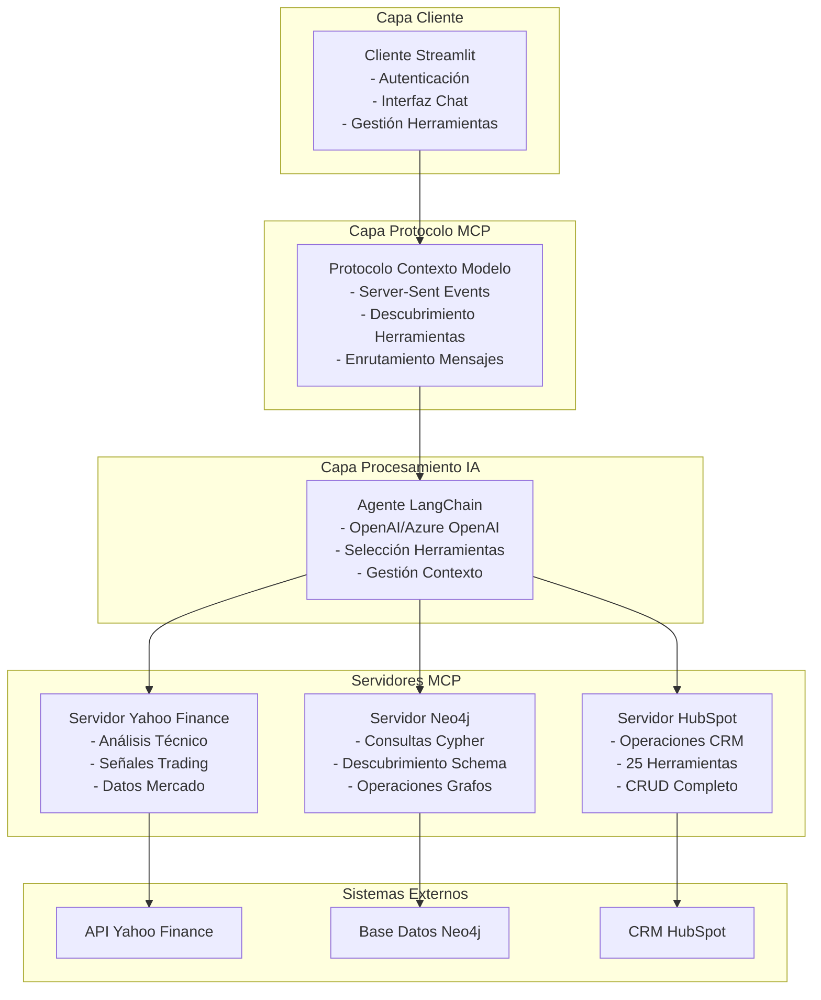
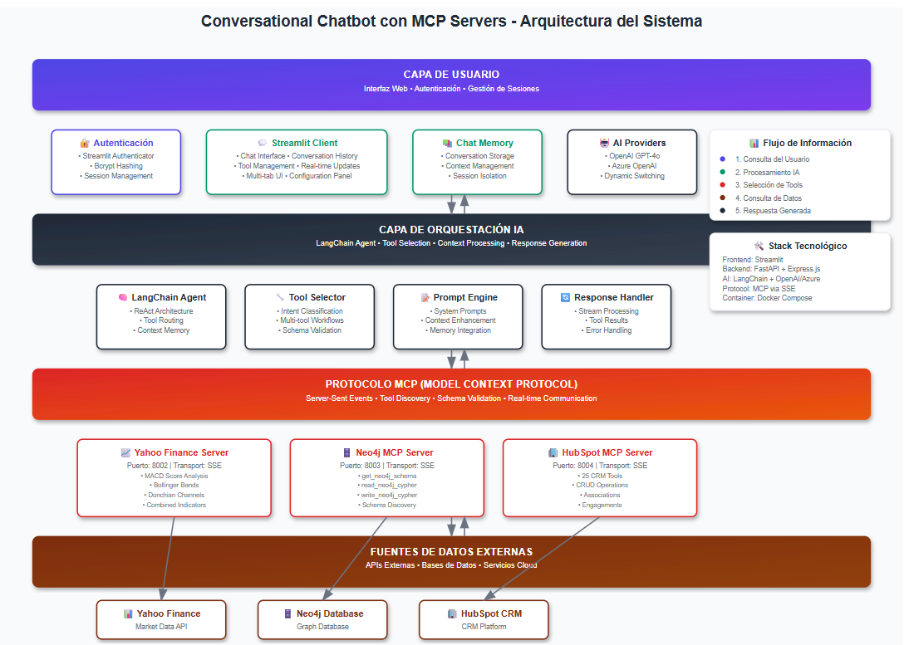
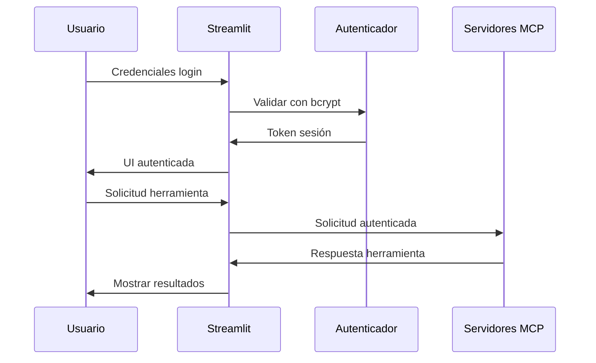

# Plataforma de Integración IA para CRM y Base de Datos de Grafos
## Presentación Técnica y Arquitectura

---

## 📋 Agenda

1. **¿Qué es esta plataforma?**
2. **Visión General de la Arquitectura**
3. **Stack Tecnológico**
4. **Análisis Profundo de Componentes**
5. **Instalación y Despliegue**
6. **Seguridad y Autenticación**
7. **Rendimiento y Escalabilidad**
8. **Demo y Casos de Uso**
9. **Preguntas y Respuestas**

---

## 🎯 ¿Qué es esta Plataforma?

### **Resumen Ejecutivo**
Una **plataforma integral de integración impulsada por IA** que unifica:
- **Datos de Mercados Financieros** (Yahoo Finance)
- **Operaciones de Base de Datos de Grafos** (Neo4j)
- **Gestión de CRM** (HubSpot)

A través de una **interfaz conversacional de IA única** usando el **Protocolo de Contexto de Modelo (MCP)**.

### **Propuestas de Valor Clave**
- **Interfaz de Lenguaje Natural**: Consulta bases de datos y CRM usando español simple
- **Integración Multi-Sistema**: Interfaz única para sistemas dispares
- **Seguridad Empresarial**: Autenticación, gestión de sesiones, SSL/TLS
- **Análisis en Tiempo Real**: Datos financieros en vivo con algoritmos propietarios
- **Arquitectura Extensible**: Sistema basado en plugins para nuevas integraciones

---

## 🏗️ Visión General de la Arquitectura

### **Arquitectura de Alto Nivel**


###  Diagrama Arquitectura




### **Flujo de Comunicación entre Componentes**

1. **Entrada Usuario** → Cliente Streamlit (sesión autenticada)
2. **Enrutamiento Mensaje** → Capa Protocolo MCP
3. **Procesamiento IA** → Agente LangChain (selección herramientas)
4. **Ejecución Herramienta** → Servidor MCP Apropiado
5. **Recuperación Datos** → Sistema Externo (Yahoo/Neo4j/HubSpot)
6. **Procesamiento Respuesta** → De vuelta por la cadena
7. **Visualización Usuario** → Resultados formateados en interfaz chat

---

## 💻 Stack Tecnológico

### **Frontend y Cliente**
```yaml
Tecnología: Streamlit 1.44+
Lenguaje: Python 3.11+
Autenticación: Streamlit Authenticator 0.3.2
Seguridad: bcrypt, soporte SSL/TLS
Framework UI: CSS personalizado, diseño responsivo
```

### **Servicios Backend**
```yaml
Servidor Yahoo Finance:
  - FastAPI + uvicorn
  - Python 3.12+
  - librería yfinance
  - Algoritmos personalizados

Servidor Neo4j:
  - FastAPI + uvicorn  
  - Python 3.11+
  - neo4j-driver
  - Procedimientos APOC

Servidor HubSpot:
  - Express.js + Node.js 18+
  - JavaScript ES6+
  - 25 herramientas especializadas
  - Validación Zod
```

### **Infraestructura**
```yaml
Contenedorización: Docker + Docker Compose
Protocolo: Protocolo Contexto Modelo (MCP)
Transporte: Server-Sent Events (SSE)
Base de Datos: Neo4j 5.0+ con APOC
APIs Externas: Yahoo Finance, API REST HubSpot
```

### **IA y ML**
```yaml
Framework: LangChain + LangGraph
Proveedores: OpenAI GPT-4o, Azure OpenAI
Agente: ReAct (Razonamiento + Actuación)
Contexto: Memoria conversacional + historial herramientas
```

---

## 🔧 Análisis Profundo de Componentes

### **1. Cliente Streamlit (Puerto 8501/8502)**

#### **Características**
- **Autenticación Empresarial**: bcrypt + gestión de sesiones
- **UI Moderna**: Interfaz con pestañas (Chat, Config, Conexiones, Herramientas)
- **Soporte SSL**: Certificados auto-generados, modo HTTPS
- **Multi-Usuario**: Conversaciones y sesiones aisladas

#### **Detalles Técnicos**
```python
# Tecnologías Clave
- streamlit-authenticator: Gestión usuarios
- nest-asyncio: Soporte async en Streamlit
- langchain-mcp-adapters: Integración cliente MCP
- langgraph: Framework agente
```

#### **Flujo de Autenticación**
```yaml
1. Login Usuario → verificación bcrypt
2. Creación Sesión → Cookie segura
3. Conexión MCP → Contexto autenticado
4. Acceso Herramientas → Enrutamiento basado en permisos
```

---

### **2. Servidor MCP Yahoo Finance (Puerto 8002)**

#### **Capacidades**
- **6 Herramientas Avanzadas**: MACD, Bollinger-Fibonacci, Canales Donchian
- **Algoritmos Propietarios**: Sistemas de puntuación personalizados (-100 a +100)
- **Datos Tiempo Real**: No requiere claves API
- **Señales Trading**: Recomendaciones automatizadas comprar/vender/mantener

#### **Implementación Técnica**
```python
# Herramientas Principales
calculate_macd_score_tool()           # Análisis MACD
calculate_donchian_channel_score()   # Análisis tendencia  
calculate_combined_score()           # Multi-indicador
calculate_bollinger_fibonacci()      # Estrategia avanzada
calculate_bollinger_z_score()        # Análisis volatilidad
calculate_connors_rsi_score()        # Variantes RSI
```

#### **Ejemplo Algoritmo: Puntuación MACD**
```python
# Componentes Ponderados
macd_signal_score = 40%  # MACD vs línea Señal
macd_zero_score = 30%    # MACD vs línea Cero  
histogram_score = 30%    # Análisis momentum
puntuacion_final = suma(componentes_ponderados)  # -100 a +100
```

---

### **3. Servidor MCP Neo4j (Puerto 8003)**

#### **Arquitectura**
- **Enfoque Schema-First**: Descubrimiento obligatorio de esquema
- **Validación Consultas**: Previene consultas Cypher inválidas
- **Operaciones Seguras**: Herramientas separadas lectura/escritura
- **Integración APOC**: Procedimientos avanzados de grafos

#### **Herramientas y Flujo de Trabajo**
```python
# Flujo Requerido
1. get_neo4j_schema()      # SIEMPRE PRIMERO
2. read_neo4j_cypher()     # Consultas seguras
3. write_neo4j_cypher()    # Escrituras validadas
```

#### **Características de Seguridad**
```yaml
Validación: Verificación consultas aware-schema
Permisos: Operaciones separadas lectura/escritura
Conexión: Pool conexiones async
Manejo Errores: Detallado sin exposición datos
```

---

### **4. Servidor MCP HubSpot (Puerto 8004)**

#### **Suite Completa de Herramientas (25 Herramientas)**
```yaml
OAuth (1): Autenticación usuario y contexto
Objetos (7): Operaciones CRUD completas
Propiedades (4): Gestión campos personalizados
Asociaciones (3): Mapeo relaciones
Compromisos (3): Notas, tareas, actividades
Flujos de Trabajo (2): Insights automatización
Enlaces (2): Integración UI
```

#### **Categorías de Herramientas**
```javascript
// Gestión Objetos
hubspot_list_objects()     // Soporte paginación
hubspot_search_objects()   // Filtrado avanzado
hubspot_batch_create()     // Operaciones masivas
hubspot_batch_update()     // Modificaciones masivas

// Gestión Relaciones  
hubspot_create_association()  // Enlazar objetos
hubspot_list_associations()   // Ver relaciones

// Integración UI
hubspot_get_link()         // Generar URLs HubSpot
```

#### **Validación y Seguridad**
```javascript
// Validación Schema Zod
const schema = z.object({
  objectType: z.enum(['contacts', 'companies', 'deals']),
  properties: z.record(z.string()),
  associations: z.array(z.object({...}))
});
```

---

## 🚀 Instalación y Despliegue

### **Configuración Desarrollo (5 minutos)**

```bash
# 1. Clonar repositorio
git clone <repo-url>
cd plataforma-ai-crm

# 2. Configuración entorno
cat > .env << EOF
OPENAI_API_KEY=tu_clave
NEO4J_URI=bolt://localhost:7687
NEO4J_PASSWORD=tu_password
PRIVATE_APP_ACCESS_TOKEN=token_hubspot
EOF

# 3. Generar autenticación
cd client
python simple_generate_password.py

# 4. Iniciar todos los servicios
docker-compose up --build

# 5. Acceder aplicación
# HTTP:  http://localhost:8501
# HTTPS: https://localhost:8502 (si SSL_ENABLED=true)
```

### **Despliegue Producción**

```yaml
# docker-compose.prod.yml
services:
  hostclient:
    environment:
      - SSL_ENABLED=true
    volumes:
      - ./certs:/app/ssl
      - ./config:/app/keys
    networks:
      - traefik-public
    labels:
      - "traefik.enable=true"
      - "traefik.http.routers.app.rule=Host(`tu-dominio.com`)"
      - "traefik.http.routers.app.tls.certresolver=letsencrypt"
```

### **Monitoreo Salud**

```bash
# Verificaciones salud
curl http://localhost:8002/health   # Yahoo Finance
curl http://localhost:8003/health   # Neo4j  
curl http://localhost:8004/health   # HubSpot
curl http://localhost:8501          # Cliente

# Script verificación salud automatizado
python health_check.py
```

---

## 🔒 Seguridad y Autenticación

### **Arquitectura Autenticación**



### **Características de Seguridad**

#### **Autenticación**
```yaml
Hash Passwords: bcrypt con salt
Gestión Sesión: Expiración 30 días (configurable)
Seguridad Cookie: HTTPOnly, Secure, SameSite
Control Acceso: Dominios email pre-autorizados
Multi-Usuario: Aislamiento completo sesiones
```

#### **Seguridad Red**
```yaml
SSL/TLS: Certificados auto-generados
Aislamiento Contenedor: Segregación red Docker
Claves API: Protección variables entorno
Validación Entrada: Prevención XSS e inyección
Manejo Errores: Sin exposición datos sensibles
```

#### **Usuarios Por Defecto (Desarrollo)**
```yaml
admin: very_Secure_p@ssword_123!
juan: Larisa1000@
giovanni_romero: MrRomero2024!
demo_user: strong_password_123!
```

---

## 📊 Rendimiento y Escalabilidad

### **Métricas de Rendimiento**

```yaml
Tiempos Respuesta:
  - Autenticación: <200ms
  - Descubrimiento Herramientas: <500ms
  - Consultas Simples: <2s
  - Análisis Complejos: <10s

Throughput:
  - Usuarios Concurrentes: 50+ (instancia única)
  - Ejecuciones Herramientas: 100+ por minuto
  - Procesamiento Datos: 10MB+ por consulta
```

### **Estrategias Escalabilidad**

#### **Escalabilidad Horizontal**
```yaml
Balanceador Carga: Múltiples instancias cliente
Servidores MCP: Escalado independiente por servicio
Base Datos: Clustering Neo4j
Cache: Redis para almacenamiento sesión
```

#### **Escalabilidad Vertical**
```yaml
Memoria: 2GB+ por contenedor
CPU: 2+ cores recomendados
Almacenamiento: SSD para rendimiento Neo4j
Red: 1Gbps+ para datasets grandes
```

### **Monitoreo y Observabilidad**

```yaml
Verificaciones Salud: Endpoints integrados
Logging: Logs estructurados con niveles
Métricas: Timing ejecución herramientas
Alertas: Intentos autenticación fallidos
Trazabilidad: Logging completo request/response
```

---

## 🎬 Demo y Casos de Uso

### **Flujo de Trabajo Análisis Financiero**

```python
# Consulta Usuario
"Analiza AAPL usando estrategias MACD y Bollinger-Fibonacci, 
luego crea una tarea en HubSpot para revisar nuestras inversiones tech"

# Flujo Ejecución IA
1. yahoo_finance.calculate_macd_score(symbol="AAPL")
2. yahoo_finance.calculate_bollinger_fibonacci(ticker="AAPL") 
3. hubspot.create_engagement(type="task", content="Revisar inversiones tech basado en análisis AAPL")
4. hubspot.get_link(objectType="tasks", objectId="12345")

# Resultado
- Puntuación MACD: +73 (Compra Fuerte)
- Bollinger-Fibonacci: +82 (Compra Fuerte) 
- Tarea Creada: "Revisar inversiones tech"
- Enlace HubSpot: Generado para acceso directo
```

### **Integración Base de Datos + CRM**

```python
# Consulta Usuario  
"Encuentra todos los clientes de la base Neo4j que no han sido 
contactados en HubSpot por más de 30 días y crea tareas de seguimiento"

# Flujo Ejecución IA
1. neo4j.get_schema()
2. neo4j.read_cypher("MATCH (c:Customer) RETURN c.email, c.name")
3. hubspot.search_objects(objectType="contacts", filters=...)
4. hubspot.batch_create_objects(objectType="tasks", ...)

# Resultado
- Análisis Base Datos: 150 clientes encontrados
- Referencia Cruzada CRM: 23 necesitan seguimiento
- Tareas Creadas: 23 tareas seguimiento
- Integración Completa: Datos sincronizados entre sistemas
```

### **Análisis Complejo Multi-Sistema**

```python
# Consulta Usuario
"Crea un reporte integral de inversión combinando análisis de mercado, 
insights base datos clientes, y métricas rendimiento CRM"

# Flujo Ejecución IA (15+ llamadas herramientas)
1. Análisis financiero múltiples acciones
2. Análisis relaciones base datos
3. Métricas rendimiento CRM
4. Generación reporte con insights
5. Creación tareas para stakeholders
6. Generación enlaces para fácil acceso

# Resultado
- Reporte integral 10 páginas
- Integración datos multi-sistema
- Insights accionables y recomendaciones
- Flujos trabajo seguimiento automatizados
```

---

## 🔄 Desarrollo y Extensibilidad

### **Agregar Nuevos Servidores MCP**

```python
# 1. Crear nuevo servidor
mkdir servers/server6
cd servers/server6

# 2. Implementar protocolo MCP
# - Registro herramientas
# - Transporte SSE
# - Validación schema

# 3. Actualizar configuración cliente
# servers_config.json
{
  "ServicioPersonalizado": {
    "transport": "sse",
    "url": "http://server6:8006/sse"
  }
}

# 4. Desplegar con Docker Compose
# docker-compose.yml
server6:
  build: ./servers/server6
  ports: ["8006:8006"]
```

### **Desarrollo Herramientas Personalizadas**

```python
# Clase BaseTool para nuevas herramientas
class HerramientaAnalisisPersonalizado(BaseTool):
    name = "analisis_personalizado"
    description = "Realizar análisis personalizado"
    
    def get_schema(self):
        return {
            "type": "object",
            "properties": {
                "datos": {"type": "string"},
                "parametros": {"type": "object"}
            }
        }
    
    async def process(self, params):
        # Lógica personalizada aquí
        return {"resultado": "análisis completado"}
```

### **Personalización Prompts IA**

```python
# utils/ai_prompts.py
def make_system_prompt():
    return f"""
    Eres un asistente IA con acceso a:
    - Herramientas análisis financiero
    - Operaciones base datos grafos  
    - Capacidades gestión CRM
    - Lógica negocio personalizada
    
    Siempre sigue protocolos seguridad y
    valida schemas antes de operaciones.
    """
```

---

## 🎯 Beneficios Técnicos Clave

### **Para Equipos Desarrollo**

```yaml
Integración Rápida: Arquitectura basada plugins
Seguridad Tipos: Validación schema integral  
Testing: Verificaciones salud y monitoreo integrados
Documentación: Descubrimiento herramientas auto-generado
Debugging: Historial ejecución detallado
```

### **Para Equipos Operaciones**

```yaml
Contenedorizado: Despliegue Docker
Escalable: Escalado horizontal y vertical
Seguro: Autenticación empresarial
Monitoreado: Verificaciones salud y logging
Mantenible: Arquitectura modular
```

### **Para Usuarios Negocio**

```yaml
Lenguaje Natural: Sin aprendizaje lenguaje consulta
Multi-Sistema: Interfaz única para todos los datos
Tiempo Real: Análisis datos en vivo
Seguro: Control acceso basado roles
Extensible: Fácil adición nuevas fuentes datos
```

---

## 🚨 Consideraciones y Limitaciones

### **Limitaciones Actuales**

```yaml
Datos Financieros: Limitado a Yahoo Finance (tier gratuito)
Neo4j: Requiere instalación plugin APOC
HubSpot: Necesita App Privada con scopes apropiados
Autenticación: Basada archivos (no SSO empresarial)
Escalado: Limitaciones instancia única
```

### **Mejoras Recomendadas**

```yaml
Auth Empresarial: Integración LDAP/SAML
Base Datos: Soporte multi-base datos
Caching: Redis para rendimiento
Monitoreo: Prometheus/Grafana
CI/CD: Pipelines despliegue automatizado
```

### **Consideraciones Seguridad**

```yaml
Producción: Cambiar passwords por defecto
SSL: Usar certificados apropiados (no auto-firmados)
Secretos: Usar sistemas gestión secretos
Red: Implementar reglas firewall apropiadas
Backup: Backups base datos y configuración
```

---

## 📈 Roadmap y Mejoras Futuras

### **Corto Plazo (1-3 meses)**
- Integración SSO empresarial
- Mecanismos caching avanzados
- Optimización rendimiento
- Monitoreo mejorado

### **Mediano Plazo (3-6 meses)**
- Conectores fuentes datos adicionales
- Soporte modelos IA avanzados
- Constructor automatización workflows
- Interfaz responsive móvil

### **Largo Plazo (6+ meses)**
- Arquitectura multi-tenant
- Dashboard analytics avanzado
- Insights machine learning
- Integración API gateway

---

## ❓ Sesión Preguntas y Respuestas

### **Preguntas Frecuentes**

**P: ¿Cómo maneja datasets grandes?**
R: Paginación, respuestas streaming, y optimización consultas eficiente

**P: ¿Qué pasa con límites rate API?**
R: Respeto límites rate integrado, operaciones batch, y caching

**P: ¿Puede integrarse con nuestros sistemas existentes?**
R: Sí, a través protocolo MCP - arquitectura altamente extensible

**P: ¿Cuál es la curva aprendizaje?**
R: Mínima - interfaz lenguaje natural, documentación integral

**P: ¿Qué tan seguro es para producción?**
R: Autenticación grado empresarial, pero requiere certificados SSL apropiados y gestión secretos para producción

---

## 🎉 ¡Hora del Demo!

### **Demostración en Vivo**

1. **Autenticación**: Proceso login y gestión usuarios
2. **Configuración**: Setup proveedor IA y conexiones servidor
3. **Descubrimiento Herramientas**: Explorar herramientas disponibles y capacidades
4. **Análisis Financiero**: Análisis acciones tiempo real con algoritmos personalizados
5. **Operaciones Base Datos**: Descubrimiento schema Neo4j y consultas
6. **Gestión CRM**: Gestión contactos y deals HubSpot
7. **Flujo Trabajo Complejo**: Ejemplo integración multi-sistema

---

## 📞 Contacto y Recursos

### **Documentación**
- README Principal: Guía configuración completa
- READMEs Componentes: Documentación técnica detallada
- Guías Herramientas: Ejemplos uso herramientas integral

### **Estructura Repositorio**
```
├── client/              # Aplicación Streamlit
├── servers/server3/     # MCP Yahoo Finance
├── servers/server4/     # MCP Neo4j  
├── servers/server5/     # MCP HubSpot
├── docker-compose.yaml  # Orquestación contenedores
└── health_check.py     # Monitoreo sistema
```

### **Soporte**
- GitHub Issues: Reportes bugs y solicitudes características
- Documentación: Guías integrales y ejemplos
- Verificaciones Salud: Monitoreo y diagnósticos integrados

---

**¡Gracias por su atención!**

*Listo para preguntas y discusiones profundas*